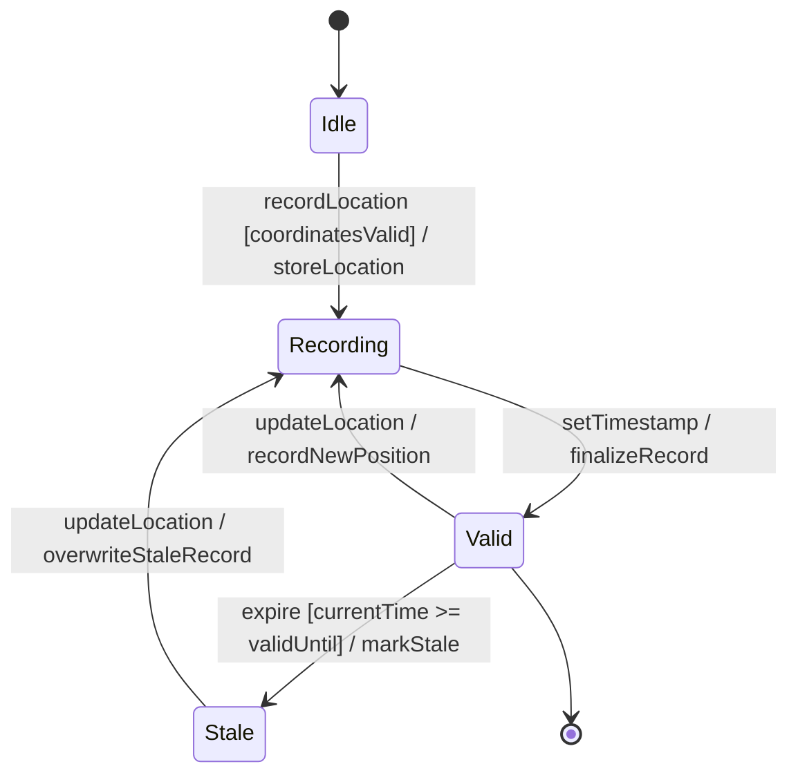

# Epic: Geo-Location: Geographic Location Specification

## 1. Context
This Epic defines the functional requirements for specifying a geographic location on or around an astronomical object (e.g., 'earth'). It encompasses the complete YANG `geo-location` grouping defined in RFC 9179, including the frame of reference, coordinate systems (ellipsoidal and Cartesian), motion vector tracks, and temporal metadata for recording location and expiry timestamps.

The module `ietf-geo-location` provides a reusable YANG grouping that other modules can use to add geolocation capabilities to their data models. It supports both standard Earth-based coordinate systems (lat/lon/height with WGS-84) and extended capabilities for non-Earth astronomical bodies, alternate reference systems, and velocity tracking.

## 2. Requirements & Checklist
- [ ] #1 - [Geo-Location Container](https://github.com/gintatkinson/3dgs-027/blob/main/docs/features/feat-01-geo-location-container.md) (Root container holding timestamp and validity metadata for the entire location record)
- [ ] #2 - [Reference Frame](https://github.com/gintatkinson/3dgs-027/blob/main/docs/features/feat-02-reference-frame.md) (Defines the spatial frame of reference including astronomical body and optional alternate system)
- [ ] #3 - [Geodetic System](https://github.com/gintatkinson/3dgs-027/blob/main/docs/features/feat-03-geodetic-system.md) (Specifies the geodetic datum and coordinate/height accuracy parameters)
- [ ] #4 - [Ellipsoidal Coordinates](https://github.com/gintatkinson/3dgs-027/blob/main/docs/features/feat-04-ellipsoidal-coordinates.md) (Latitude, longitude, and height coordinate specification)
- [ ] #5 - [Cartesian Coordinates](https://github.com/gintatkinson/3dgs-027/blob/main/docs/features/feat-05-cartesian-coordinates.md) (X, Y, Z Cartesian coordinate specification)
- [ ] #6 - [Velocity Vector](https://github.com/gintatkinson/3dgs-027/blob/main/docs/features/feat-06-velocity-vector.md) (Three-dimensional velocity vector for objects in motion)

### Associated Use Cases & User Stories

#### Associated Use Cases
*To be populated after Phase 3*
<!-- Populated after Phase 3 -->

#### Associated User Stories
*To be populated after Phase 3*
<!-- Populated after Phase 2 -->

## 3. Architecture

### System-Level UML Class Diagram

```mermaid
classDiagram
    class GeoLocation {
        +String timestamp [0..1]
        +String validUntil [0..1]
        +Status setTimestamp(String time) [1]
        +ValidityResult checkValidity(String currentTime) [1]
        +Status setCoordinates(String coordinateSystem, Coordinates coords) [1]
        +SpeedHeadingResult requestSpeedAndHeading(String timestamp) [1]
        +Cartesian convertToCartesian(String geodeticDatum) [1]
        +Ellipsoid convertToEllipsoid(String geodeticDatum) [1]
        +Location projectPosition(Real deltaTime) [1]
        +EffectiveReferenceFrame getEffectiveReferenceFrame() [1]
        +EffectiveReferenceFrame getEffectiveGeodeticDatum() [1]
        +Status inheritFromParent(GeoLocation parent) [1]
        +Status overrideReferenceFrame(ReferenceFrame newFrame) [1]
        +Status enableAlternateSystem(String alternateSystemId) [1]
        +Status clearAlternateSystem() [1]
        +Status switchToEllipsoid(Coordinates coordinates) [1]
        +Status create(GeoLocation attachedTo) [1]
        +Boolean checkOwnReferenceFrame() [1]
        +Boolean checkHasInheritedFrame() [1]
        +Status setOwnReferenceFrame(ReferenceFrame newFrame) [1]
        +String readAstronomicalBody() [1]
        +String readGeodeticDatum() [1]
        +String readValidUntil() [1]
        +ReferenceFrame getReferenceFrame() [1]
    }
    class ReferenceFrame {
        +String alternateSystem [0..1]
        +Boolean alternateSystems [0..1]
        +String astronomicalBody [0..1]
        +Status setAlternateSystem(String alternateSystemId) [1]
        +Status resetToNaturalUniverse() [1]
        +ReferenceFrame getReferenceFrame() [1]
    }
    class GeodeticSystem {
        +String geodeticDatum [0..1]
        +Real coordAccuracy [0..1]
        +Real heightAccuracy [0..1]
    }
    class Ellipsoid {
        +Real latitude [0..1]
        +Real longitude [0..1]
        +Real height [0..1]
    }
    class Cartesian {
        +Real x [0..1]
        +Real y [0..1]
        +Real z [0..1]
    }
    class Velocity {
        +Real vNorth [0..1]
        +Real vEast [0..1]
        +Real vUp [0..1]
    }
    class Location {
        <<choice>>
    }
    class VelocityCalculator {
        <<service>>
        +Real computeSpeed(Real vNorth, Real vEast) [1]
        +Real computeHeading(Real vNorth, Real vEast) [1]
    }
    class GeodeticCalculator {
        <<service>>
        +EllipsoidParams getEllipsoidParameters(String geodeticDatum) [1]
        +Cartesian ellipsoidToCartesian(Real lat, Real lon, Real h, EllipsoidParams params) [1]
        +Ellipsoid cartesianToEllipsoid(Real x, Real y, Real z, EllipsoidParams params) [1]
    }
    class ClockService {
        <<service>>
        +ComparisonResult compare(String currentTime, String validUntil) [1]
    }
    class MotionProjector {
        <<service>>
        +Location interpolate(Real lat, Real lon, Real h, Real vN, Real vE, Real vU, Real deltaTime, String datum) [1]
    }
    class DefaultResolver {
        <<service>>
        +String resolveDefaultAstronomicalBody() [1]
        +String resolveDefaultGeodeticDatum(String astronomicalBody) [1]
    }
    class ReferenceFrameResolver {
        <<service>>
        +ReferenceFrame inheritFromParent(GeoLocation parent) [1]
    }
    class LocationStrategy {
        <<service>>
        +Status activateEllipsoid(Coordinates coords) [1]
        +Status activateCartesian(Coordinates coords) [1]
        +Status replaceCartesianWithEllipsoid(Coordinates coords) [1]
    }
    class FeatureChecker {
        <<service>>
        +Boolean isFeatureEnabled(String featureName) [1]
    }
    class HierarchyManager {
        <<external>>
    }
    class LocationTransformer {
        <<external>>
    }
    class TrajectoryProjector {
        <<external>>
    }
    class LocationInterpreter {
        <<external>>
    }
    class LocationValidator {
        <<external>>
    }
    class SystemConfigurator {
        <<external>>
    }
    class LocationConsumer {
        <<external>>
    }
    class LocationRecorder {
        <<external>>
    }

    GeoLocation *-- ReferenceFrame
    ReferenceFrame *-- GeodeticSystem
    GeoLocation *-- Location
    Location <|-- Ellipsoid
    Location <|-- Cartesian
    GeoLocation *-- Velocity
    GeoLocation --> VelocityCalculator
    GeoLocation --> GeodeticCalculator
    GeoLocation --> ClockService
    GeoLocation --> MotionProjector
    GeoLocation --> DefaultResolver
    GeoLocation --> ReferenceFrameResolver
    GeoLocation --> LocationStrategy
    GeoLocation --> FeatureChecker
    HierarchyManager ..> GeoLocation
    LocationTransformer ..> GeoLocation
    TrajectoryProjector ..> GeoLocation
    LocationInterpreter ..> GeoLocation
    LocationValidator ..> GeoLocation
    SystemConfigurator ..> GeoLocation
    LocationConsumer ..> GeoLocation
    LocationRecorder ..> GeoLocation
```

### System State Machine Diagram

## 4. Operational Considerations

The geo-location grouping is designed as a reusable YANG grouping to be incorporated via `uses geo:geo-location` into other YANG data models. Implementers must consider:

- **Nested Location Inheritance**: When locations are nested (e.g., a building contains routers that also have locations), the containing module may define that the reference-frame is inherited from the parent object, avoiding repetition of reference-frame data.
- **Coordinate System Selection**: Users must choose between ellipsoidal (latitude/longitude/height) and Cartesian (X/Y/Z) coordinate representations. Both are mutually exclusive within a single geo-location instance. Conversion between systems depends on the geodetic-datum parameters.
- **Motion Tracking Limitations**: The velocity vector captures motion at a single point in time for relatively stable motion. For objects with complex or rapidly changing trajectories, implementers should either add additional motion data to their models or require more frequent location queries.
- **Temporal Lifecycle**: The valid-until timestamp governs record freshness. Systems consuming geo-location data MUST check validity before acting on location data, especially for time-sensitive applications.
- **Default Values**: When astronomical-body is not specified, 'earth' is the default. When geodetic-datum is not specified for Earth, 'wgs-84' is the effective default per RFC 9179.
- **Portability**: The YANG grouping is designed for interoperability with standards including W3C Geolocation API, GML (ISO 19136), KML, and IETF geo URI (RFC 5870). Mapping between these formats may involve precision trade-offs due to decimal64 versus string/double representations.
- **Precision Management**: Coordinate values (latitude/longitude) support 16 fraction digits of decimal64 precision; accuracy values support 6 fraction digits; velocity supports 12 fraction digits. Implementers must handle rounding at these boundaries.

## 5. Security & Governance

The geo-location grouping conveys potentially sensitive location data. Implementers and module authors using this grouping MUST consider:

- **Privacy**: Location data for individuals, sensitive facilities, or critical infrastructure may be privacy-sensitive. Read access to geo-location data SHOULD be controlled via access control mechanisms (e.g., NETCONF Access Control Model RFC 8341, RESTCONF authentication).
- **Data Integrity**: Location data corruption could lead to incorrect operational decisions. The secure transport layer (SSH for NETCONF per RFC 6242, TLS for RESTCONF per RFC 8446) provides integrity protection in transit.
- **Write Access Control**: All data nodes in the geo-location grouping are writable/creatable/deletable (config true). Unauthorized modification of location data could misdirect network operations, physical deployments, or emergency responses. Write access MUST be restricted to authorized roles.
- **Geodetic Datum Registry**: The IANA "Geodetic System Values" registry (created by RFC 9179 Section 6.1) governs the standard values for geodetic-datum. This registry uses First Come First Served allocation policy to prevent duplicate values.
- **Alternate Systems**: The optional `alternate-systems` feature enables specification of non-natural-universe coordinate systems (e.g., virtual realities). Systems enabling this feature should document the alternate system definitions to ensure consistent interpretation.
- **Auditability**: Changes to geo-location data SHOULD be logged for audit purposes, particularly for locations associated with network infrastructure, compliance-regulated assets, or safety-critical systems.
- **Schema Validation**: All geo-location data MUST be validated against the YANG schema constraints (patterns, ranges, types) before storage. Invalid data MUST be rejected at the schema validation boundary.

## 6. Source References
Structural Schema: [ietf-geo-location.yang](https://github.com/gintatkinson/3dgs-027/blob/main/standard/ietf/RFC/ietf-geo-location%402022-02-11.yang)
Normative Specification: [RFC 9179 - A YANG Grouping for Geographic Locations](https://datatracker.ietf.org/doc/rfc9179/)
