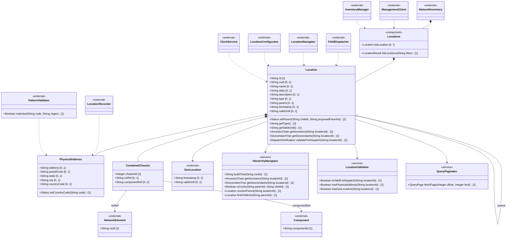
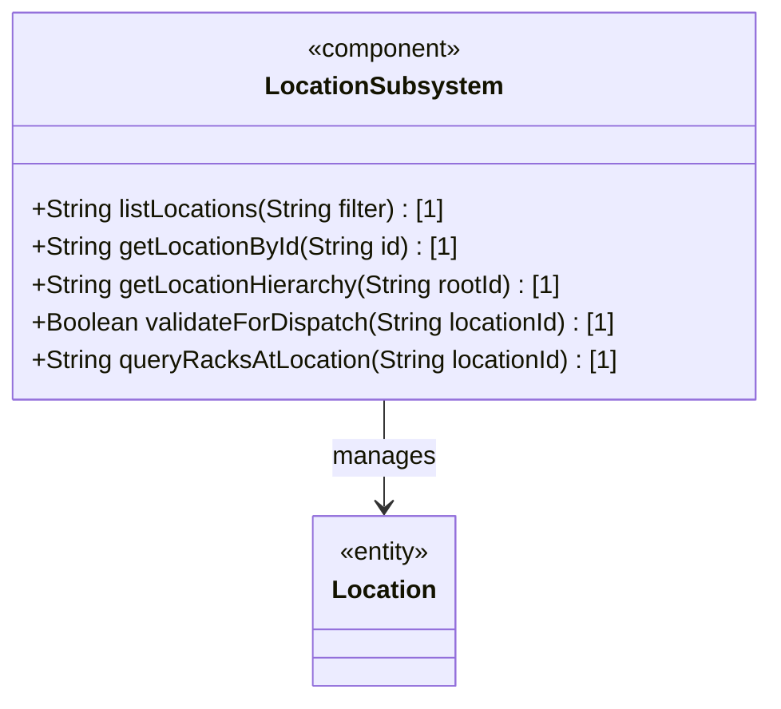
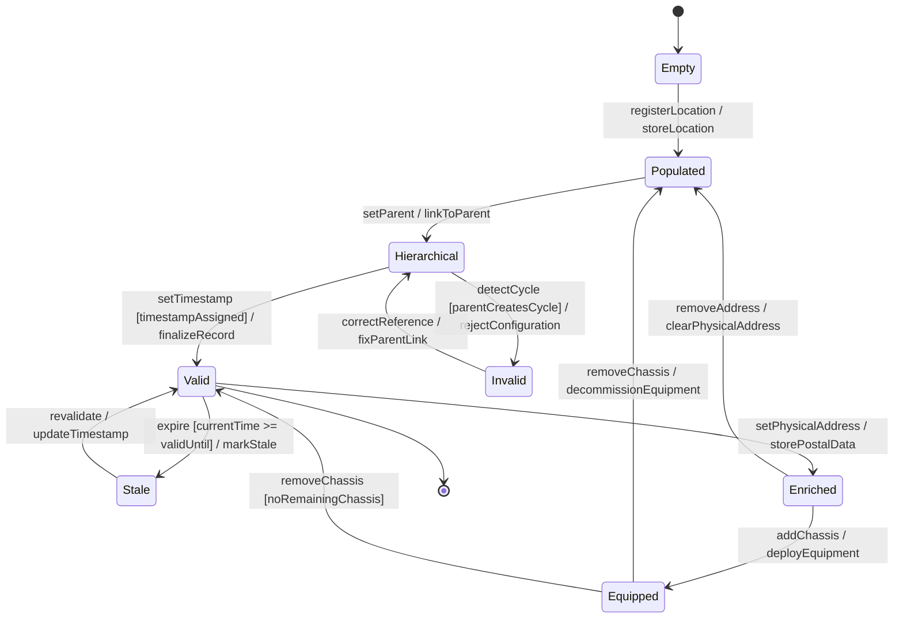

# Epic: Location Hierarchy & Physical Addressing

## 1. Context
This Epic defines the functional requirements for managing physical locations within the network inventory as specified by the `ietf-ni-location` YANG module. It covers the hierarchical location structure (sites, buildings, rooms), the physical postal addressing of locations, and the direct deployment of chassis at locations without rack enclosures.

The module `ietf-ni-location` augments the base network inventory (`ietf-network-inventory`) with a read-only locations list. Locations form a self-referencing hierarchy through the parent leafref, enabling operators to model nested physical structures from sites down to individual rooms or outdoor mounting points. Each location carries descriptive metadata, a flexible type classification, optional physical address information, temporal validity tracking, and the ability to host chassis directly.

This Epic groups the Locations Container, Location Entity, Physical Address, and Location Contained Chassis features together as a cohesive location management subsystem.

## 2. Requirements & Checklist
- [ ] #22 - [Locations Container](https://github.com/gintatkinson/3dgs-027/blob/main/docs/features/feat-07-locations-container.md) (Top-level container for the location collection)
- [ ] #23 - [Location Entity](https://github.com/gintatkinson/3dgs-027/blob/main/docs/features/feat-08-location-entity.md) (Individual physical location record with hierarchy and metadata)
- [ ] #24 - [Physical Address](https://github.com/gintatkinson/3dgs-027/blob/main/docs/features/feat-09-physical-address.md) (Postal address container for location identification)
- [ ] #25 - [Location Contained Chassis](https://github.com/gintatkinson/3dgs-027/blob/main/docs/features/feat-10-location-contained-chassis.md) (Chassis directly deployed at a location without rack)

### Associated Use Cases & User Stories

#### Associated Use Cases
- [ ] #40 - [Register Physical Location in Inventory](https://github.com/gintatkinson/3dgs-027/blob/main/docs/use-cases/uc-07-register-physical-location.md) (Creating location entries in the inventory)
- [ ] #41 - [Manage Location Hierarchy](https://github.com/gintatkinson/3dgs-027/blob/main/docs/use-cases/uc-08-manage-location-hierarchy.md) (Configuring parent-child location structures)
- [ ] #42 - [Record Physical Address for Location](https://github.com/gintatkinson/3dgs-027/blob/main/docs/use-cases/uc-09-record-physical-address.md) (Recording postal address data)
- [ ] #45 - [Deploy Chassis Directly to Location](https://github.com/gintatkinson/3dgs-027/blob/main/docs/use-cases/uc-12-deploy-chassis-to-location.md) (Chassis deployment without rack)

#### Associated User Stories
- [ ] #32 - [Paginate Large Location Query Results](https://github.com/gintatkinson/3dgs-027/blob/main/docs/user-stories/us-09-paginate-location-queries.md) (Pagination for large location inventories)
- [ ] #33 - [Verify Location Completeness for Field Dispatch](https://github.com/gintatkinson/3dgs-027/blob/main/docs/user-stories/us-10-verify-dispatch-readiness.md) (Pre-dispatch verification of location data)
- [ ] #34 - [Traverse and Resolve Nested Location Hierarchies](https://github.com/gintatkinson/3dgs-027/blob/main/docs/user-stories/us-11-traverse-location-hierarchy.md) (Hierarchy traversal and tree resolution)
- [ ] #35 - [Filter Locations by Custom Type Classification](https://github.com/gintatkinson/3dgs-027/blob/main/docs/user-stories/us-12-filter-locations-by-type.md) (Type-based filtering)
- [ ] #36 - [Validate Physical Address Country Code Format](https://github.com/gintatkinson/3dgs-027/blob/main/docs/user-stories/us-13-validate-country-code.md) (Country code pattern validation)
- [ ] #37 - [Detect and Prevent Circular Location Hierarchy References](https://github.com/gintatkinson/3dgs-027/blob/main/docs/user-stories/us-14-detect-location-cycle.md) (Cycle detection in location hierarchies)

## 3. Architecture

### System-Level UML Class Diagram

### Subsystem Component Definition

### System State Machine Diagram

## 4. Operational Considerations

The Location Hierarchy subsystem provides the organizational backbone for network inventory physical management. Key operational considerations include:

- **Hierarchy Integrity**: The parent leafref establishes a self-referencing tree structure. Implementers MUST enforce acyclic constraints to prevent circular references (e.g., a building cannot be its own ancestor). Hierarchy depth SHOULD be bounded to prevent performance degradation on deep traversals.

- **Flexible Typing**: The `type` field uses a free-form string rather than a fixed identity enumeration, enabling operators to define custom location types (e.g., 'pole', 'roof', 'floor', 'manhole') without YANG model extensions. However, this flexibility requires organizational governance of type naming conventions to maintain consistency across inventory data.

- **Read-Only Operational State**: All location data is `config false`. The controller is the authoritative source, populated through automated tooling (RFID, geolocation services) and manual entry. OSS systems consume this data as read-only operational state via standard YANG retrieval operations.

- **Data Quality Verification**: Before using a location for field dispatch or planning, consuming systems MUST verify that at least one of physical-address or geo-location is present, and that the valid-until leaf is either absent or indicates a future time per Section 6 of the specification.

- **Pagination**: Large-scale inventories may contain thousands of location entries. Servers SHOULD implement NETCONF or RESTCONF pagination for location list queries to avoid overwhelming clients or causing timeouts.

- **Distributed Systems**: When chassis are directly deployed at locations without racks, multiple chassis entries across different locations may reference the same network element (ne-ref), supporting distributed multi-chassis deployments.

- **Addresses and Geolocation**: The physical-address and geo-location containers are complementary. Physical addresses provide human-readable postal identification; geo-location provides machine-readable coordinates. Both are optional but at least one should be present for field dispatch scenarios.

- **Migration from Brownfield**: Existing proprietary OSS deployments may have their own location models. The migration path to this standardized model depends on the specific proprietary implementation and requires data mapping between schemas.

## 5. Security & Governance

Location data carries physical deployment information that may be sensitive. Key security considerations:

- **Physical Security**: The locations list reports physical deployment information including facility structures (sites, buildings, rooms). Uncontrolled disclosure may reveal facility layouts and equipment density patterns. Read access MUST be controlled via NACM or equivalent mechanisms.

- **Geographic Privacy**: When geo-location coordinates are configured, precise geographic locations are exposed. This may facilitate physical location identification and requires appropriate access controls.

- **Referential Integrity**: The parent, ne-ref, and component-ref leafref constraints enforce data consistency. Broken references must be detected and reported, not silently accepted.

- **Access Control Granularity**: Different organizational roles may require different access levels: field technicians may need only location and address data for their region; capacity planners may need inventory-wide location views; security auditors may need access logs for location data modifications.

- **Audit Trail**: Changes to location data (additions, modifications, deletions) SHOULD be logged with timestamps and user identification for audit purposes.

- **Country Code Governance**: The country-code field uses ISO ALPHA-2 codes. Organizations SHOULD validate that country codes correspond to recognized ISO codes, as the YANG pattern constraint only enforces format (`[A-Z]{2}`), not semantic validity.

- **Data Retention**: Location records with expired valid-until timestamps represent historical deployment data. Organizations SHOULD define retention policies for expired location records.

## 6. Source References
Structural Schema: [ietf-ni-location.yang](https://github.com/ietf-ivy-wg/network-inventory-location/blob/main/ietf-ni-location.yang)
Normative Specification: [draft-ietf-ivy-network-inventory-location-06](https://datatracker.ietf.org/doc/html/draft-ietf-ivy-network-inventory-location)
