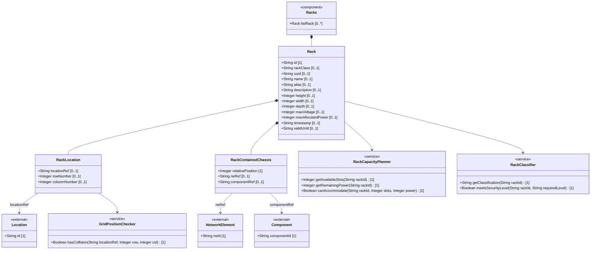
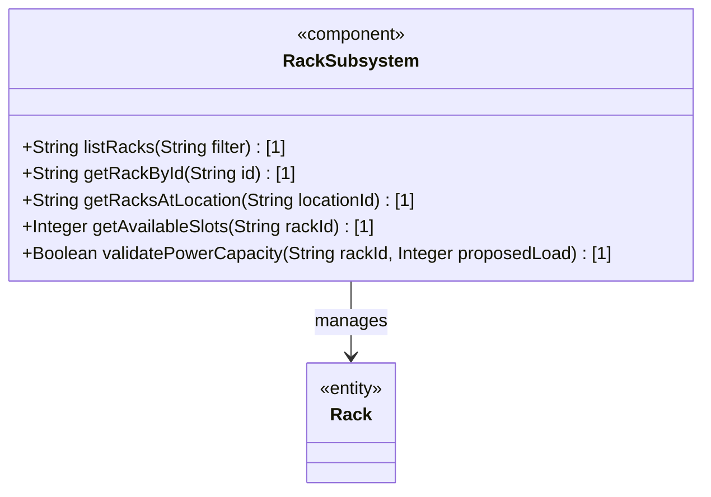
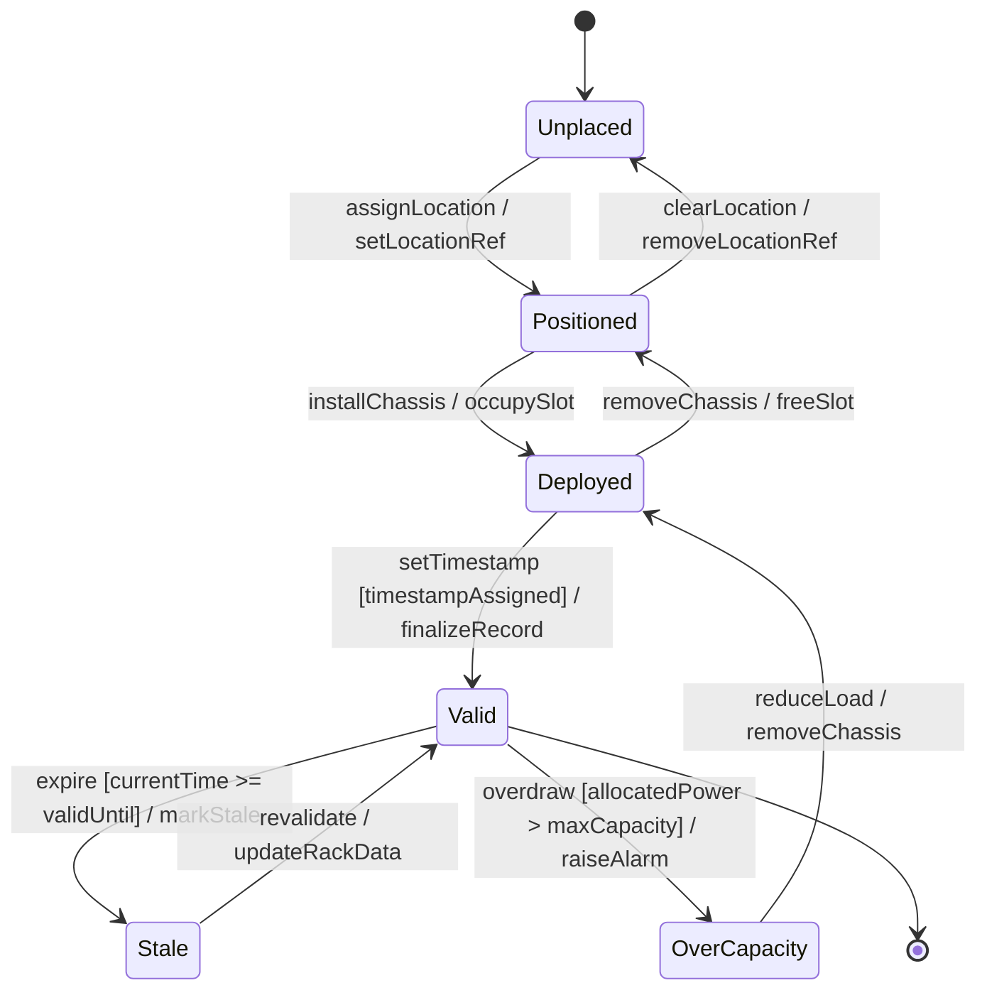

# Epic: Rack Infrastructure Management

## 1. Context
This Epic defines the functional requirements for managing physical equipment racks within the network inventory. Racks serve as the primary enclosure for network equipment chassis in data centers and equipment rooms. They carry attributes covering physical dimensions (height, width, depth in millimeters), electrical characteristics (voltage and power capacity), and a security classification system ranging from standard open racks to high-security lockable enclosures.

The rack subsystem is organized under the `racks` container, alongside the `location` list in the `ietf-ni-location` module. Each rack can be assigned to a specific location (e.g., an equipment room) through its rack-location container, and can host multiple chassis at specific slot positions through the contained-chassis list. This enables precise tracking of equipment placement down to the U-slot level within racks.

This Epic groups the Racks Container, Rack Entity, Rack Location, and Rack Contained Chassis features together as a cohesive rack infrastructure management subsystem.

## 2. Requirements & Checklist
- [ ] #26 - [Racks Container](https://github.com/gintatkinson/3dgs-027/blob/main/docs/features/feat-11-racks-container.md) (Top-level container for the rack collection)
- [ ] #27 - [Rack Entity](https://github.com/gintatkinson/3dgs-027/blob/main/docs/features/feat-12-rack-entity.md) (Physical rack with dimensions, power, and security classification)
- [ ] #28 - [Rack Location](https://github.com/gintatkinson/3dgs-027/blob/main/docs/features/feat-13-rack-location.md) (Grid position assignment of rack within a parent location)
- [ ] #29 - [Rack Contained Chassis](https://github.com/gintatkinson/3dgs-027/blob/main/docs/features/feat-14-rack-contained-chassis.md) (Chassis installed within rack slots)

### Associated Use Cases & User Stories

#### Associated Use Cases
*To be populated after Phase 3*
<!-- Populated after Phase 3 -->

#### Associated User Stories
*To be populated after Phase 2*
<!-- Populated after Phase 2 -->

## 3. Architecture

### System-Level UML Class Diagram

### Subsystem Component Definition

### System State Machine Diagram

## 4. Operational Considerations

The Rack Infrastructure subsystem enables precise physical equipment tracking at the enclosure level. Key operational considerations:

- **Dimension Standards**: Rack dimensions are specified in millimeters. Common data center rack sizes include 600mm x 1200mm (width x depth) and heights of 2000-2200mm (42U). The YANG model uses uint16 for dimensions, accommodating up to 65535mm.

- **Power Management**: The `max-voltage` and `max-allocated-power` fields define the rack's electrical envelope. Operators MUST ensure that the sum of power allocated to installed chassis does not exceed `max-allocated-power`. Voltage compatibility between rack supply and chassis requirements must be verified.

- **Slot Management**: The `relative-position` key in contained-chassis represents U-slot positions. Standard racks top out at 42U or 45U. Implementations should warn when slot positions exceed the rack's physical height capacity.

- **Security Classification**: The rack-class identity hierarchy defines four levels (standard, secure-baseline, secure-medium, secure-high). This classification guides physical access control policies. Extensions can define additional regional or vendor-specific classifications by deriving from the `rack-class-type` base identity.

- **Location Assignment**: The `rack-location` container links racks to parent locations via the `ni-location-ref` leafref. Moving a rack between rooms requires updating the location-ref, row-number, and column-number fields. Grid collision detection at the same row/column within a location prevents double-booking of floor positions.

- **Distributed Deployments**: Multiple chassis across different racks (and potentially different locations) may reference the same network element through their ne-ref fields, supporting distributed multi-chassis network elements where individual chassis members of a stack or cluster are dispersed.

- **Capacity Planning**: Operators can aggregate rack power and slot utilization across locations for data center capacity planning. The sum of max-allocated-power across all racks provides the total facility power envelope.

- **Data Freshness**: Rack records carry independent timestamp and valid-until metadata. Expired rack records (valid-until in the past) MUST NOT be used for operational decisions without revalidation.

## 5. Security & Governance

Rack data carries physical infrastructure information with security implications:

- **Rack Physical Security**: The rack-class classification reveals physical protection levels. In combination with location data, this may indicate which racks house sensitive or critical infrastructure. Read access to rack classification SHOULD be controlled.

- **Power Infrastructure Disclosure**: The max-voltage and max-allocated-power fields reveal electrical infrastructure details. In security-sensitive environments, power capacity information may need restricted access.

- **Slot-Level Visibility**: The contained-chassis list reveals precisely which equipment occupies which rack slot. This level of detail, combined with ne-ref and component-ref references, could enable targeted physical attacks if disclosed to unauthorized parties.

- **Location Reference Integrity**: The location-ref leafref ensures racks are always associated with valid locations. Deleting a location that has racks referenced must either be prevented or must cascade to update the rack assignments.

- **Auditability**: Rack installations, moves, and decommissions SHOULD be logged with timestamps, user identification, and before/after state snapshots. Rack physical modifications (e.g., changing power allocation) may have safety implications and require documented change control.

- **Identity Management**: New rack-class identities derived from rack-class-type SHOULD be registered and documented to ensure consistent interpretation across the organization.

## 6. Source References
Structural Schema: [ietf-ni-location.yang](https://github.com/ietf-ivy-wg/network-inventory-location/blob/main/ietf-ni-location.yang)
Normative Specification: [draft-ietf-ivy-network-inventory-location-06](https://datatracker.ietf.org/doc/html/draft-ietf-ivy-network-inventory-location)
