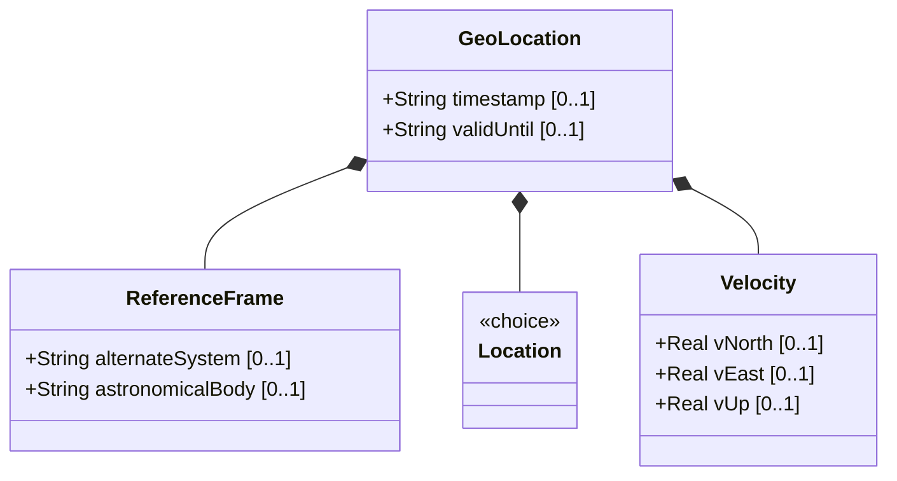

# Feature: Geo-Location Container

## Parent Epic
- [ ] #7 - [Geo-Location: Geographic Location Specification](https://github.com/gintatkinson/3dgs-027/blob/main/docs/epics/epic-01-geo-location-specification.md) (Root container for the entire geo-location grouping)

## Description
The Geo-Location container is the root container of the geo-location grouping. It serves as the composite parent for all geolocation data including the reference frame, location coordinates, velocity vector, and temporal metadata. As a reusable YANG grouping, it is designed to be included via `uses geo:geo-location` in other YANG data models.

This feature specifically addresses the temporal metadata attributes (`timestamp` and `valid-until`) that are direct children of the geo-location container, governing the lifecycle and freshness of location records.

## UML Class Diagram



## Interface Requirements

### 1. Payload Schema (JSON Schema / Protobuf Example)

```json
{
  "geo-location": {
    "timestamp": "2022-02-11T12:00:00Z",
    "valid-until": "2022-02-12T12:00:00Z"
  }
}
```

### 2. Validation & Constraints

- `timestamp`: Type is `yang:date-and-time` (string formatted per RFC 3339). This is the reference time when the location was recorded. No additional constraints specified in schema.
- `valid-until`: Type is `yang:date-and-time` (string formatted per RFC 3339). The timestamp for which this geo-location is valid until. If unspecified, the geo-location has no specific expiration time.
- Both `timestamp` and `valid-until` are optional leaf nodes.
- When `valid-until` is specified and is earlier than the current time, the location record is considered expired.

### 3. Logical Operations & Interface Messages

- **READ**: Retrieve the timestamp and valid-until values for a geo-location record.
- **WRITE**: Set the timestamp and valid-until values when creating or updating a geo-location record.
- **VALIDATE**: Check whether the current time exceeds the valid-until timestamp to determine record freshness.
- The geo-location container is the root access point for all location data; all sub-containers (reference-frame, location, velocity) are accessed through this container.

### 4. Logical Exception States & Validation Failures

- **Missing timestamp**: If a geo-location record is stored without a timestamp, the record age cannot be determined and must be treated as having an unknown recording time.
- **Invalid timestamp format**: If the timestamp value does not conform to RFC 3339 date-and-time format, the record MUST be rejected with a validation error.
- **Invalid valid-until format**: If the valid-until value does not conform to RFC 3339 format, validation MUST fail.
- **Time reversal**: If valid-until is specified and is chronologically earlier than timestamp, the system MUST raise a validation error.

## Given-When-Then Acceptance Criteria

**Scenario: Store a geo-location record with a recording timestamp**
- Given a system that supports geo-location records
- When a geo-location record is stored with a valid RFC 3339 timestamp value
- Then the timestamp is persisted and retrievable as the recording time of the location

**Scenario: Store a geo-location record with a validity expiration**
- Given a geo-location record with a timestamp
- When the record is stored with a valid-until timestamp that is later than the recording timestamp
- Then the valid-until value is persisted and the record is considered valid until the specified time

**Scenario: Geo-location record with no expiration**
- Given a geo-location record
- When the record is stored without a valid-until value
- Then the record has no specific expiration time and remains valid indefinitely

**Scenario: Query determines record has expired**
- Given a geo-location record with a valid-until value in the past relative to the current system time
- When the record's validity is checked
- Then the record is reported as expired

**Scenario: Query determines record is still valid**
- Given a geo-location record with a valid-until value in the future relative to the current system time
- When the record's validity is checked
- Then the record is reported as valid

**Scenario: Reject invalid timestamp format**
- Given the system receives a geo-location record
- When the timestamp value does not conform to RFC 3339 date-and-time format
- Then the record MUST be rejected with a validation error indicating the format violation

**Scenario: Reject invalid valid-until format**
- Given the system receives a geo-location record
- When the valid-until value does not conform to RFC 3339 date-and-time format
- Then the record MUST be rejected with a validation error indicating the format violation

**Scenario: Reject reversed time bounds**
- Given the system receives a geo-location record
- When the valid-until value is chronologically earlier than the timestamp value
- Then the record MUST be rejected with a validation error indicating the time reversal

**Scenario: Update timestamp on existing record**
- Given an existing geo-location record with a timestamp
- When the record is updated with a new timestamp value
- Then the new timestamp replaces the old value and all references to recording time reflect the update

**Scenario: Store record with timestamp at extreme future date**
- Given a system that accepts geo-location records
- When a record is stored with a timestamp value set to the maximum representable date-and-time
- Then the record is accepted and the timestamp is preserved without overflow or truncation

## Specification Context (Verbatim)

From RFC 9179 Section 2:
> This is the location on, or relative to, the astronomical object. It is specified using two or three coordinate values.

From the YANG schema (timestamp leaf):
> Reference time when location was recorded.

From the YANG schema (valid-until leaf):
> The timestamp for which this geo-location is valid until. If unspecified, the geo-location has no specific expiration time.

## 4. Source References
Structural Schema: [ietf-geo-location.yang](https://github.com/YangModels/yang/blob/main/standard/ietf/RFC/ietf-geo-location%402022-02-11.yang)
Normative Specification: [RFC 9179 - A YANG Grouping for Geographic Locations](https://datatracker.ietf.org/doc/rfc9179/)

## 5. Logical UI & Layout Bindings
- **Target LUI Component:** PropertyGrid
- **Target Layout Container ID:** `properties_view`
- **Data Source Bindings:** `schema:generic-topology/topology/component[@id='active_focused_element']`
