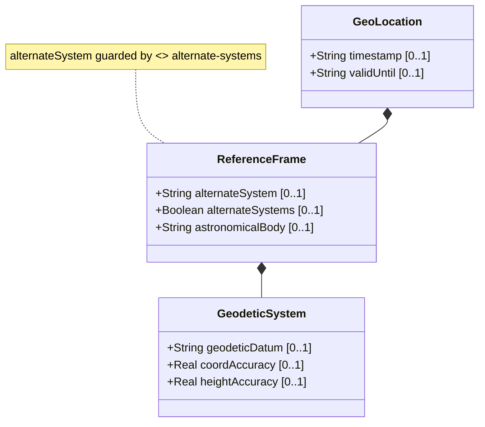

# Feature: Reference Frame

## Parent Epic
- [ ] #7 - [Geo-Location: Geographic Location Specification](https://github.com/gintatkinson/3dgs-027/blob/main/docs/epics/epic-01-geo-location-specification.md) (Defines the spatial frame of reference for location coordinates)
## Description
The Reference Frame defines the spatial context for all location values. It specifies which astronomical body (e.g., Earth, Moon, Mars) the coordinates are relative to, and optionally an alternate system for virtual or non-standard reference frames. This container serves as the foundation for interpreting location data, ensuring that coordinate values have well-defined meaning.

The Reference Frame includes the optional `alternate-system` leaf (guarded by the `alternate-systems` feature) and the `astronomical-body` leaf with a default value of 'earth'.

## UML Class Diagram



## Interface Requirements

### 1. Payload Schema (JSON Schema / Protobuf Example)

```json
{
  "reference-frame": {
    "alternate-system": "vr-instance-42",
    "astronomical-body": "mars"
  }
}
```

### 2. Validation & Constraints

- `alternate-system`: Type is `string`. Conditional leaf present only when the `alternate-systems` feature is enabled (if-feature "alternate-systems"). When present, this value identifies a non-natural-universe system (e.g., virtual reality). When not present, the natural universe is implied. No pattern constraint specified.
- `astronomical-body`: Type is `string` with regex pattern `[ -@\[-\^_-~]*` (ASCII characters 32..64 and 91..126). Default value is `"earth"`. Named per International Astronomical Union (IAU) conventions. Values SHOULD be lowercase with no control characters. Any preceding 'the' in the name SHOULD NOT be included.
- Reference Frame container is optional within geo-location.
- When not specified, the default astronomical body is 'earth' with the natural universe system.

### 3. Logical Operations & Interface Messages

- **READ**: Retrieve the astronomical body and optional alternate system for the reference frame.
- **WRITE**: Set or update the astronomical body and optional alternate system.
- **INHERIT**: In nested location scenarios, the reference-frame may be inherited from a parent container, avoiding repetition.
- The reference-frame values define the context for interpreting all child coordinate and velocity data.

### 4. Logical Exception States & Validation Failures

- **Invalid astronomical body string**: If the astronomical-body value contains control characters or values outside ASCII ranges 32..64 and 91..126, the value MUST be rejected.
- **Empty astronomical body string**: An empty string for astronomical-body is technically valid per the pattern (space is allowed) but semantically meaningless; implementations SHOULD treat this as invalid or revert to the default "earth".
- **alternate-system specified without feature support**: If the `alternate-systems` feature is not supported by the implementation, the alternate-system leaf MUST NOT be present; if received, it MUST be silently dropped or rejected per implementation policy.
- **Unknown astronomical body**: If the specified astronomical-body value is not recognized (e.g., not a known IAU designation), the system MAY accept it but SHOULD log a warning.

## Given-When-Then Acceptance Criteria

**Scenario: Default reference frame for Earth**
- Given a geo-location record is created without specifying a reference frame
- When the astronomical-body value is queried
- Then the default value 'earth' is returned and the natural universe system is implied

**Scenario: Specify a non-Earth astronomical body**
- Given a system that supports geo-location records
- When a reference frame is configured with astronomical-body set to 'mars'
- Then the system stores and retrieves 'mars' as the astronomical body, and all coordinate interpretations are relative to Mars

**Scenario: Enable alternate system with feature support**
- Given a system where the `alternate-systems` feature is enabled
- When a reference frame is configured with alternate-system set to 'vr-training-ground'
- Then the system stores and retrieves the alternate system value, and coordinate meanings are defined within that alternate system

**Scenario: Alternate system rejected without feature support**
- Given a system where the `alternate-systems` feature is NOT enabled
- When a reference frame is configured with an alternate-system value
- Then the alternate-system value is rejected or silently dropped, and the natural universe system is used

**Scenario: Validate astronomical body name pattern**
- Given a reference frame is being configured
- When the astronomical-body value contains control characters (ASCII 0..31 or 127)
- Then the value MUST be rejected as invalid per the schema pattern constraint

**Scenario: Uppercase astronomical body converted to lowercase**
- Given a reference frame configuration
- When the astronomical-body value is specified in uppercase (e.g., 'EARTH')
- Then the value SHOULD be converted to lowercase ('earth') for storage per the schema description

**Scenario: Astronomical body name with preceding 'the' stripped**
- Given a reference frame configuration
- When the astronomical-body value contains a preceding 'the' (e.g., 'the moon')
- Then the value SHOULD have 'the' stripped and be stored as 'moon' per the schema description

**Scenario: Inherit reference frame from parent in nested locations**
- Given a nested location hierarchy where a parent container has a reference frame defining astronomical-body as 'enceladus'
- When a child location is created without specifying its own reference frame
- Then the child location inherits the parent's reference frame with astronomical-body 'enceladus'

**Scenario: Override inherited reference frame**
- Given a nested location hierarchy with an inherited reference frame
- When a child location specifies its own astronomical-body value
- Then the child's explicitly specified value takes precedence over the inherited value

**Scenario: Alternate system modifies non-astronomical-body values**
- Given a reference frame with an alternate system configured
- When the geodetic-datum or coordinate values are interpreted
- Then the alternate system modifies the definition (but not the type) of those values per the schema

## Specification Context (Verbatim)

From RFC 9179 Section 2.1:
> The frame of reference ('reference-frame') defines what the location values refer to and their meaning. The referred-to object can be any astronomical body. It could be a planet such as Earth or Mars, a moon such as Enceladus, an asteroid such as Ceres, or even a comet such as 1P/Halley. This value is specified in 'astronomical-body' and is defined by the International Astronomical Union. The default 'astronomical-body' value is 'earth'.

> Finally, we define an optional feature that allows for changing the system for which the above values are defined. This optional feature adds an 'alternate-system' value to the reference frame. This value is normally not present, which implies the natural universe is the system. The use of this value is intended to allow for creating virtual realities or perhaps alternate coordinate systems.

From the YANG schema (astronomical-body):
> An astronomical body as named by the International Astronomical Union (IAU) or according to the alternate system if specified. Examples include 'sun' (our star), 'earth' (our planet), 'moon' (our moon), 'enceladus' (a moon of Saturn), 'ceres' (an asteroid), and '67p/churyumov-gerasimenko (a comet).

## 4. Source References
Structural Schema: [ietf-geo-location.yang](https://github.com/YangModels/yang/blob/main/standard/ietf/RFC/ietf-geo-location%402022-02-11.yang)
Normative Specification: [RFC 9179 - A YANG Grouping for Geographic Locations](https://datatracker.ietf.org/doc/rfc9179/)

## 5. Logical UI & Layout Bindings
- **Target LUI Component:** PropertyGrid
- **Target Layout Container ID:** `properties_view`
- **Data Source Bindings:** `schema:generic-topology/topology/component[@id='active_focused_element']`
