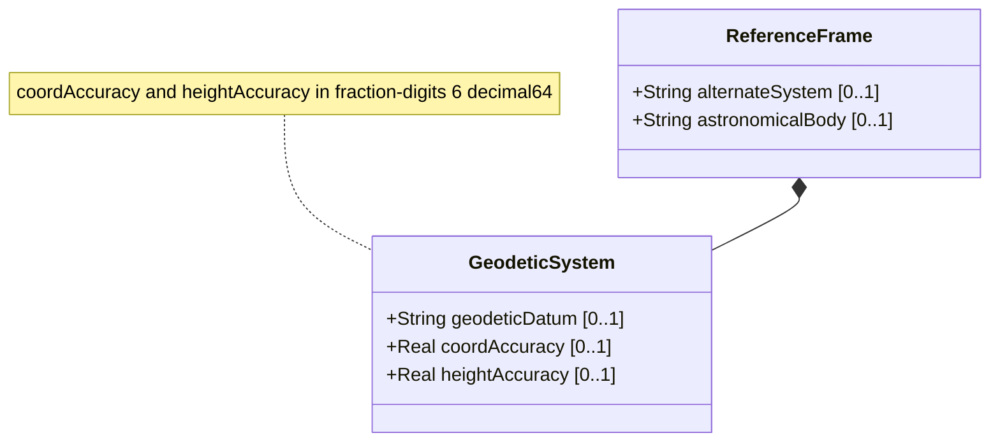

# Feature: Geodetic System

## Parent Epic
- [ ] #7 - [Geo-Location: Geographic Location Specification](https://github.com/gintatkinson/3dgs-027/blob/main/docs/epics/epic-01-geo-location-specification.md) (Defines the geodetic datum and coordinate accuracy for interpreting location measurements)
## Description
The Geodetic System defines how coordinate values map to physical positions on an astronomical body. It specifies the geodetic datum (a mathematical model of the body's shape), the coordinate accuracy (how precisely the horizontal position has been determined), and the height accuracy (the precision of elevation measurements).

The default geodetic datum for Earth is 'wgs-84' (World Geodetic System 1984), which is used by GPS. An IANA registry provides standard values for alternative datums. Accuracy values indicate measurement uncertainty and may override default accuracy implied by the datum.

## UML Class Diagram



## Interface Requirements

### 1. Payload Schema (JSON Schema / Protobuf Example)

```json
{
  "geodetic-system": {
    "geodetic-datum": "wgs-84",
    "coord-accuracy": 0.000001,
    "height-accuracy": 0.01
  }
}
```

### 2. Validation & Constraints

- `geodetic-datum`: Type is `string` with regex pattern `[ -@\[-\^_-~]*` (ASCII characters 32..64 and 91..126). Identifies the geodetic system (e.g., 'wgs-84', 'wgs-84-96', 'wgs-84-08', 'me' for Mean Earth/Polar Axis on Moon). Values MUST be lowercase, spaces MUST be changed to dashes '-'. No default in schema but RFC 9179 specifies 'wgs-84' as default when astronomical body is 'earth'. Value is registered in IANA Geodetic System Values registry.
- `coord-accuracy`: Type is `decimal64` with 6 fraction digits. Represents the accuracy of latitude/longitude pair for ellipsoidal coordinates, or the X/Y/Z components for Cartesian coordinates. When specified, indicates how precisely coordinates have been determined with respect to the coordinate system. No units specified (unit-less precision indicator).
- `height-accuracy`: Type is `decimal64` with 6 fraction digits. Units: "meters". Represents the accuracy of the height value for ellipsoidal coordinates. This value is not used with Cartesian coordinates. When specified, indicates how precisely heights have been determined.
- `height-accuracy` MUST NOT be negative; accuracy is a magnitude.
- `coord-accuracy` MUST NOT be negative; accuracy is a magnitude.
- The geodetic-system container and all its leaf nodes are optional.

### 3. Logical Operations & Interface Messages

- **READ**: Retrieve the geodetic datum, coordinate accuracy, and height accuracy values.
- **WRITE**: Configure the geodetic datum and accuracy parameters for a geo-location record.
- **DEFAULT**: When geodetic-datum is not specified and astronomical-body is 'earth', the effective default is 'wgs-84'.
- **OVERRIDE**: The coord-accuracy and height-accuracy values, when specified, override the default accuracy implied by the geodetic-datum.

### 4. Logical Exception States & Validation Failures

- **Invalid geodetic datum format**: If the geodetic-datum contains control characters or characters outside the allowed ASCII ranges, the value MUST be rejected.
- **Unknown geodetic datum**: If the geodetic-datum value is not registered in the IANA Geodetic System Values registry, the system SHOULD accept it but MAY log a warning.
- **Negative accuracy values**: If coord-accuracy or height-accuracy is set to a negative value, the value MUST be rejected as semantically invalid (accuracy cannot be negative).
- **Zero accuracy**: Zero accuracy means the coordinate or height is known exactly with no uncertainty; this is valid but typically unrealistic.
- **Height accuracy with Cartesian coordinates**: If height-accuracy is specified for a location using Cartesian coordinates, the value is semantically irrelevant and SHOULD be ignored per the schema semantics.
- **Excessive precision beyond fraction-digits**: Values with more than 6 fraction digits for accuracy types MUST be rounded or rejected per the decimal64 type constraint.

## Given-When-Then Acceptance Criteria

**Scenario: Default geodetic datum for Earth**
- Given a geo-location record on Earth without a specified geodetic datum
- When the effective geodetic datum is queried
- Then the system returns 'wgs-84' as the default geodetic datum

**Scenario: Specify a non-default geodetic datum**
- Given a geo-location record
- When the geodetic-datum is set to 'wgs-84-08'
- Then the system stores 'wgs-84-08' and interprets all coordinates according to the World Geodetic System 1984 EGM08 model

**Scenario: Non-Earth geodetic datum**
- Given a geo-location record for the Moon (astronomical-body = 'moon')
- When the geodetic-datum is set to 'me' (Mean Earth/Polar Axis)
- Then the system stores 'me' and interprets coordinates using the Mean Earth/Polar Axis lunar reference system

**Scenario: Specify coordinate accuracy**
- Given a geo-location record with ellipsoidal coordinates
- When coord-accuracy is set to 0.000001 (indicating micro-degree precision)
- Then the system stores the accuracy value and reports that the latitude/longitude pair has been determined to that precision

**Scenario: Specify height accuracy**
- Given a geo-location record with ellipsoidal coordinates including height
- When height-accuracy is set to 0.5 (meters)
- Then the system stores the accuracy value and reports that height has been determined to within 0.5 meters precision

**Scenario: Override default accuracy**
- Given a geodetic-datum that implies a default accuracy
- When coord-accuracy is explicitly set to a value different from the datum's default
- Then the explicit coord-accuracy value overrides the datum's default accuracy

**Scenario: Reject negative coordinate accuracy**
- Given a geo-location record
- When coord-accuracy is set to a negative value
- Then the value MUST be rejected with a validation error indicating accuracy must be non-negative

**Scenario: Reject negative height accuracy**
- Given a geo-location record
- When height-accuracy is set to a negative value
- Then the value MUST be rejected with a validation error indicating accuracy must be non-negative

**Scenario: Upper and lower case conversion for geodetic datum**
- Given a geodetic-datum value specified with uppercase characters (e.g., 'WGS-84')
- When the value is stored
- Then it SHOULD be converted to lowercase ('wgs-84') per the schema and registry rules

**Scenario: Space to dash conversion for geodetic datum**
- Given a geodetic-datum value containing spaces (e.g., 'wgs 84')
- When the value is stored or registered
- Then spaces MUST be converted to dashes ('wgs-84') per the IANA registry rules

**Scenario: Reject decimal with excessive fractional digits**
- Given the coord-accuracy type constraint of fraction-digits 6
- When a value with 7 or more fraction digits is provided
- Then the value MUST be rejected or rounded to 6 fraction digits

## Specification Context (Verbatim)

From RFC 9179 Section 2.1:
> In addition to identifying the astronomical body, we also need to define the meaning of the coordinates (e.g., latitude and longitude) and the definition of 0-height. This is done with a 'geodetic-datum' value. The default value for 'geodetic-datum' is 'wgs-84' (i.e., the World Geodetic System [WGS84]), which is used by the Global Positioning System (GPS) among many others. We define an IANA registry for specifying standard values for the 'geodetic-datum'.

> In addition to the 'geodetic-datum' value, we allow overriding the coordinate and height accuracy using 'coord-accuracy' and 'height-accuracy', respectively. When specified, these values override the defaults implied by the 'geodetic-datum' value.

From the YANG schema (geodetic-datum):
> A geodetic-datum defining the meaning of latitude, longitude, and height. The specification for the geodetic-datum indicates how accurately it models the astronomical body in question, both for the 'horizontal' latitude/longitude coordinates and for height coordinates.

## 4. Source References
Structural Schema: [ietf-geo-location.yang](https://github.com/YangModels/yang/blob/main/standard/ietf/RFC/ietf-geo-location%402022-02-11.yang)
Normative Specification: [RFC 9179 - A YANG Grouping for Geographic Locations](https://datatracker.ietf.org/doc/rfc9179/)

## 5. Logical UI & Layout Bindings
- **Target LUI Component:** PropertyGrid
- **Target Layout Container ID:** `properties_view`
- **Data Source Bindings:** `schema:generic-topology/topology/component[@id='active_focused_element']`
