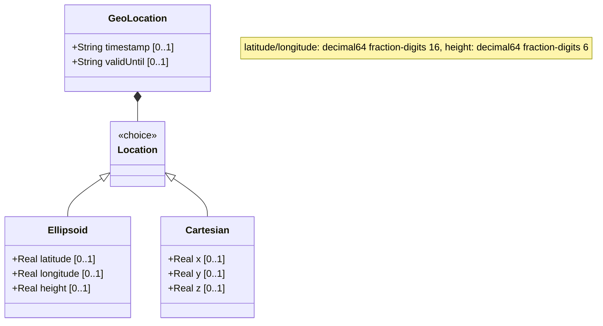

# Feature: Ellipsoidal Coordinates

## Parent Epic
- [ ] #7 - [Geo-Location: Geographic Location Specification](https://github.com/gintatkinson/3dgs-027/blob/main/docs/epics/epic-01-geo-location-specification.md) (Specifies location using latitude, longitude, and optional height)
## Description
Ellipsoidal Coordinates represent a location on an astronomical body using a spherical/ellipsoidal coordinate system: latitude (angular distance north/south from equator), longitude (angular distance east/west from prime meridian), and an optional height (distance from a reference surface). This is one of two mutually exclusive location representations in the geo-location grouping (the other being Cartesian coordinates).

The coordinate values are decimal degrees for latitude and longitude, and meters for height. The precision and meaning of these values are defined by the enclosing reference frame and geodetic system.

## UML Class Diagram



## Interface Requirements

### 1. Payload Schema (JSON Schema / Protobuf Example)

```json
{
  "location": {
    "ellipsoid": {
      "latitude": 40.7329700000000000,
      "longitude": -74.0076960000000000,
      "height": 35.000000
    }
  }
}
```

### 2. Validation & Constraints

- `latitude`: Type is `decimal64` with 16 fraction digits. Units: "decimal degrees". Represents the angular position north or south of the equator. Valid range is approximately -90.0 to +90.0 decimal degrees. The definition and precision are indicated by the reference-frame.
- `longitude`: Type is `decimal64` with 16 fraction digits. Units: "decimal degrees". Represents the angular position east or west of the prime meridian. Valid range is approximately -180.0 to +180.0 decimal degrees. The definition and precision are indicated by the reference-frame.
- `height`: Type is `decimal64` with 6 fraction digits. Units: "meters". Represents the vertical distance from a reference 0 value. The precision and '0' value are defined by the reference-frame. Optional (height may be unspecified for 2D coordinates).
- Latitude and longitude values outside their valid angular ranges MUST be rejected.
- Latitude and longitude are both optional; however, a meaningful location typically requires both.
- The ellipsoid case is mutually exclusive with the cartesian case (YANG `choice`).

### 3. Logical Operations & Interface Messages

- **READ**: Retrieve the latitude, longitude, and height values for a geo-location using ellipsoidal coordinates.
- **WRITE**: Set the latitude, longitude, and optional height values.
- **CONVERT**: Transform ellipsoidal coordinates to Cartesian coordinates (and vice versa) when the geodetic-datum supports both representations. The conversion depends on the reference frame and geodetic system.
- **VALIDATE**: Verify that latitude is within [-90, +90], longitude within [-180, +180], and height is a valid finite number.

### 4. Logical Exception States & Validation Failures

- **Latitude out of range**: If latitude is less than -90.0 or greater than +90.0, the value MUST be rejected with a validation error.
- **Longitude out of range**: If longitude is less than -180.0 or greater than +180.0, the value MUST be rejected with a validation error.
- **Missing both latitude and longitude**: A coordinate record with neither latitude nor longitude is semantically empty; the system MAY reject or treat as unpositioned.
- **Height specified without latitude/longitude**: A valid ellipsoidal position minimally requires latitude and longitude; height alone is insufficient.
- **Excessive precision beyond fraction-digits**: Values with more than 16 fraction digits for latitude/longitude or more than 6 for height MUST be rounded or rejected.
- **Infinite or NaN values**: Non-finite values for any coordinate component MUST be rejected.
- **Coordinate precision mismatch with geodetic-datum**: If the datum implies lower precision than the coordinate values, the system SHOULD note the discrepancy.

## Given-When-Then Acceptance Criteria

**Scenario: Store a valid 2D ellipsoidal location**
- Given a reference frame set to Earth with WGS-84 datum
- When latitude is set to 40.73297 and longitude is set to -74.007696
- Then the system stores the coordinates and reports the location at 40.73297 degrees North, 74.007696 degrees West

**Scenario: Store a valid 3D ellipsoidal location with height**
- Given a reference frame set to Earth with WGS-84 datum
- When latitude is set to 48.8583424, longitude to 2.3375084, and height to 35.0 meters
- Then the system stores all three coordinate values and reports a 3D location

**Scenario: Store a location with only latitude**
- Given an ellipsoidal coordinate record
- When only latitude is specified (no longitude, no height)
- Then the system stores the latitude value but the location is incomplete for 2D positioning

**Scenario: Reject latitude above maximum range**
- Given a geo-location record
- When latitude is set to 90.000001 decimal degrees
- Then the value MUST be rejected with a validation error indicating latitude exceeds 90.0 degrees

**Scenario: Reject latitude below minimum range**
- Given a geo-location record
- When latitude is set to -90.000001 decimal degrees
- Then the value MUST be rejected with a validation error indicating latitude is below -90.0 degrees

**Scenario: Reject longitude above maximum range**
- Given a geo-location record
- When longitude is set to 180.000001 decimal degrees
- Then the value MUST be rejected with a validation error indicating longitude exceeds 180.0 degrees

**Scenario: Reject longitude below minimum range**
- Given a geo-location record
- When longitude is set to -180.000001 decimal degrees
- Then the value MUST be rejected with a validation error indicating longitude is below -180.0 degrees

**Scenario: Accept latitude at exact boundary**
- Given a geo-location record
- When latitude is set to exactly 90.0 decimal degrees
- Then the system accepts and stores the value (this represents the North Pole)

**Scenario: Accept longitude at exact boundary**
- Given a geo-location record
- When longitude is set to exactly -180.0 decimal degrees
- Then the system accepts and stores the value

**Scenario: High-precision coordinate rounding**
- Given the latitude type constraint of 16 fraction digits
- When a latitude value with 17 fraction digits is provided
- Then the value MUST be rounded to 16 fraction digits or rejected

## Specification Context (Verbatim)

From RFC 9179 Section 2.2:
> This is the location on, or relative to, the astronomical object. It is specified using two or three coordinate values. These values are given either as 'latitude', 'longitude', and an optional 'height', or as Cartesian coordinates of 'x', 'y', and 'z'. For the standard location choice, 'latitude' and 'longitude' are specified as decimal degrees, and the 'height' value is in fractions of meters.

From RFC 9179 Section 4 (ISO 6709:2008 Conformance):
> For test 'A.1.2.4', the YANG geo-location object either includes a Coordinate Reference System (CRS) ('reference-frame') or has a default defined [WGS84].

## 4. Source References
Structural Schema: [ietf-geo-location.yang](https://github.com/YangModels/yang/blob/main/standard/ietf/RFC/ietf-geo-location%402022-02-11.yang)
Normative Specification: [RFC 9179 - A YANG Grouping for Geographic Locations](https://datatracker.ietf.org/doc/rfc9179/)

## 5. Logical UI & Layout Bindings
- **Target LUI Component:** PropertyGrid
- **Target Layout Container ID:** `properties_view`
- **Data Source Bindings:** `schema:generic-topology/topology/component[@id='active_focused_element']`
