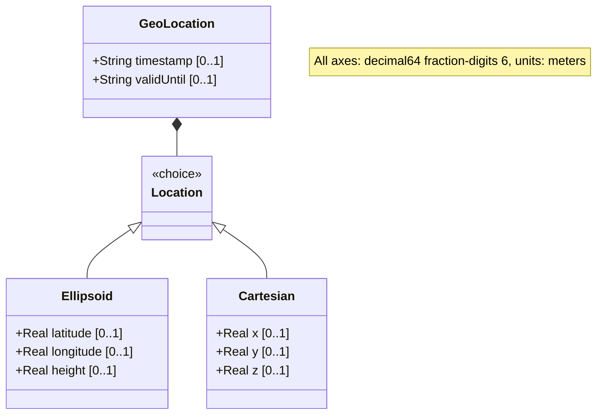

# Feature: Cartesian Coordinates

## Parent Epic
- [ ] #7 - [Geo-Location: Geographic Location Specification](https://github.com/gintatkinson/3dgs-027/blob/main/docs/epics/epic-01-geo-location-specification.md) (Specifies location using X, Y, Z Cartesian coordinates)
## Description
Cartesian Coordinates represent a location on an astronomical body using a three-dimensional X/Y/Z coordinate system. Each component represents a distance in meters along its respective axis as defined by the reference frame. This provides an alternative to the ellipsoidal (latitude/longitude/height) system and is mutually exclusive with it.

All three coordinate components (X, Y, Z) are specified in fractional meters with 6 decimal digits of precision. The exact meaning and origin of each axis are defined by the enclosing reference frame and geodetic system.

## UML Class Diagram



## Interface Requirements

### 1. Payload Schema (JSON Schema / Protobuf Example)

```json
{
  "location": {
    "cartesian": {
      "x": 1284500.123456,
      "y": -4654300.654321,
      "z": 4133500.000000
    }
  }
}
```

### 2. Validation & Constraints

- `x`: Type is `decimal64` with 6 fraction digits. Units: "meters". The X value as defined by the reference-frame.
- `y`: Type is `decimal64` with 6 fraction digits. Units: "meters". The Y value as defined by the reference-frame.
- `z`: Type is `decimal64` with 6 fraction digits. Units: "meters". The Z value as defined by the reference-frame.
- All three components are optional per the schema; however, a meaningful Cartesian location requires all three axes.
- The cartesian case is mutually exclusive with the ellipsoid case (YANG `choice`).
- No explicit range constraints on X, Y, Z values in the schema; the range is implicitly bounded by the decimal64 representation.
- Cartesian coordinates are typically used for Earth-Centered Earth-Fixed (ECEF) coordinate systems or other right-handed 3D coordinate systems defined by the reference frame.

### 3. Logical Operations & Interface Messages

- **READ**: Retrieve the X, Y, Z coordinate values for a geo-location using the Cartesian system.
- **WRITE**: Set the X, Y, Z coordinate values.
- **CONVERT**: Transform Cartesian coordinates to ellipsoidal coordinates (and vice versa) when the geodetic-datum supports both representations. The conversion formula depends on the reference frame and geodetic system parameters.
- **DISTANCE**: Calculate Euclidean distance between two Cartesian coordinate points using the standard 3D distance formula.

### 4. Logical Exception States & Validation Failures

- **Incomplete coordinate set**: If only one or two of X, Y, Z are specified, the coordinate is incomplete for 3D positioning. The system MAY accept partial data but MUST flag it as incomplete.
- **Excessive precision beyond fraction-digits**: Values with more than 6 fraction digits must be rounded or rejected per the decimal64 type constraint.
- **Infinite or NaN values**: Non-finite values for any coordinate component must be rejected.
- **Coordinate origin ambiguity**: Without a properly defined reference frame, the meaning of the coordinate values is undefined. The system MUST ensure the reference frame is specified before accepting Cartesian coordinates.
- **Conversion loss**: When converting from ellipsoidal to Cartesian coordinates (or vice versa), some precision may be lost. The system SHOULD document the precision characteristics of the conversion.

## Given-When-Then Acceptance Criteria

**Scenario: Store a valid 3D Cartesian location**
- Given a reference frame defining a Cartesian coordinate system
- When X is set to 1284500.123456, Y to -4654300.654321, and Z to 4133500.000000 (all in meters)
- Then the system stores all three coordinate values and reports a valid 3D Cartesian location

**Scenario: Store a Cartesian location with partial coordinates**
- Given a Cartesian coordinate record
- When only X and Y are specified (Z is omitted)
- Then the system stores the available values but flags the location as incomplete for 3D positioning

**Scenario: Mutually exclusive with ellipsoidal coordinates**
- Given a geo-location record with ellipsoidal coordinates already set
- When Cartesian coordinates are written to the same record
- Then the ellipsoidal coordinates are replaced by the Cartesian coordinates (only one location representation is active)

**Scenario: Convert from Cartesian to ellipsoidal coordinates**
- Given a Cartesian coordinate (X, Y, Z) and a known geodetic datum (e.g., WGS-84)
- When a conversion to ellipsoidal coordinates is requested
- Then the system computes and returns the equivalent latitude, longitude, and height values

**Scenario: Convert from ellipsoidal to Cartesian coordinates**
- Given an ellipsoidal coordinate (latitude, longitude, height) and a known geodetic datum
- When a conversion to Cartesian coordinates is requested
- Then the system computes and returns the equivalent X, Y, Z values

**Scenario: Calculate distance between two Cartesian points**
- Given two Cartesian coordinate points (X1, Y1, Z1) and (X2, Y2, Z2)
- When the Euclidean distance between them is calculated using the formula sqrt((X2-X1)^2 + (Y2-Y1)^2 + (Z2-Z1)^2)
- Then the system returns the correct straight-line distance in meters

**Scenario: Zero-origin coordinates**
- Given a Cartesian coordinate system
- When X, Y, and Z are all set to 0.0
- Then the location is at the origin of the reference frame's coordinate system

**Scenario: Large coordinate values**
- Given a Cartesian coordinate system
- When coordinate values approach the maximum representable decimal64 range
- Then the system stores and retrieves the values without overflow or data loss

**Scenario: Reject excessive fractional digits**
- Given the decimal64 fraction-digits constraint of 6
- When a Cartesian coordinate value with 7 or more fraction digits is provided
- Then the value must be rounded to 6 fraction digits or rejected

**Scenario: Reject non-finite values**
- Given a Cartesian coordinate record
- When any component (X, Y, or Z) is set to NaN, Infinity, or -Infinity
- Then the value must be rejected as invalid

## Specification Context (Verbatim)

From RFC 9179 Section 2.2:
> For the Cartesian choice, 'x', 'y', and 'z' are in fractions of meters. In both choices, the exact meanings of all the values are defined by the 'geodetic-datum' value in Section 2.1.

From the YANG schema (x leaf):
> The X value as defined by the reference-frame.

From the YANG schema (y leaf):
> The Y value as defined by the reference-frame.

From the YANG schema (z leaf):
> The Z value as defined by the reference-frame.

## 4. Source References
Structural Schema: [ietf-geo-location.yang](https://github.com/YangModels/yang/blob/main/standard/ietf/RFC/ietf-geo-location%402022-02-11.yang)
Normative Specification: [RFC 9179 - A YANG Grouping for Geographic Locations](https://datatracker.ietf.org/doc/rfc9179/)

## 5. Logical UI & Layout Bindings
- **Target LUI Component:** PropertyGrid
- **Target Layout Container ID:** `properties_view`
- **Data Source Bindings:** `schema:generic-topology/topology/component[@id='active_focused_element']`
