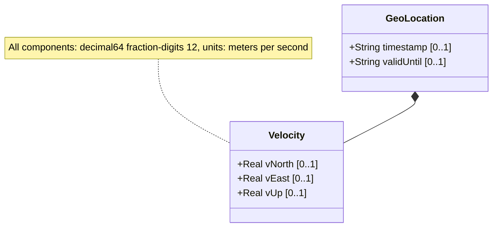

# Feature: Velocity Vector

## Parent Epic
- [ ] #7 - [Geo-Location: Geographic Location Specification](https://github.com/gintatkinson/3dgs-027/blob/main/docs/epics/epic-01-geo-location-specification.md) (Defines a three-dimensional velocity vector for objects in motion)
## Description
The Velocity Vector captures the motion of an object at the time recorded by the timestamp. It defines a three-dimensional velocity with components: v-north (speed toward true north), v-east (speed perpendicular to the right of true north), and v-up (speed away from the center of mass). All components are expressed in meters per second.

This feature supports both near-real-time tracking of moving objects and slow-motion tracking (e.g., continental drift). The velocity vector can be converted to two-dimensional speed and heading using formulas specified in RFC 9179. More complex motion patterns are outside the scope of this grouping.

## UML Class Diagram



## Interface Requirements

### 1. Payload Schema (JSON Schema / Protobuf Example)

```json
{
  "velocity": {
    "v-north": 0.500000000000,
    "v-east": -0.100000000000,
    "v-up": 0.001000000000
  }
}
```

### 2. Validation & Constraints

- `v-north`: Type is `decimal64` with 12 fraction digits. Units: "meters per second". Rate of change (speed) towards true north as defined by the geodetic-system.
- `v-east`: Type is `decimal64` with 12 fraction digits. Units: "meters per second". Rate of change (speed) perpendicular to the right of true north as defined by the geodetic-system.
- `v-up`: Type is `decimal64` with 12 fraction digits. Units: "meters per second". Rate of change (speed) away from the center of mass. Positive values indicate movement away from the center of the astronomical body.
- All three velocity components are optional.
- The velocity vector describes motion at the time given by the timestamp of the geo-location record.
- The velocity container and its children are optional — a stationary object need not specify velocity.

### 3. Logical Operations & Interface Messages

- **READ**: Retrieve the v-north, v-east, and v-up velocity components.
- **WRITE**: Set the velocity components for a geo-location record.
- **CONVERT to speed and heading**: Compute planar speed from v-north and v-east using the formula: `speed = sqrt(v_north^2 + v_east^2)`. Compute heading from the arctangent: `heading = arctan(v_east / v_north)`. The heading is measured clockwise from true north.
- **PROJECT**: Project the object's future position given the current location, velocity, and a time delta using linear interpolation.
- **COMBINE**: Derive 3D speed magnitude from all three components: `speed_3d = sqrt(v_north^2 + v_east^2 + v_up^2)`.

### 4. Logical Exception States & Validation Failures

- **Velocity without timestamp**: A velocity vector without a corresponding timestamp is ambiguous (speed is rate of change over time). The system SHOULD warn or reject a velocity record with no timestamp.
- **Zero velocity vector**: All three components set to exactly zero is valid and indicates the object is stationary.
- **High-velocity values**: Exceptionally high velocity values (e.g., exceeding the speed of light or orbital escape velocity) should be flagged as potentially erroneous but not necessarily rejected.
- **Excessive precision beyond fraction-digits**: Values with more than 12 fraction digits must be rounded or rejected.
- **Infinite or NaN values**: Non-finite velocity values must be rejected.
- **Division by zero in heading calculation**: When v-north is zero, the heading arctangent calculation involves division by zero. The system MUST handle this by returning 90 degrees (v-east positive), 270 degrees (v-east negative), or undefined (both zero).

## Given-When-Then Acceptance Criteria

**Scenario: Store a valid velocity vector for a moving object**
- Given a geo-location record with a timestamp and ellipsoidal coordinates
- When v-north is set to 0.5, v-east to -0.1, and v-up to 0.001 (all in meters per second)
- Then the system stores the velocity vector, and the object's motion is defined at that timestamp

**Scenario: Compute 2D speed from velocity components**
- Given a velocity vector with v-north = 0.5 and v-east = -0.1 meters per second
- When the planar speed is calculated using sqrt(v-north^2 + v-east^2)
- Then the system returns approximately 0.5099 meters per second

**Scenario: Compute heading from velocity components**
- Given a velocity vector with v-north = 1.0 and v-east = 1.0 meters per second
- When the heading is calculated using arctan(v-east / v-north)
- Then the system returns a heading of 45 degrees (northeast direction)

**Scenario: Heading due north (v-east = 0, v-north > 0)**
- Given a velocity vector with v-north = 2.0 and v-east = 0.0 meters per second
- When the heading is calculated
- Then the system returns 0 degrees (due north)

**Scenario: Heading due east (v-north = 0, v-east > 0)**
- Given a velocity vector with v-north = 0.0 and v-east = 2.0 meters per second
- When the heading is calculated
- Then the system returns 90 degrees (due east) without division-by-zero errors

**Scenario: Stationary object with zero velocity**
- Given a geo-location record for a stationary object
- When all velocity components (v-north, v-east, v-up) are set to 0.0
- Then the system stores the zero velocity vector and reports the object as stationary

**Scenario: Object moving upward from center of mass**
- Given a geo-location record
- When v-up is set to a positive value (e.g., 10.0 meters per second)
- Then the system records upward motion away from the center of mass

**Scenario: Project position after time delta using velocity**
- Given a geo-location record at timestamp T with coordinates and velocity (v-north, v-east, v-up)
- When the projected position at time T + delta_t is requested using linear interpolation
- Then the system computes new coordinates by adding (velocity_component * delta_t) to each original coordinate

**Scenario: Velocity without timestamp is ambiguous**
- Given a geo-location record with velocity values but no timestamp
- When the velocity is queried
- Then the system SHOULD warn that the velocity context is incomplete without a reference time

**Scenario: Reject non-finite velocity values**
- Given a velocity record
- When any component is set to NaN, Infinity, or -Infinity
- Then the value must be rejected as invalid

**Scenario: Track continental drift using slow velocities**
- Given a geo-location record representing a tectonic plate position
- When the velocity is set to a very small value (e.g., v-north = 0.000000000035 meters per second, approximately 1.1 mm/year)
- Then the system accurately stores the high-precision small velocity value within the 12 fraction-digit precision

## Specification Context (Verbatim)

From RFC 9179 Section 2.3:
> Support is added for objects in relatively stable motion. For objects in relatively stable motion, the grouping provides a three-dimensional vector value. The components of the vector are 'v-north', 'v-east', and 'v-up', which are all given in fractional meters per second. The values 'v-north' and 'v-east' are relative to true north as defined by the reference frame for the astronomical body; 'v-up' is perpendicular to the plane defined by 'v-north' and 'v-east', and is pointed away from the center of mass.

> To derive the two-dimensional heading and speed, one would use the following formulas:
> speed = sqrt(v_north^2 + v_east^2)
> heading = arctan(v_east / v_north)

> For some applications that demand high accuracy and where the data is infrequently updated, this velocity vector can track very slow movement such as continental drift.

From RFC 9179 Section 2.3 (continued):
> Tracking more complex forms of motion is outside the scope of this work. The intent of the grouping being defined here is to identify where something is located.

## 4. Source References
Structural Schema: [ietf-geo-location.yang](https://github.com/YangModels/yang/blob/main/standard/ietf/RFC/ietf-geo-location%402022-02-11.yang)
Normative Specification: [RFC 9179 - A YANG Grouping for Geographic Locations](https://datatracker.ietf.org/doc/rfc9179/)

## 5. Logical UI & Layout Bindings
- **Target LUI Component:** PropertyGrid
- **Target Layout Container ID:** `properties_view`
- **Data Source Bindings:** `schema:generic-topology/topology/component[@id='active_focused_element']`
