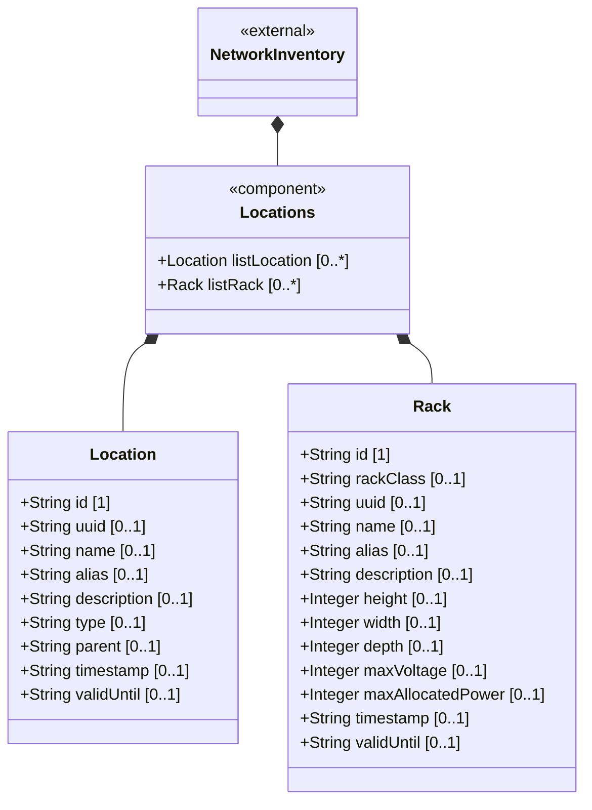

# Feature: Locations Container

## Parent Epic
- [ ] #30 - [Location Hierarchy & Physical Addressing](https://github.com/gintatkinson/3dgs-027/blob/main/docs/epics/epic-02-location-hierarchy.md) (Root container for the locations collection)

## Description
The Locations Container is the top-level container for all location records within the network inventory. It serves as the augmenting root that extends the base network inventory module with location information. The container is read-only (`config false`) and holds the list of location entries and the racks container. As the entry point for all location queries, it provides the namespace scope for location references and hierarchical navigation.

## UML Class Diagram



## Interface Requirements

### 1. Payload Schema (JSON Schema / Protobuf Example)

```json
{
  "ietf-ni-location:locations": {
    "location": [],
    "racks": {
      "rack": []
    }
  }
}
```

### 2. Validation & Constraints

- The `locations` container is read-only (`config false`). Direct write operations to this container are not supported by the controller.
- All child lists (`location` and `rack`) are accessed through this container's namespace.
- The container augments the base network inventory path `/nwi:network-inventory`.
- The container MUST be present when location information is reported by the controller.

### 3. Logical Operations & Interface Messages

- **QUERY**: Retrieve the full locations container, including all location entries and racks, via standard YANG retrieval operations (NETCONF `<get>`, RESTCONF GET).
- **FILTER**: Apply subtree or XPath filters to query specific location entries by attributes (id, name, type, parent).
- **PAGINATE**: For large-scale inventories, the server SHOULD support NETCONF or RESTCONF pagination to avoid overwhelming the client with result sets containing numerous location entries.
- **NAVIGATE**: The container provides the root path for `ni-location-ref` leafref resolution, enabling cross-references between rack assignments and location entries.

### 4. Logical Exception States & Validation Failures

- **Empty collection**: If no location entries exist, the query MUST return an empty location list rather than an error.
- **Pagination overflow**: If a query exceeds the server's configured page size, the server MUST return a partial result set with pagination continuation metadata.
- **Namespace violation**: If a client attempts to access location data outside the augmented namespace, the access MUST be rejected with a schema-mount error.
- **Timeout on large result sets**: For inventories with thousands of locations, unbounded queries MUST time out gracefully after a configured limit, returning partial results rather than blocking indefinitely.

## Given-When-Then Acceptance Criteria

**Scenario: Query all locations from the inventory**
- Given a network inventory controller with location data populated
- When a management client issues a GET operation on the locations container
- Then the response includes the complete location list and racks container with all child data nodes

**Scenario: Filter locations by type**
- Given a network inventory with locations of different types (site, building, room)
- When a client queries the locations container with an XPath filter for `type='building'`
- Then the response includes only location entries where the type equals 'building'

**Scenario: Empty location inventory**
- Given a network inventory controller with no location data recorded
- When a management client queries the locations container
- Then the response includes an empty location list and an empty racks container, with no error

**Scenario: Paginate large location queries**
- Given a network inventory with more location entries than the configured page size
- When a management client requests the locations container
- Then the server returns a paginated response with a subset of location entries and continuation metadata for subsequent pages

**Scenario: Unauthorized read access to locations**
- Given a NETCONF or RESTCONF session with insufficient read permissions for the locations subtree
- When the client attempts to query the locations container
- Then the server rejects the request with an access-denied error per NACM rules

**Scenario: Query with subtree filter for specific location**
- Given a location entry with a known id
- When a client issues a GET with a subtree filter matching the specific location id
- Then the response includes only the matching location entry and its children

**Scenario: Concurrent read operations on locations**
- Given multiple management clients querying the locations container simultaneously
- When each client issues a read-only GET operation
- Then all clients receive consistent snapshot views of the location data without read locks blocking concurrent access

**Scenario: Schema validation of the locations container**
- Given a system bootstrapping its location data model
- When the YANG module `ietf-ni-location` is loaded
- Then the locations container is registered at the `config false` path under the augmented network-inventory root

**Scenario: Query location container with depth-limited retrieval**
- Given a location entry with nested geo-location data and contained chassis
- When a client requests the locations container with a depth limit of 2
- Then only location attributes and direct child containers (physical-address, geo-location root) are returned, excluding deeper descendants

## Specification Context (Verbatim)

From the IETF draft (Section 2):
> The "location" list is generalized to support a variety of geographic location, such as sites, rooms, buildings.

From the IETF draft (Section 6):
> This model serves as a complement to the base inventory, providing a read-only perspective of network inventory location information known to the controller. It reports the physical locations of network elements and components installed in the network, enabling queries for site, rack, and other location-related information associated with network elements and components.

From the IETF draft (Section 6):
> OSS systems and other management applications obtain location information via standard YANG retrieval operations (NETCONF, RESTCONF), such as querying network elements associated with a specific site or rack.

## 4. Source References
Structural Schema: [ietf-ni-location.yang](https://github.com/ietf-ivy-wg/network-inventory-location/blob/main/ietf-ni-location.yang)
Normative Specification: [draft-ietf-ivy-network-inventory-location-06](https://datatracker.ietf.org/doc/html/draft-ietf-ivy-network-inventory-location)

## 5. Logical UI & Layout Bindings
- **Target LUI Component:** PropertyGrid
- **Target Layout Container ID:** `properties_view`
- **Data Source Bindings:** `schema:generic-topology/topology[@id='selected_entity']`
