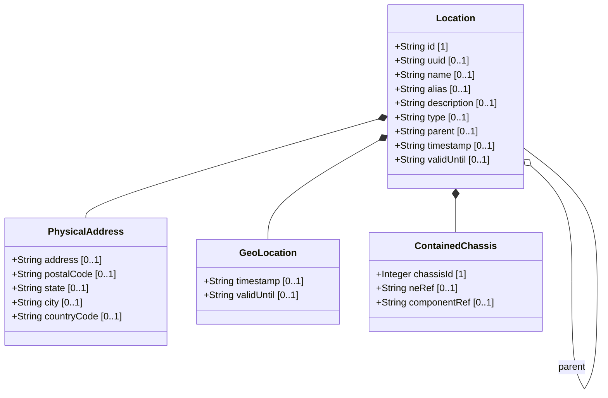

# Feature: Location Entity

## Parent Epic
- [ ] #30 - [Location Hierarchy & Physical Addressing](https://github.com/gintatkinson/3dgs-027/blob/main/docs/epics/epic-02-location-hierarchy.md) (Primary entity for physical location records in the inventory)

## Description
The Location Entity represents a single physical location record within the network inventory. Each location is identified by a unique `id` and supports a hierarchical parent-child relationship through the `parent` leafref. Locations serve as the organizational backbone for grouping network elements, racks, and chassis. The location entity carries descriptive attributes (name, alias, description), a flexible `type` field for custom classification, and temporal metadata (timestamp, valid-until) governing record freshness. It aggregates a physical-address, an optional geo-location, and a list of chassis directly deployed at this location without rack enclosures.

## UML Class Diagram



## Interface Requirements

### 1. Payload Schema (JSON Schema / Protobuf Example)

```json
{
  "location": [
    {
      "id": "Building-A",
      "uuid": "550e8400-e29b-41d4-a716-446655440001",
      "name": "Building A",
      "alias": "HQ-Bldg-A",
      "description": "Main headquarters building",
      "type": "building",
      "parent": "Foo-Enterprise-Campus",
      "timestamp": "2026-01-15T08:30:00Z",
      "valid-until": "2030-12-31T23:59:59Z",
      "physical-address": {},
      "geo-location": {},
      "contained-chassis": []
    }
  ]
}
```

### 2. Validation & Constraints

- `id`: Type is `string`. This is the key for the location list. Must be unique within the locations container. No additional constraints specified in schema.
- `uuid`: Type is `yang:uuid` (string formatted per RFC 4122). Optional. Provides a globally unique identifier for the location.
- `name`: Type is `string`. Optional. Human-readable name for the location (inherited from `basic-common-entity-attributes` grouping).
- `alias`: Type is `string`. Optional. Alternative name for the location (inherited from `basic-common-entity-attributes` grouping).
- `description`: Type is `string`. Optional. Free-text description of the location (inherited from `basic-common-entity-attributes` grouping).
- `type`: Type is `string`. Optional. Flexible location classification enabling operators to define custom types (e.g., 'site', 'building', 'room', 'floor', 'pole', 'roof'). String-based design allows dynamic adaptation without model extensions.
- `parent`: Type is leafref to `../../location/id`. Optional. Establishes the hierarchical parent-child relationship. Must reference an existing location id.
- `timestamp`: Type is `yang:date-and-time`. Optional. Recording time of the location information.
- `valid-until`: Type is `yang:date-and-time`. Optional. Expiration timestamp. If unspecified, the location has no specific expiration time.
- All data nodes under the location list are read-only (`config false`).
- The `parent` leafref MUST NOT create circular references. Referential integrity between parent and child locations must be maintained.

### 3. Logical Operations & Interface Messages

- **QUERY**: Retrieve location entries by id, type, name, or parent filter.
- **NAVIGATE**: Traverse the location hierarchy using the parent leafref to build the containment tree.
- **RESOLVE**: Resolve the parent location to retrieve the full hierarchy chain up to the root site.
- **IDENTIFY**: Look up a location by its uuid for cross-system correlation.
- **VALIDATE**: Check whether the current time exceeds the valid-until timestamp to determine if the location record is stale.
- The location entity is accessed through the `/nwi:network-inventory/nil:locations/nil:location` path.

### 4. Logical Exception States & Validation Failures

- **Circular parent reference**: If a location's parent is set to itself or creates a circular chain, the system MUST reject the configuration and report a referential integrity violation.
- **Dangling parent reference**: If the location's parent references a non-existent location id, the referential integrity check MUST fail.
- **Missing id**: The id is a mandatory key. Attempting to create a location without an id MUST be rejected with a key-violation error.
- **Expired location**: If valid-until is specified and earlier than the current system time, queries to the location data MUST return a warning that the record is stale.
- **Duplicate id**: Since id is the list key, duplicate id values within the locations list MUST be rejected with a data-exists error.
- **Type coercion failure**: If the uuid field receives a value not conforming to RFC 4122 format, the system MUST reject it with a type-validation error.

## Given-When-Then Acceptance Criteria

**Scenario: Create a new location record with required id**
- Given a network inventory location system
- When a location record is submitted with a unique id and optional descriptive attributes (name, type, parent)
- Then the location is stored and retrievable by its id

**Scenario: Retrieve a location by id**
- Given a location with a known id exists in the inventory
- When a management client queries the location list filtered by the specific id
- Then the response includes the full location record with all child containers

**Scenario: Build hierarchical location tree**
- Given multiple location entries with parent references forming a hierarchy (Site -> Building -> Room)
- When a client traverses the parent chain from a child location up to the root
- Then the complete hierarchy is resolved correctly at each level

**Scenario: Store location with type classification**
- Given a system supporting flexible location types
- When a location is recorded with a custom type string (e.g., 'roof' or 'pole')
- Then the type is persisted and the location is filterable by that type value

**Scenario: Store location with uuid for cross-system reference**
- Given a location record being created
- When a valid RFC 4122 uuid is provided
- Then the uuid is stored and the location is uniquely identifiable across distributed inventory systems

**Scenario: Reject duplicate location id**
- Given an existing location with id 'Building-A'
- When a second location is submitted with the same id 'Building-A'
- Then the system rejects the second record with a data-exists error

**Scenario: Reject circular parent reference**
- Given location A has parent B, and B has parent A as a proposed update
- When the circular parent chain is detected during validation
- Then the system rejects the update and reports a referential integrity violation

**Scenario: Query locations with empty optional fields**
- Given a location record stored with only the mandatory id field
- When the location is retrieved
- Then all optional fields (name, alias, description, type, parent, uuid, timestamp, valid-until) are returned as absent/null

**Scenario: Location record passes schema validation**
- Given a location record with all fields conforming to their YANG type constraints
- When the record is validated against the ietf-ni-location schema
- Then the validation passes with no errors

**Scenario: Reject location with invalid uuid format**
- Given a location record being created with a uuid value
- When the uuid does not conform to RFC 4122 format
- Then the system rejects the record with a type-validation error for the uuid field

## Specification Context (Verbatim)

From the IETF draft (Section 2):
> A site represents a general geographic location to group a set of NEs and corresponding inventory components. NEs, racks, equipment rooms, and buildings can be grouped within a site.

From the IETF draft (Section 2):
> Locations can be nested to form a hierarchy. For example, buildings may be within a site, and a room may be within a building.

From the YANG schema (type leaf):
> The type of network inventory location, e.g. equipment room, building, or site. This allows operators to flexibly define custom location types (e.g., 'pole', 'roof', 'floor') based on their specific network scenarios without requiring model extensions.

From the IETF draft (Section 6):
> Data quality is indicated through timestamps recording the last update time, as well as an optional expiration time for location validity.

## 4. Source References
Structural Schema: [ietf-ni-location.yang](https://github.com/ietf-ivy-wg/network-inventory-location/blob/main/ietf-ni-location.yang)
Normative Specification: [draft-ietf-ivy-network-inventory-location-06](https://datatracker.ietf.org/doc/html/draft-ietf-ivy-network-inventory-location)

## 5. Logical UI & Layout Bindings
- **Target LUI Component:** PropertyGrid
- **Target Layout Container ID:** `properties_view`
- **Data Source Bindings:** `schema:generic-topology/topology/component[@id='active_focused_element']`
