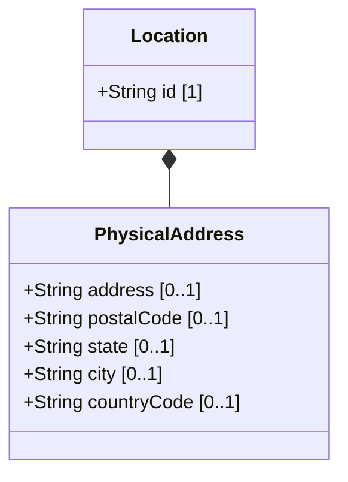

# Feature: Physical Address

## Parent Epic
- [ ] #30 - [Location Hierarchy & Physical Addressing](https://github.com/gintatkinson/3dgs-027/blob/main/docs/epics/epic-02-location-hierarchy.md) (Physical postal address associated with a location)

## Description
The Physical Address container holds postal address information associated with a location. It provides structured fields for street address, postal code, state or region, city, and the ISO ALPHA-2 country code. This information is critical for field dispatch, planning, and human-readable location identification. The physical address complements geo-location data, providing the human-oriented address reference alongside geographic coordinates.

## UML Class Diagram



## Interface Requirements

### 1. Payload Schema (JSON Schema / Protobuf Example)

```json
{
  "physical-address": {
    "address": "123 Foo Street, Floor 2 East Corridor",
    "postal-code": "12345",
    "state": "Foo-State",
    "city": "Foo-City",
    "country-code": "ZZ"
  }
}
```

### 2. Validation & Constraints

- `address`: Type is `string`. Optional. Specifies the street address including number and street name.
- `postal-code`: Type is `string`. Optional. Specifies the postal or ZIP code for the location.
- `state`: Type is `string`. Optional. Specifies a state, province, or region. Can also be used for countries without formal state divisions.
- `city`: Type is `string`. Optional. Specifies the city or municipality.
- `country-code`: Type is `string` with pattern `[A-Z]{2}`. Optional. Must be exactly two uppercase ASCII letters conforming to ISO ALPHA-2 country codes.
- All fields are optional — a physical address may have any subset of these fields populated.
- The `country-code` pattern constraint enforces strict two-letter uppercase format.

### 3. Logical Operations & Interface Messages

- **READ**: Retrieve the physical address fields for a given location.
- **UPDATE**: Modify individual address fields (partial updates supported since all fields are optional).
- **VALIDATE**: Verify the country-code conforms to the two-letter uppercase pattern before storage.
- The physical address is accessed through the location path: `/nwi:network-inventory/nil:locations/nil:location/nil:physical-address`.

### 4. Logical Exception States & Validation Failures

- **Invalid country code format**: If a country-code value does not match the pattern `[A-Z]{2}` (e.g., lowercase letters, more than 2 characters, or empty string after trim), the system MUST reject the value with a pattern-validation error.
- **Field length overflow**: If any string field exceeds the system's maximum string length, the value MUST be rejected with a length-constraint error.
- **Control characters in address fields**: If any field contains non-printable or control characters, the system MUST reject the value.
- **Empty container**: Since all fields are optional, the physical-address container may be present but empty. This is valid and indicates no postal address information is recorded.

## Given-When-Then Acceptance Criteria

**Scenario: Store a complete physical address**
- Given a location exists in the inventory
- When a physical address is stored with all fields populated (address, postal-code, state, city, country-code)
- Then all fields are persisted and retrievable via the location query

**Scenario: Store a partial physical address with only city and country**
- Given a location exists in the inventory
- When a physical address is stored with only city and country-code fields populated
- Then the address, postal-code, and state fields remain absent and the query returns only city and country-code

**Scenario: Reject invalid country code with lowercase letters**
- Given a location with a physical address container
- When a country-code value of 'us' (lowercase) is submitted
- Then the system rejects the value with a pattern-validation error requiring uppercase letters

**Scenario: Reject invalid country code with more than two characters**
- Given a physical address being stored
- When a country-code value of 'USA' is submitted
- Then the system rejects the value with a pattern-validation error for exceeding the two-character limit

**Scenario: Reject invalid country code with numeric characters**
- Given a physical address being stored
- When a country-code value of 'A1' is submitted
- Then the system rejects the value with a pattern-validation error

**Scenario: Store address with extended characters**
- Given a location being recorded
- When the address field includes international characters, apartment numbers, or special formatting
- Then the address string is stored as-is without modification

**Scenario: Query location returns physical address**
- Given a location with a populated physical-address
- When the location is queried with full depth
- Then the physical-address container is included in the response with its populated fields

**Scenario: Retrieve location without physical address**
- Given a location that has no physical address stored
- When the location is queried
- Then the physical-address container may be absent or present but with all fields empty/null

**Scenario: Partial update of address fields**
- Given a location with an existing physical address containing city and country
- When the address field is updated with a new street value
- Then the city and country remain unchanged and the street is stored as the new value

## Specification Context (Verbatim)

From the YANG schema (address leaf):
> Specifies an address (number and street).

From the YANG schema (country-code leaf):
> Specifies a country. Expressed as ISO ALPHA-2 code.

From the IETF draft (Section 6):
> Before using a location for field dispatch or planning, verification is required to ensure at least one of physical-address or geo-location is present, and that the valid-until leaf is either not present or indicates a future time.

## 4. Source References
Structural Schema: [ietf-ni-location.yang](https://github.com/ietf-ivy-wg/network-inventory-location/blob/main/ietf-ni-location.yang)
Normative Specification: [draft-ietf-ivy-network-inventory-location-06](https://datatracker.ietf.org/doc/html/draft-ietf-ivy-network-inventory-location)

## 5. Logical UI & Layout Bindings
- **Target LUI Component:** PropertyGrid
- **Target Layout Container ID:** `properties_view`
- **Data Source Bindings:** `schema:generic-topology/topology/component[@id='active_focused_element']/physical-address`
