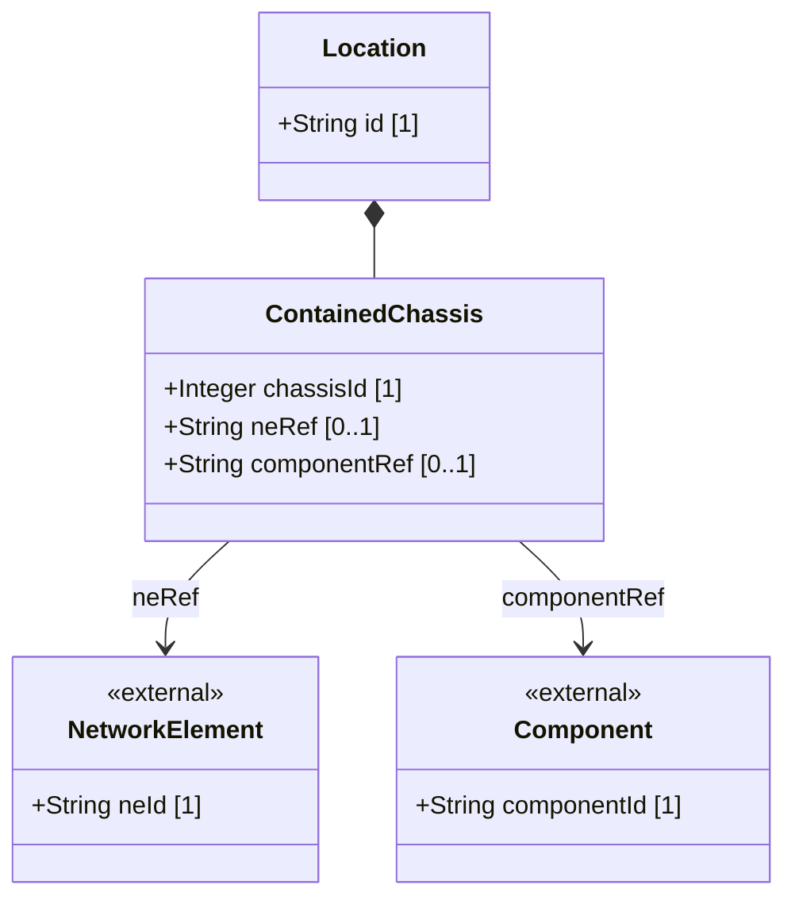

# Feature: Location Contained Chassis

## Parent Epic
- [ ] #30 - [Location Hierarchy & Physical Addressing](https://github.com/gintatkinson/3dgs-027/blob/main/docs/epics/epic-02-location-hierarchy.md) (Chassis directly deployed in a location without rack)

## Description
The Location Contained Chassis feature models network equipment chassis that are deployed directly in a location without a rack enclosure. This applies to edge deployment scenarios such as access points ceiling-mounted in corridors, wall-mounted devices, or distributed chassis components that are logically part of a network element but physically located at different sites. Each entry references a network element and its specific chassis component, enabling the inventory to track which equipment is placed at which physical location.

## UML Class Diagram



## Interface Requirements

### 1. Payload Schema (JSON Schema / Protobuf Example)

```json
{
  "contained-chassis": [
    {
      "chassis-id": 1,
      "ne-ref": "AP-Corridor-East-01",
      "component-ref": "chassis-1"
    }
  ]
}
```

### 2. Validation & Constraints

- `chassis-id`: Type is `uint32`. Mandatory key. Unique identifier for this chassis instance within the location.
- `ne-ref`: Type is leafref to `/nwi:network-inventory/nwi:network-elements/nwi:network-element/nwi:ne-id`. Optional. References the network element this chassis belongs to.
- `component-ref`: Type is leafref to the component-id within the referenced network element. The path is conditionally resolved: `/nwi:network-inventory/nwi:network-elements/nwi:network-element[nwi:ne-id=current()/../ne-ref]/nwi:components/nwi:component/nwi:component-id`. Optional.
- Multiple chassis entries may reference the same `ne-ref` for distributed systems where a single logical network element spans multiple physical chassis.
- The `component-ref` is only meaningful when `ne-ref` is also specified, as it resolves relative to the referenced network element.

### 3. Logical Operations & Interface Messages

- **QUERY**: Retrieve all chassis directly deployed at a specific location.
- **ASSOCIATE**: Link a chassis instance to its network element and component references.
- **RESOLVE**: Follow the leafref path from component-ref up to the network element to retrieve full equipment details.
- The contained-chassis list is accessed through: `/nwi:network-inventory/nil:locations/nil:location/nil:contained-chassis`.

### 4. Logical Exception States & Validation Failures

- **Dangling ne-ref**: If the ne-ref references a non-existent network element id, the leafref constraint is violated and the entry MUST be rejected.
- **Dangling component-ref**: If the component-ref resolves to a non-existent component within the referenced network element, the leafref constraint is violated.
- **Duplicate chassis-id**: Since chassis-id is the list key, duplicate chassis-id values within the same location MUST be rejected.
- **component-ref without ne-ref**: If component-ref is specified but ne-ref is absent, the leafref path cannot be resolved and the entry MUST be rejected.
- **Orphan chassis entry**: A chassis entry without a ne-ref provides only an identifier with no equipment association, which may be valid (unassociated chassis slot) but the system SHOULD warn about unlinked chassis entries.

## Given-When-Then Acceptance Criteria

**Scenario: Deploy chassis directly to a location without rack**
- Given a location exists in the inventory (e.g., a corridor)
- When a chassis entry is added with a unique chassis-id and references to a network element and component
- Then the chassis is registered as deployed at that location and retrievable via location queries

**Scenario: Query all chassis at a location**
- Given a location with multiple directly deployed chassis
- When the location's contained-chassis list is queried
- Then all chassis entries with their ne-ref and component-ref are returned

**Scenario: Reject duplicate chassis-id in same location**
- Given a location with an existing chassis entry having chassis-id 1
- When a second chassis entry with chassis-id 1 is submitted to the same location
- Then the system rejects the entry with a data-exists error

**Scenario: Reject chassis with non-existent network element reference**
- Given a location and a chassis entry being created
- When the ne-ref references a network element id that does not exist in the base inventory
- Then the system rejects the entry due to a leafref constraint violation

**Scenario: Reject chassis with dangling component reference**
- Given a valid network element reference but a component-ref pointing to a non-existent component
- When the chassis entry is validated
- Then the system rejects the entry due to a leafref constraint violation

**Scenario: Multiple chassis referencing the same network element**
- Given a distributed network element with chassis deployed at different locations
- When each location adds a chassis entry referencing the same ne-ref
- Then all chassis entries are valid and the inventory correctly tracks the distributed deployment

**Scenario: Remove a chassis from a location**
- Given a location with a deployed chassis entry
- When the chassis entry is deleted from the location's contained-chassis list
- Then the chassis is no longer associated with that location

**Scenario: Update chassis component reference**
- Given a chassis entry with an existing component-ref
- When the component-ref is updated to reference a different component within the same network element
- Then the new reference is stored and the old association is replaced

**Scenario: Chassis entry with no network element reference**
- Given a location and a chassis entry with only a chassis-id
- When the entry is stored without ne-ref or component-ref
- Then the chassis slot is registered at the location with no equipment association

## Specification Context (Verbatim)

From the YANG schema (contained-chassis list):
> Chassis directly deployed in this location without rack. Also used for distributed chassis components that are logically part of a network element but physically located.

From the IETF draft (Section 1):
> The information about sites, equipment rooms, and other more precise locations is critical, but it cannot be automatically populated and retrieved from NEs. Instead, it is usually configured manually.

From the IETF draft Appendix A.1:
> This example illustrates a typical edge deployment scenario where a Wi-Fi Access Point (AP) is mounted directly to a ceiling without a rack enclosure.

## 4. Source References
Structural Schema: [ietf-ni-location.yang](https://github.com/ietf-ivy-wg/network-inventory-location/blob/main/ietf-ni-location.yang)
Normative Specification: [draft-ietf-ivy-network-inventory-location-06](https://datatracker.ietf.org/doc/html/draft-ietf-ivy-network-inventory-location)

## 5. Logical UI & Layout Bindings
- **Target LUI Component:** PropertyGrid
- **Target Layout Container ID:** `properties_view`
- **Data Source Bindings:** `schema:generic-topology/topology/component[@id='active_focused_element']/child-components`
