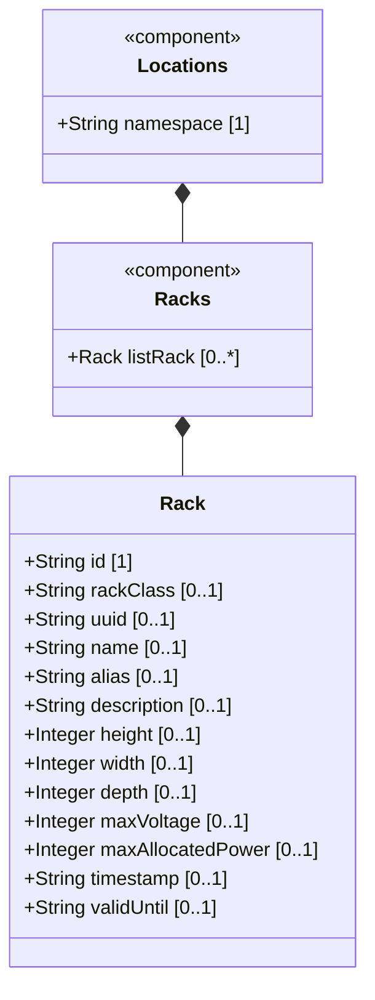

# Feature: Racks Container

## Parent Epic
- [ ] #31 - [Rack Infrastructure Management](https://github.com/gintatkinson/3dgs-027/blob/main/docs/epics/epic-03-rack-infrastructure.md) (Top-level container for the rack collection)

## Description
The Racks Container is the top-level container for managing physical equipment racks within the network inventory. It sits alongside the locations list under the main locations augment, providing a separate namespace for rack entities. All data within this container is read-only (`config false`), reflecting the controller's authoritative view of physical rack deployments. Racks represent equipment cabinets in which network elements are installed, with attributes for physical dimensions, electrical capacity, security classification, and location assignment.

## UML Class Diagram



## Interface Requirements

### 1. Payload Schema (JSON Schema / Protobuf Example)

```json
{
  "racks": {
    "rack": []
  }
}
```

### 2. Validation & Constraints

- The `racks` container is read-only (`config false`). Direct write operations are not supported.
- The container hosts the `rack` list, keyed by `id`.
- All rack entries within this container are independently versioned through their own timestamp and valid-until fields.
- The racks container is accessed through `/nwi:network-inventory/nil:locations/nil:racks`.

### 3. Logical Operations & Interface Messages

- **QUERY**: Retrieve the full rack inventory, optionally filtered by rack-class, location reference, or dimensions.
- **PAGINATE**: In large data centers with hundreds of racks, the server SHOULD support pagination for rack list queries.
- **AGGREGATE**: Compute total power allocation and voltage draw across all racks for capacity planning.
- The racks container provides the scope for rack identity resolution and leaf-based queries.

### 4. Logical Exception States & Validation Failures

- **Empty rack inventory**: If no racks are recorded, queries MUST return an empty rack list rather than an error.
- **Container absent**: If the racks container has not been provisioned, it may be absent from the location data tree; clients MUST handle this gracefully.
- **Concurrent query contention**: Multiple simultaneous read-only queries to the racks container MUST NOT create lock contention.

## Given-When-Then Acceptance Criteria

**Scenario: Query all racks in the inventory**
- Given a network inventory with rack data populated
- When a management client issues a GET on the racks container
- Then the response includes the complete list of rack entries with all attributes

**Scenario: Query racks with empty inventory**
- Given a network inventory with no racks recorded
- When a client queries the racks container
- Then the response includes an empty rack list with no error

**Scenario: Filter racks by classification**
- Given a rack inventory with mixed rack-class values (standard, secure-baseline, secure-medium, secure-high)
- When a client queries the racks container filtered to secure-medium racks
- Then the response includes only racks with the secure-medium classification

**Scenario: Paginate large rack queries**
- Given a data center with more racks than the configured page size
- When a client requests the full racks container
- Then the server returns partial results with pagination continuation metadata

**Scenario: Aggregate power allocation across all racks**
- Given a rack inventory with max-allocated-power values set for each rack
- When a management client queries for total power allocation
- Then the system computes the sum of all max-allocated-power values across all racks

**Scenario: Unauthorized access to racks data**
- Given a NETCONF session with restricted NACM permissions
- When the client attempts to read the racks container without authorization
- Then the server rejects the request with an access-denied error

## Specification Context (Verbatim)

From the IETF draft (Section 3):
> "racks" represent physical equipment racks in which NEs can be installed, which facilitate device maintenance. Through "rack-location", each rack can be assigned to a site or a specific location within a site, such as an equipment room.

From the YANG schema (racks container):
> Top-level container for the list of racks.

## 4. Source References
Structural Schema: [ietf-ni-location.yang](https://github.com/ietf-ivy-wg/network-inventory-location/blob/main/ietf-ni-location.yang)
Normative Specification: [draft-ietf-ivy-network-inventory-location-06](https://datatracker.ietf.org/doc/html/draft-ietf-ivy-network-inventory-location)

## 5. Logical UI & Layout Bindings
- **Target LUI Component:** PropertyGrid
- **Target Layout Container ID:** `properties_view`
- **Data Source Bindings:** `schema:generic-topology/topology[@id='selected_entity']`
