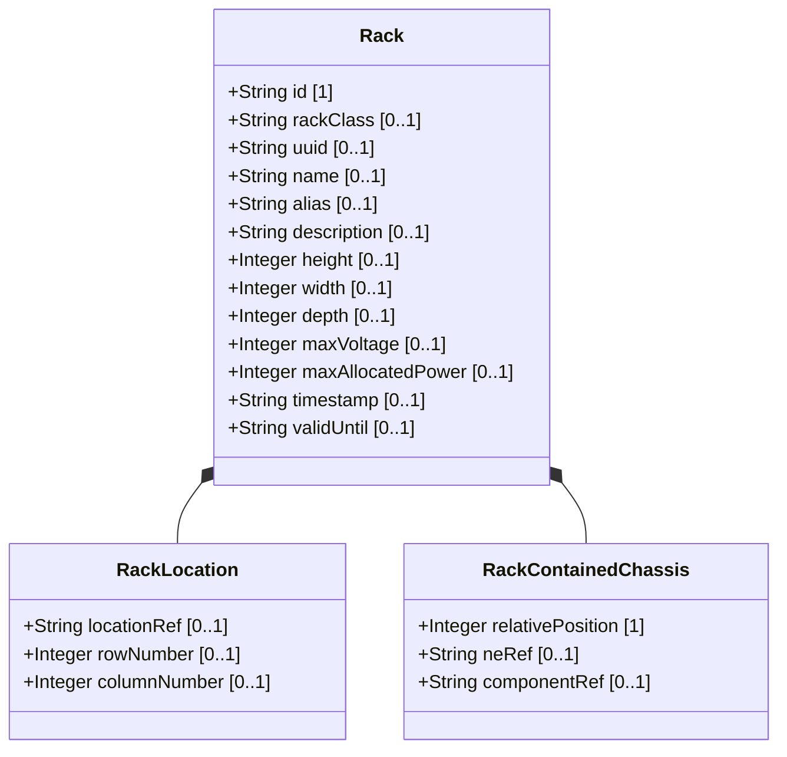

# Feature: Rack Entity

## Parent Epic
- [ ] #31 - [Rack Infrastructure Management](https://github.com/gintatkinson/3dgs-027/blob/main/docs/epics/epic-03-rack-infrastructure.md) (Physical equipment rack with dimensions, power, and security classification)

## Description
The Rack Entity represents a single physical equipment rack within the network inventory. Each rack is uniquely identified and carries attributes covering three domains: physical dimensions (height, width, depth in millimeters), electrical characteristics (max-voltage in volts, max-allocated-power in watts), and security classification (rack-class identity reference ranging from standard to high-security). Racks serve as the enclosure for network equipment chassis deployed in equipment rooms, with their location specified through the rack-location container referencing a parent location.

## UML Class Diagram



## Interface Requirements

### 1. Payload Schema (JSON Schema / Protobuf Example)

```json
{
  "rack": [
    {
      "id": "Rack-101-A",
      "rack-class": "rack-standard",
      "uuid": "660e8400-e29b-41d4-a716-446655440010",
      "name": "Rack A Room 101",
      "alias": "DC1-R101-A",
      "description": "Primary rack for first floor telecom room",
      "rack-location": {},
      "height": 2200,
      "width": 600,
      "depth": 1200,
      "max-voltage": 240,
      "max-allocated-power": 8000,
      "contained-chassis": [],
      "timestamp": "2026-01-15T10:00:00Z",
      "valid-until": "2028-01-15T10:00:00Z"
    }
  ]
}
```

### 2. Validation & Constraints

- `id`: Type is `string`. Mandatory key. Uniquely identifies the rack within the inventory.
- `rack-class`: Type is `identityref` with base `rack-class-type`. Optional. Classification values include: `rack-standard`, `rack-secure-baseline`, `rack-secure-medium`, `rack-secure-high`.
- `uuid`: Type is `yang:uuid`. Optional. Globally unique identifier.
- `name`: Type is `string`. Optional. Human-readable name (inherited from basic-common-entity-attributes).
- `alias`: Type is `string`. Optional. Alternative name.
- `description`: Type is `string`. Optional. Free-text description.
- `height`: Type is `uint16`, units `millimeter`. Optional. Rack physical height.
- `width`: Type is `uint16`, units `millimeter`. Optional. Rack physical width.
- `depth`: Type is `uint16`, units `millimeter`. Optional. Rack physical depth.
- `max-voltage`: Type is `uint16`, units `volt`. Optional. Maximum voltage supported by the rack.
- `max-allocated-power`: Type is `uint16`, units `watts`. Optional. Maximum allocated power for the rack.
- `timestamp`: Type is `yang:date-and-time`. Optional. Recording timestamp.
- `valid-until`: Type is `yang:date-and-time`. Optional. Validity expiration.
- Dimension values must be positive integers. Zero values for height/width/depth are semantically invalid.
- Power allocation must not exceed the rack's maximum electrical capacity.

### 3. Logical Operations & Interface Messages

- **QUERY**: Retrieve rack entries by id, rack-class, location reference, or dimension ranges.
- **COMPARE**: Compare rack capacity (available slots, remaining power) against planned deployments.
- **VALIDATE**: Check rack timestamps and valid-until for data freshness.
- **ACCESS**: Retrieve rack details through `/nwi:network-inventory/nil:locations/nil:racks/nil:rack`.

### 4. Logical Exception States & Validation Failures

- **Zero dimension values**: A rack with zero height, width, or depth is physically impossible. The system SHOULD warn or reject such entries.
- **Negative dimension values**: Since dimensions are uint16 (unsigned), negative values are rejected at the type level.
- **Expired rack record**: If valid-until is in the past, the rack data is stale and MUST NOT be used for operational planning without verification.
- **Overloaded power allocation**: If the sum of allocated power for installed chassis exceeds max-allocated-power, the system MUST flag a capacity violation.
- **Invalid rack-class**: If an identityref value does not derive from the rack-class-type base, the entry MUST be rejected.
- **Duplicate rack id**: The id is the list key; duplicate values MUST be rejected.

## Given-When-Then Acceptance Criteria

**Scenario: Register a new rack with dimensions and power capacity**
- Given a network inventory
- When a rack entry is submitted with id, height=2200, width=600, depth=1200, max-voltage=240, and max-allocated-power=8000
- Then the rack is stored with all dimension and electrical values retrievable

**Scenario: Query rack by id**
- Given a rack with id 'Rack-101-A' exists
- When a client queries the rack list filtered by that id
- Then the complete rack record including rack-location and contained-chassis is returned

**Scenario: Assign security classification to rack**
- Given a rack entry being created
- When the rack-class is set to rack-secure-high
- Then the classification is stored and the rack is queryable by its security level

**Scenario: Reject duplicate rack id**
- Given an existing rack with id 'Rack-101-A'
- When a new rack entry with the same id is submitted
- Then the system rejects the entry with a data-exists error

**Scenario: Store rack without dimensions**
- Given a rack record being registered
- When no height, width, or depth values are provided
- Then the rack is stored with absent dimension fields and no validation errors

**Scenario: Reject rack with invalid rack-class identity**
- Given a rack entry being created
- When rack-class is set to a value not derived from rack-class-type
- Then the system rejects the entry with an identityref validation error

**Scenario: Verify rack power capacity against allocated loads**
- Given a rack with max-allocated-power of 8000 watts and chassis consuming 7000 watts total
- When a new chassis requiring 2000 watts is proposed for installation
- Then the system reports that the rack power capacity would be exceeded

**Scenario: Query racks by dimension range**
- Given a rack inventory with varying dimensions
- When a client queries for racks with height >= 2000 and width <= 800
- Then only racks meeting both dimensional criteria are returned

## Specification Context (Verbatim)

From the IETF draft (Section 3):
> Each rack is assigned a unique ID and a name in the context of a facility, e.g. a site. A rack may have some specific attributes, such as appearance-related attributes and electricity-related attributes.

From the YANG schema (rack-class identity hierarchy):
> Base identity for generic rack classification based on physical security characteristics.

From the YANG schema (max-voltage leaf):
> The maximum voltage supported by the rack.

## 4. Source References
Structural Schema: [ietf-ni-location.yang](https://github.com/ietf-ivy-wg/network-inventory-location/blob/main/ietf-ni-location.yang)
Normative Specification: [draft-ietf-ivy-network-inventory-location-06](https://datatracker.ietf.org/doc/html/draft-ietf-ivy-network-inventory-location)

## 5. Logical UI & Layout Bindings
- **Target LUI Component:** PropertyGrid
- **Target Layout Container ID:** `properties_view`
- **Data Source Bindings:** `schema:generic-topology/topology/component[@id='active_focused_element']`
