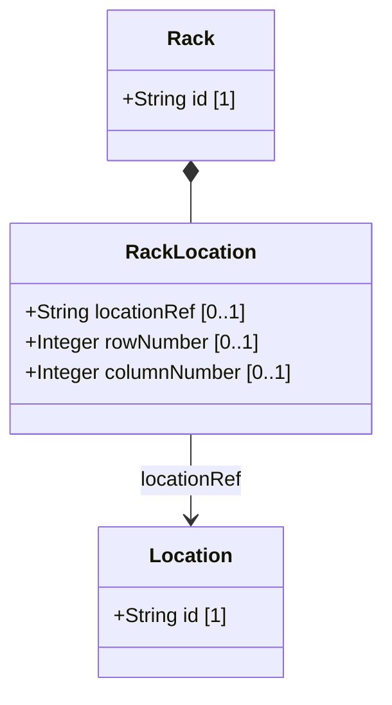

# Feature: Rack Location

## Parent Epic
- [ ] #31 - [Rack Infrastructure Management](https://github.com/gintatkinson/3dgs-027/blob/main/docs/epics/epic-03-rack-infrastructure.md) (Grid position of a rack within a parent location)

## Description
The Rack Location container specifies the exact physical placement of a rack within a parent location. It references the location where the rack is placed (e.g., an equipment room), and identifies the grid coordinates using row and column numbers. This enables precise mapping of rack positions within data center floors or equipment rooms, supporting efficient equipment location and maintenance routing. The location-ref uses the `ni-location-ref` typedef to ensure referential integrity with the parent locations list.

## UML Class Diagram



## Interface Requirements

### 1. Payload Schema (JSON Schema / Protobuf Example)

```json
{
  "rack-location": {
    "location-ref": "Room-101",
    "row-number": 1,
    "column-number": 3
  }
}
```

### 2. Validation & Constraints

- `location-ref`: Type is `ni-location-ref` (leafref to location id). Optional. Must reference an existing location id in the locations list.
- `row-number`: Type is `uint32`. Optional. Identifies the row within the referenced location where the rack is located.
- `column-number`: Type is `uint32`. Optional. Identifies the column within the referenced location where the rack is located.
- The location-ref leafref enforces referential integrity: the target location MUST exist.
- Row and column numbers are unsigned 32-bit integers. Negative values are rejected at the type level.
- If row-number is specified without a location-ref, the row/column data has no meaningful context.

### 3. Logical Operations & Interface Messages

- **ASSIGN**: Link a rack to a parent location via the location-ref field.
- **RELOCATE**: Update the location-ref, row-number, and column-number when a rack is physically moved.
- **QUERY**: Find all racks assigned to a specific location by filtering on the location-ref value.
- **RESOLVE**: Follow the location-ref leafref to retrieve the full parent location details.

### 4. Logical Exception States & Validation Failures

- **Dangling location reference**: If location-ref references a non-existent or deleted location, the leafref constraint is violated and the rack entry MUST be flagged as invalid.
- **Empty rack-location**: Since all fields are optional, a rack may exist without a rack-location container or with an empty one. This indicates the rack's physical position is unrecorded.
- **Grid collision**: If two racks in the same location claim the same row and column numbers, this represents a physical placement conflict. The system SHOULD warn about overlapping grid positions.
- **Location ref deleted**: If a parent location is deleted from the inventory, all racks referencing it via location-ref must have their references invalidated or the deletion MUST be cascaded.

## Given-When-Then Acceptance Criteria

**Scenario: Assign a rack to an equipment room location**
- Given an existing location representing an equipment room and an existing rack
- When the rack's rack-location is set with location-ref pointing to the room and row-number=1, column-number=1
- Then the rack is assigned to that room and queries for racks at that location return this rack

**Scenario: Query all racks in a specific location**
- Given a location 'Room-101' with multiple racks assigned
- When a client queries the rack list filtered by rack-location/location-ref='Room-101'
- Then all racks assigned to that room are returned

**Scenario: Relocate a rack to different grid position**
- Given a rack assigned to Room-101 at row 1, column 1
- When the rack-location is updated to row 2, column 3
- Then the new grid position is stored and the old position is replaced

**Scenario: Move rack to different location**
- Given a rack in Room-101
- When the rack-location/location-ref is updated to 'Room-201'
- Then the rack is now associated with Room-201 and no longer appears in Room-101 queries

**Scenario: Reject rack assignment to non-existent location**
- Given a rack entry being configured
- When the location-ref is set to a location id that does not exist
- Then the system rejects the assignment with a leafref violation error

**Scenario: Rack with no location assignment**
- Given a rack entry stored without a rack-location container
- When the rack is queried
- Then the rack-location container is absent, indicating the rack's position is unrecorded

**Scenario: Detect grid position collision**
- Given two racks both assigned to Room-101 with identical row 3, column 2
- When the second rack assignment is submitted
- Then the system accepts the assignment but issues a warning about overlapping grid positions

**Scenario: Query racks by row within a location**
- Given a location with racks spread across multiple rows
- When a client queries for racks in location 'Room-101' filtered by row-number=1
- Then only racks in row 1 of that room are returned

## Specification Context (Verbatim)

From the YANG schema (rack-location container):
> The location information of the rack, which comprises the location reference, row number, and column number.

From the YANG schema (location-ref leaf):
> Reference to the location where this rack is placed.

From the IETF draft (Section 3):
> Through "rack-location", each rack can be assigned to a site or a specific location within a site, such as an equipment room.

## 4. Source References
Structural Schema: [ietf-ni-location.yang](https://github.com/ietf-ivy-wg/network-inventory-location/blob/main/ietf-ni-location.yang)
Normative Specification: [draft-ietf-ivy-network-inventory-location-06](https://datatracker.ietf.org/doc/html/draft-ietf-ivy-network-inventory-location)

## 5. Logical UI & Layout Bindings
- **Target LUI Component:** PropertyGrid
- **Target Layout Container ID:** `properties_view`
- **Data Source Bindings:** `schema:generic-topology/topology/component[@id='active_focused_element']`
