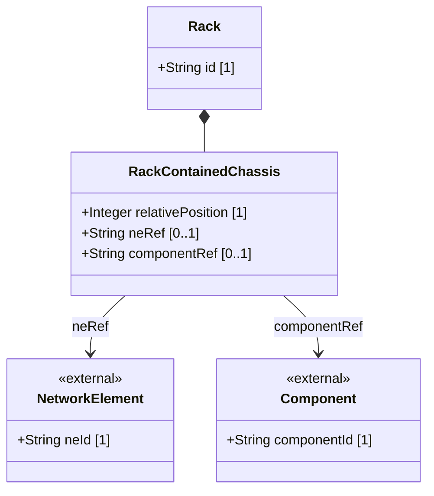

# Feature: Rack Contained Chassis

## Parent Epic
- [ ] #31 - [Rack Infrastructure Management](https://github.com/gintatkinson/3dgs-027/blob/main/docs/epics/epic-03-rack-infrastructure.md) (Chassis deployed within rack slots)

## Description
The Rack Contained Chassis feature models network equipment chassis that are installed within rack enclosures. Each chassis occupies a specific slot position within the rack, identified by its relative-position (typically U-slot numbering). The feature tracks which network element and component is installed at each rack position, enabling precise equipment location tracking for maintenance, capacity planning, and inventory management. In a distributed multi-chassis deployment, multiple chassis across different racks may reference the same network element.

## UML Class Diagram



## Interface Requirements

### 1. Payload Schema (JSON Schema / Protobuf Example)

```json
{
  "contained-chassis": [
    {
      "relative-position": 10,
      "ne-ref": "NE-1",
      "component-ref": "chassis-1"
    },
    {
      "relative-position": 15,
      "ne-ref": "NE-2",
      "component-ref": "chassis-1"
    }
  ]
}
```

### 2. Validation & Constraints

- `relative-position`: Type is `uint8`. Mandatory key. The U-slot or relative position of the chassis within the rack, ranging from 0 to 255.
- `ne-ref`: Type is leafref to network element id. Optional. References the network element containing this chassis component.
- `component-ref`: Type is leafref to the component within the referenced network element. The path resolves conditionally based on the ne-ref value. Optional.
- The `component-ref` is only meaningful when `ne-ref` is also specified.
- Multiple chassis in the same rack may reference the same `ne-ref` for multi-slot network elements, but must have unique relative-positions.
- The relative-position acts as the key; two chassis cannot occupy the same slot within the same rack.

### 3. Logical Operations & Interface Messages

- **INSTALL**: Register a chassis instance at a specific relative-position within a rack, linking it to a network element and component.
- **DEINSTALL**: Remove a chassis entry from a rack position.
- **QUERY**: Find which chassis are installed in a specific rack or at a specific slot position.
- **RESOLVE**: Follow the ne-ref and component-ref references to retrieve full equipment details from the base inventory.

### 4. Logical Exception States & Validation Failures

- **Slot collision**: Two chassis entries with the same relative-position in the same rack MUST be rejected as duplicate keys.
- **Exceeding rack capacity**: If the relative-position exceeds the rack's physical height capacity (e.g., U-slot 100 on a 42U rack), the system SHOULD warn about out-of-bounds slot placement.
- **Dangling ne-ref**: If the ne-ref references a deleted or non-existent network element, the leafref constraint is violated.
- **Dangling component-ref**: If the component-ref resolves to a non-existent component, the leafref constraint is violated.
- **Empty slot**: A relative-position entry without ne-ref or component-ref represents an empty, reserved slot that may be planned for future deployment.
- **Power capacity violation**: If the sum of allocated power for all installed chassis exceeds the rack's max-allocated-power, a capacity alarm SHOULD be raised.

## Given-When-Then Acceptance Criteria

**Scenario: Install a chassis in a rack slot**
- Given an existing rack with defined power capacity
- When a chassis is registered at relative-position 10 with ne-ref and component-ref
- Then the chassis is recorded as installed at that slot and the rack inventory is updated

**Scenario: Query all chassis in a rack**
- Given a rack with multiple chassis installed across different slots
- When the rack's contained-chassis list is queried
- Then all chassis entries with their relative-positions and equipment references are returned

**Scenario: Reject chassis at duplicate slot position**
- Given a rack with a chassis already installed at relative-position 10
- When a second chassis entry with relative-position 10 is submitted to the same rack
- Then the system rejects the entry with a duplicate-key error

**Scenario: Remove a chassis from a rack**
- Given a chassis installed at position 15 in a rack
- When the chassis entry is deleted from the rack's contained-chassis list
- Then the slot position 15 is freed and the chassis is no longer associated with that rack

**Scenario: Move chassis to different slot**
- Given a chassis at position 10
- When its relative-position is updated to position 12
- Then the chassis is recorded at slot 12 and slot 10 is freed

**Scenario: Reject chassis without valid network element reference**
- Given a rack and a chassis entry being created
- When the ne-ref references a network element that does not exist
- Then the system rejects the entry with a leafref constraint violation

**Scenario: Multiple chassis referencing the same network element**
- Given a distributed network element with two chassis components
- When both chassis are installed in the same rack at positions 10 and 15, both referencing the same ne-ref but different component-ref values
- Then both chassis entries are valid and the inventory correctly tracks the multi-slot deployment

**Scenario: Reserve empty slot for future deployment**
- Given a rack and a planned chassis slot
- When a chassis entry is created with only relative-position (no ne-ref or component-ref)
- Then the slot is reserved in the rack inventory with no equipment association

**Scenario: Detect power capacity exceeded by installed chassis**
- Given a rack with max-allocated-power of 8000 watts and chassis already consuming 7500 watts
- When a new chassis requiring 1000 watts is proposed for installation
- Then the system raises a capacity violation warning

## Specification Context (Verbatim)

From the YANG schema (contained-chassis list):
> The list of chassis within a rack.

From the YANG schema (relative-position leaf):
> Relative position (e.g., U-slot) of chassis within the rack.

From the IETF draft Appendix A.2:
> This example illustrates a distributed deployment where a single logical network element (NE-1, a stack switch) spans multiple physical locations. The three chassis of the stack switch are located in separate telecommunications rooms on different floors.

## 4. Source References
Structural Schema: [ietf-ni-location.yang](https://github.com/ietf-ivy-wg/network-inventory-location/blob/main/ietf-ni-location.yang)
Normative Specification: [draft-ietf-ivy-network-inventory-location-06](https://datatracker.ietf.org/doc/html/draft-ietf-ivy-network-inventory-location)

## 5. Logical UI & Layout Bindings
- **Target LUI Component:** PropertyGrid
- **Target Layout Container ID:** `properties_view`
- **Data Source Bindings:** `schema:generic-topology/topology/component[@id='active_focused_element']/child-components`
