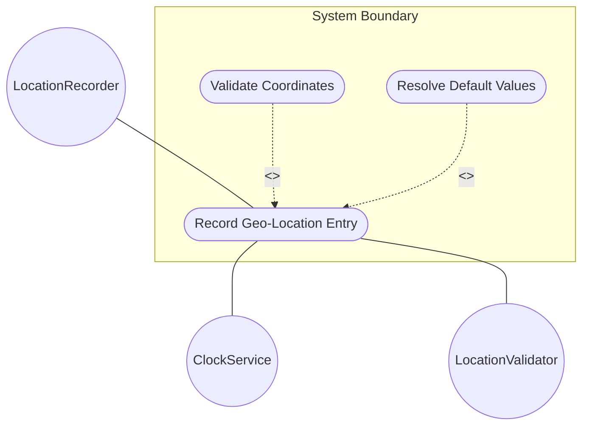
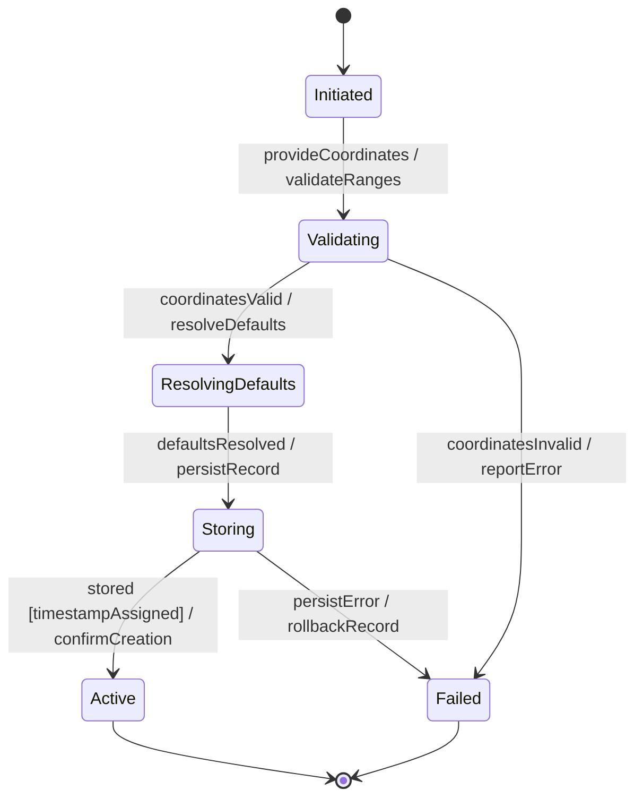

# Use Case: Record Geo-Location Entry

## Parent Epic
- [ ] #7 - [Geo-Location: Geographic Location Specification](https://github.com/gintatkinson/3dgs-027/blob/main/docs/epics/epic-01-geo-location-specification.md) (Root container for the geo-location grouping)

## 1. Actors
- **Primary Actor:** LocationRecorder (the entity or user recording a location)
- **Secondary Actors:** ClockService (provides timestamp reference), LocationValidator (checks record validity)

## 2. Preconditions
- The system has a valid reference frame configured or will accept defaults.
- The recorder has authorization to create geo-location records.

## 3. Trigger
A user or system component initiates the recording of a geographic location by providing coordinate data and optionally a validity expiration.

## 4. Main Success Scenario (Basic Flow)
1. The LocationRecorder provides coordinate data (ellipsoidal or Cartesian) and an optional valid-until timestamp.
2. The system validates that the coordinate values are within their allowed ranges and conform to type constraints.
3. The system assigns a recording timestamp to the geo-location entry.
4. The system resolves default values for the reference frame (astronomical-body defaults to 'earth').
5. The system resolves default values for the geodetic system (geodetic-datum defaults to 'wgs-84' for Earth).
6. The system stores the complete geo-location record with all resolved values.
7. The system reports successful creation with the assigned timestamp.

## 5. Alternate and Exception Flows

- **5a. Coordinate validation failure (Branches from Basic Flow step 2):**
  1. The system detects that latitude is outside the range [-90, +90] or longitude is outside [-180, +180].
  2. The system rejects the record and reports a validation error specifying the invalid field and expected range.

- **5b. Missing timestamp on record (Branches from Basic Flow step 3):**
  1. The ClockService is unavailable or the timestamp cannot be generated.
  2. The system stores the record with an empty timestamp field and reports a warning that the recording time is unknown.

- **5c. Expired valid-until timestamp (Branches from Basic Flow step 1):**
  1. The LocationRecorder provides a valid-until timestamp that is chronologically earlier than the recording timestamp.
  2. The system rejects the record and reports a time-reversal validation error.

- **5d. Invalid timestamp format (Branches from Basic Flow step 3):**
  1. The system attempts to generate or assign a timestamp.
  2. The value does not conform to RFC 3339 date-and-time format; the system rejects the record.

## 6. Postconditions (Guarantees)
- **Success Guarantee:** A new geo-location record is stored with a recording timestamp, resolved reference frame defaults, and valid coordinate data. The record is retrievable and its validity can be checked against the optional valid-until field.
- **Failure Guarantee:** No partial geo-location record is persisted. The system reports the specific validation failure to the caller. Any in-progress record data is rolled back.

## UML Diagrams

### Use Case Diagram

### State Machine Diagram

## 7. Operational Context

From RFC 9179 Section 2:
> This document defines a 'geo-location' YANG grouping that allows for all the above data to be captured.

From the YANG schema (geo-location container):
> A location on an astronomical body (e.g., 'earth') somewhere in a universe.

## 8. Realization Matrix

### Required User Stories
- [ ] #10 - [Determine Geo-Location Record Validity and Handle Expiration](https://github.com/gintatkinson/3dgs-027/blob/main/docs/user-stories/us-03-validity-expiration.md) (Validity lifecycle governs record freshness from creation through expiry)
- [ ] #13 - [Resolve Default Reference Frame and Geodetic Datum Values](https://github.com/gintatkinson/3dgs-027/blob/main/docs/user-stories/us-06-resolve-defaults.md) (Default value resolution occurs during record creation)

### Required Features
- [ ] #1 - [Geo-Location Container](https://github.com/gintatkinson/3dgs-027/blob/main/docs/features/feat-01-geo-location-container.md) (Provides the timestamp and valid-until attributes for the root record)

## Source References
Structural Schema: [ietf-geo-location.yang](https://github.com/YangModels/yang/blob/main/standard/ietf/RFC/ietf-geo-location%402022-02-11.yang)
Normative Specification: [RFC 9179 - A YANG Grouping for Geographic Locations](https://datatracker.ietf.org/doc/rfc9179/)
