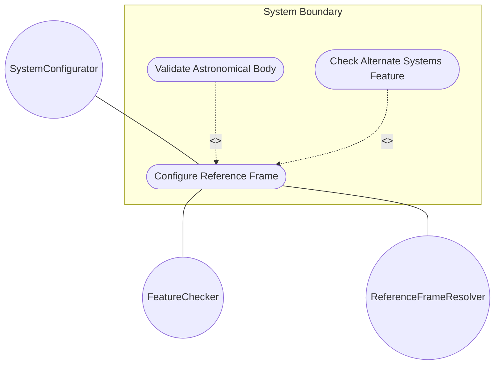
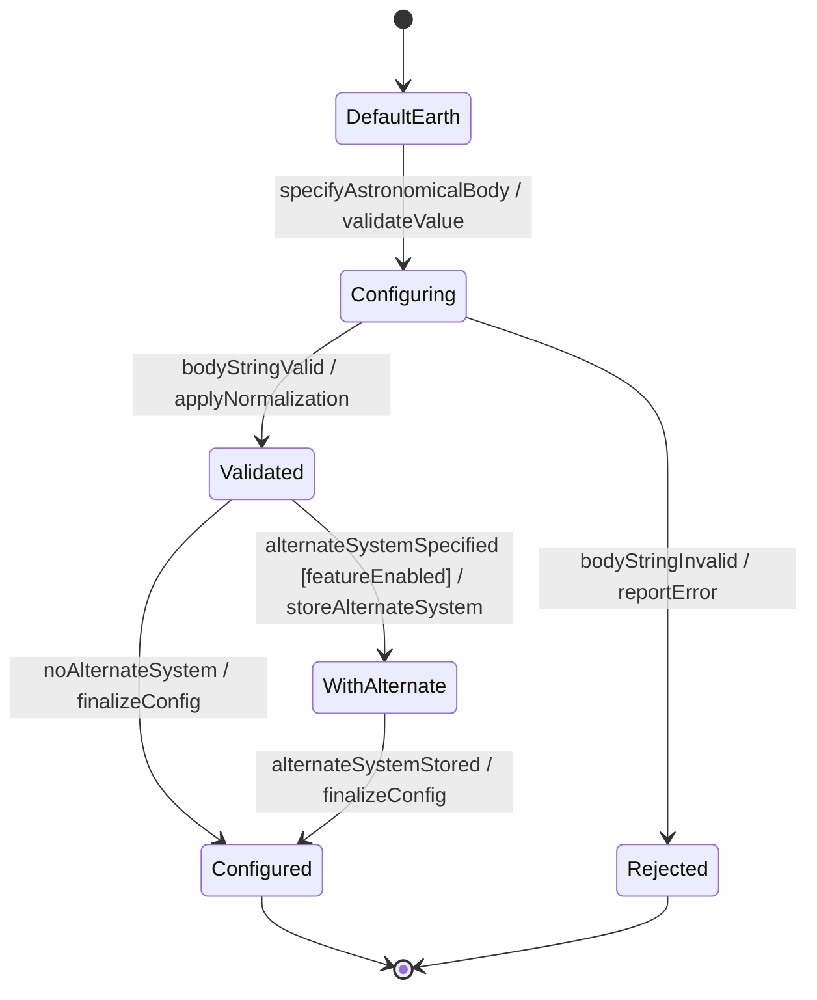

# Use Case: Configure Reference Frame

## Parent Epic
- [ ] #7 - [Geo-Location: Geographic Location Specification](https://github.com/gintatkinson/3dgs-027/blob/main/docs/epics/epic-01-geo-location-specification.md) (Defines the spatial frame of reference for location coordinates)

## 1. Actors
- **Primary Actor:** SystemConfigurator (entity configuring the reference frame)
- **Secondary Actors:** FeatureChecker (verifies alternate-systems feature availability), ReferenceFrameResolver (handles hierarchical inheritance)

## 2. Preconditions
- A geo-location record exists or is being created.
- The SystemConfigurator has write access to the reference frame data.

## 3. Trigger
A user or system specifies which astronomical body the coordinates relate to, optionally enabling an alternate coordinate system.

## 4. Main Success Scenario (Basic Flow)
1. The SystemConfigurator specifies the astronomical-body value (e.g., 'mars', 'moon', 'enceladus') or accepts the default 'earth'.
2. The system validates the astronomical-body string against the allowed ASCII character pattern.
3. The system converts uppercase characters to lowercase per the schema convention.
4. The system strips any preceding 'the' from the astronomical-body name per the schema convention.
5. The system stores the reference frame configuration with the validated astronomical-body.
6. If the alternate-systems feature is enabled and an alternate-system value is provided, the system stores the alternate system identifier.
7. The system reports successful configuration.

## 5. Alternate and Exception Flows

- **5a. Invalid astronomical-body string (Branches from Basic Flow step 2):**
  1. The system detects control characters (ASCII 0..31 or 127) in the astronomical-body value.
  2. The system rejects the value and reports a validation error identifying the invalid character.

- **5b. Empty astronomical-body value (Branches from Basic Flow step 2):**
  1. The astronomical-body value is an empty string.
  2. The system rejects the value and applies the default 'earth'.

- **5c. Alternate-systems feature not enabled (Branches from Basic Flow step 6):**
  1. The SystemConfigurator attempts to set an alternate-system value.
  2. The FeatureChecker reports that the alternate-systems feature is not supported.
  3. The system silently drops the alternate-system value and continues with the natural universe system implied.

- **5d. Unrecognized astronomical-body name (Branches from Basic Flow step 4):**
  1. The astronomical-body value is not a recognized IAU designation.
  2. The system accepts the value but logs a warning for operator review.

## 6. Postconditions (Guarantees)
- **Success Guarantee:** The reference frame is configured with a valid astronomical-body value (or the 'earth' default) and optionally an alternate system identifier. The reference frame is available for coordinate interpretation.
- **Failure Guarantee:** The previous reference frame configuration (if any) remains unchanged. The system reports the specific validation failure.

## UML Diagrams

### Use Case Diagram

### State Machine Diagram

## 7. Operational Context

From RFC 9179 Section 2.1:
> The frame of reference ('reference-frame') defines what the location values refer to and their meaning. The referred-to object can be any astronomical body. It could be a planet such as Earth or Mars, a moon such as Enceladus, an asteroid such as Ceres, or even a comet such as 1P/Halley. The default 'astronomical-body' value is 'earth'.

## 8. Realization Matrix

### Required User Stories
- [ ] #14 - [Inherit Reference Frame in Nested Location Hierarchies](https://github.com/gintatkinson/3dgs-027/blob/main/docs/user-stories/us-07-inherit-reference-frame.md) (Reference frame configuration cascades through nested locations)
- [ ] #15 - [Configure and Toggle Alternate Coordinate System Support](https://github.com/gintatkinson/3dgs-027/blob/main/docs/user-stories/us-08-alternate-system.md) (Alternate system configuration is part of reference frame setup)
- [ ] #13 - [Resolve Default Reference Frame and Geodetic Datum Values](https://github.com/gintatkinson/3dgs-027/blob/main/docs/user-stories/us-06-resolve-defaults.md) (Astronomical-body defaults to 'earth' when not specified)

### Required Features
- [ ] #2 - [Reference Frame](https://github.com/gintatkinson/3dgs-027/blob/main/docs/features/feat-02-reference-frame.md) (Provides the astronomical-body and alternate-system attributes)

## Source References
Structural Schema: [ietf-geo-location.yang](https://github.com/YangModels/yang/blob/main/standard/ietf/RFC/ietf-geo-location%402022-02-11.yang)
Normative Specification: [RFC 9179 - A YANG Grouping for Geographic Locations](https://datatracker.ietf.org/doc/rfc9179/)
