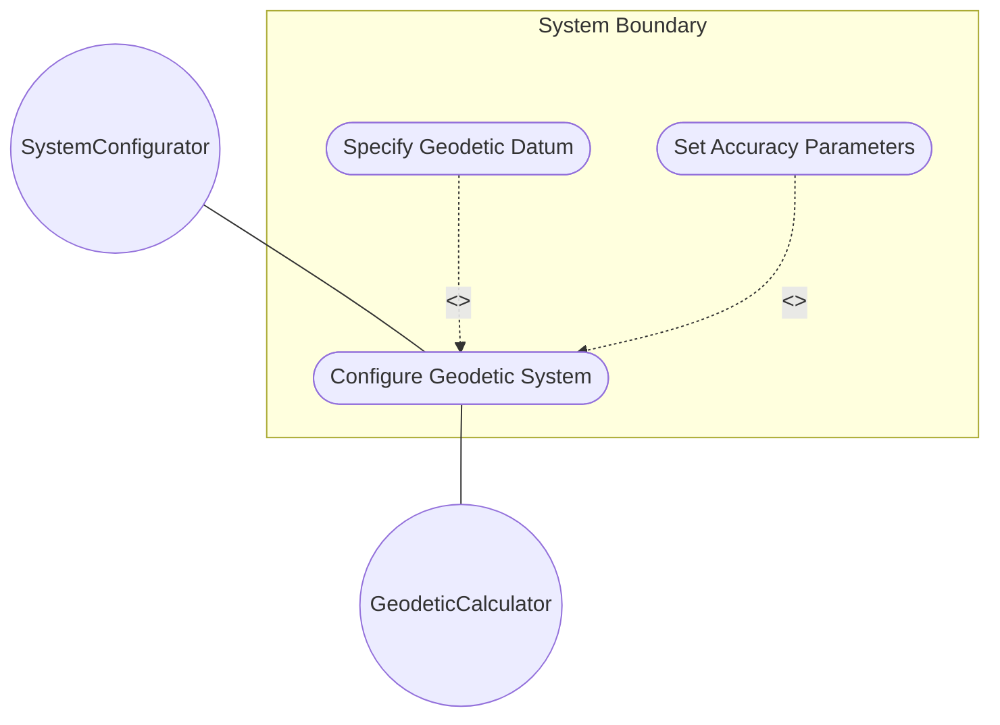
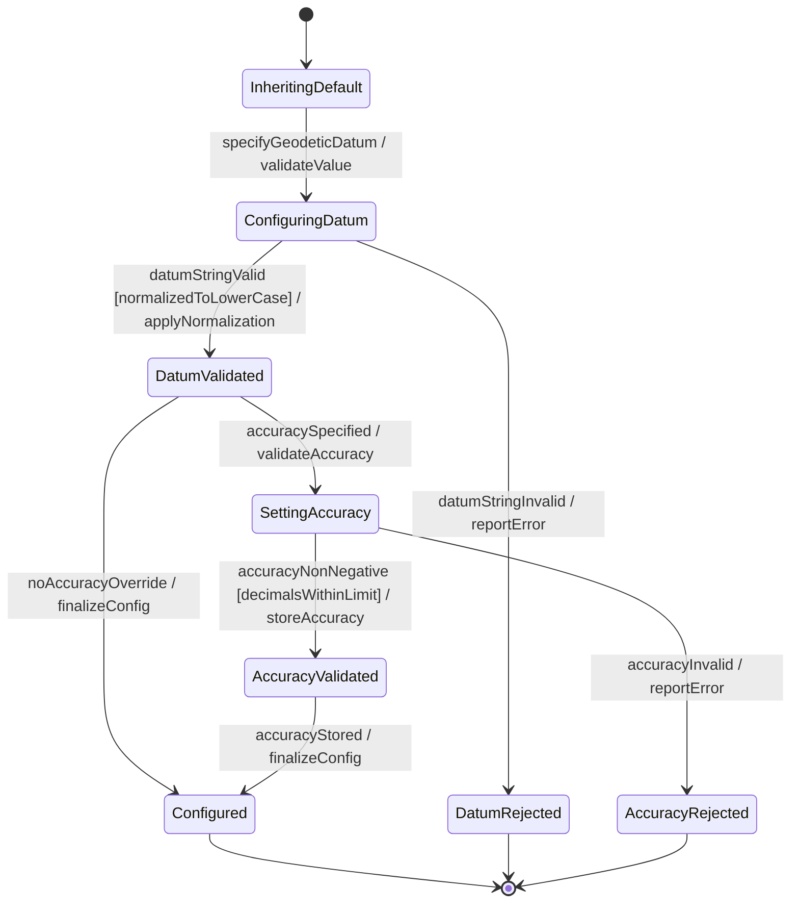

# Use Case: Configure Geodetic System Parameters

## Parent Epic
- [ ] #7 - [Geo-Location: Geographic Location Specification](https://github.com/gintatkinson/3dgs-027/blob/main/docs/epics/epic-01-geo-location-specification.md) (Defines the geodetic datum and accuracy parameters)

## 1. Actors
- **Primary Actor:** SystemConfigurator (entity configuring geodetic parameters)
- **Secondary Actors:** GeodeticCalculator (performs coordinate transformations using datum parameters)

## 2. Preconditions
- A reference frame is configured with a valid astronomical-body value.
- The SystemConfigurator has write access to geodetic system parameters.

## 3. Trigger
A user specifies a geodetic datum and/or accuracy parameters to define how coordinate values map to physical positions.

## 4. Main Success Scenario (Basic Flow)
1. The SystemConfigurator specifies a geodetic-datum value (e.g., 'wgs-84', 'wgs-84-96', 'me').
2. The system validates that the geodetic-datum string conforms to the ASCII character pattern.
3. The system normalizes the value: converts to lowercase and replaces spaces with dashes.
4. The SystemConfigurator optionally provides coord-accuracy and height-accuracy values in decimal64 format with up to 6 fraction digits.
5. The system validates that accuracy values are non-negative.
6. The system stores the geodetic system configuration.
7. The system reports successful configuration.

## 5. Alternate and Exception Flows

- **5a. Invalid geodetic-datum characters (Branches from Basic Flow step 2):**
  1. The geodetic-datum value contains control characters or invalid ASCII ranges.
  2. The system rejects the value and reports a validation error.

- **5b. Negative accuracy value (Branches from Basic Flow step 5):**
  1. The coord-accuracy or height-accuracy value is negative.
  2. The system rejects the value and reports that accuracy must be non-negative.

- **5c. Excessive decimal precision (Branches from Basic Flow step 4):**
  1. An accuracy value has more than 6 fraction digits.
  2. The system rounds the value to 6 fraction digits or rejects it per the decimal64 type constraint.

- **5d. Default datum resolution for Earth (Branches from Basic Flow step 1):**
  1. No geodetic-datum is explicitly specified.
  2. The system checks the astronomical-body: if 'earth', applies the default 'wgs-84' datum automatically.

- **5e. Height-accuracy with Cartesian coordinates (Branches from Basic Flow step 4):**
  1. Height-accuracy is specified but the location uses Cartesian coordinates.
  2. The system stores the value but notes that it is semantically irrelevant for Cartesian coordinates.

- **5f. Unknown geodetic-datum from registry (Branches from Basic Flow step 1):**
  1. The geodetic-datum value is not found in the IANA Geodetic System Values registry.
  2. The system accepts the value but logs a warning indicating the datum is unregistered.

## 6. Postconditions (Guarantees)
- **Success Guarantee:** The geodetic system is configured with a valid datum and optional accuracy overrides. Coordinate interpretation uses the specified datum. Default accuracy from the datum is overridden where explicit accuracy values are provided.
- **Failure Guarantee:** The previous geodetic system configuration remains unchanged. The system reports the specific validation failure.

## UML Diagrams

### Use Case Diagram

### State Machine Diagram

## 7. Operational Context

From RFC 9179 Section 2.1:
> In addition to identifying the astronomical body, we also need to define the meaning of the coordinates (e.g., latitude and longitude) and the definition of 0-height. This is done with a 'geodetic-datum' value. In addition to the 'geodetic-datum' value, we allow overriding the coordinate and height accuracy using 'coord-accuracy' and 'height-accuracy', respectively.

## 8. Realization Matrix

### Required User Stories
- [ ] #13 - [Resolve Default Reference Frame and Geodetic Datum Values](https://github.com/gintatkinson/3dgs-027/blob/main/docs/user-stories/us-06-resolve-defaults.md) (Geodetic-datum defaults to 'wgs-84' for Earth)
- [ ] #9 - [Convert Between Ellipsoidal and Cartesian Coordinate Systems](https://github.com/gintatkinson/3dgs-027/blob/main/docs/user-stories/us-02-coordinate-conversion.md) (Coordinate conversion requires correct geodetic datum parameters)

### Required Features
- [ ] #3 - [Geodetic System](https://github.com/gintatkinson/3dgs-027/blob/main/docs/features/feat-03-geodetic-system.md) (Provides geodetic-datum, coord-accuracy, and height-accuracy attributes)

## Source References
Structural Schema: [ietf-geo-location.yang](https://github.com/YangModels/yang/blob/main/standard/ietf/RFC/ietf-geo-location%402022-02-11.yang)
Normative Specification: [RFC 9179 - A YANG Grouping for Geographic Locations](https://datatracker.ietf.org/doc/rfc9179/)
