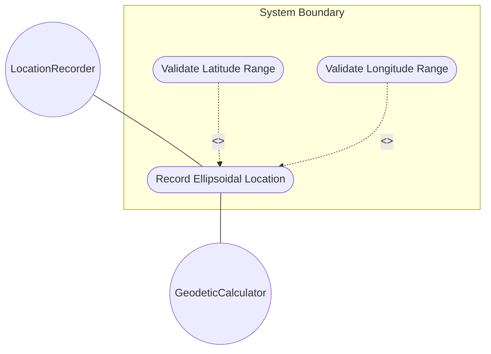
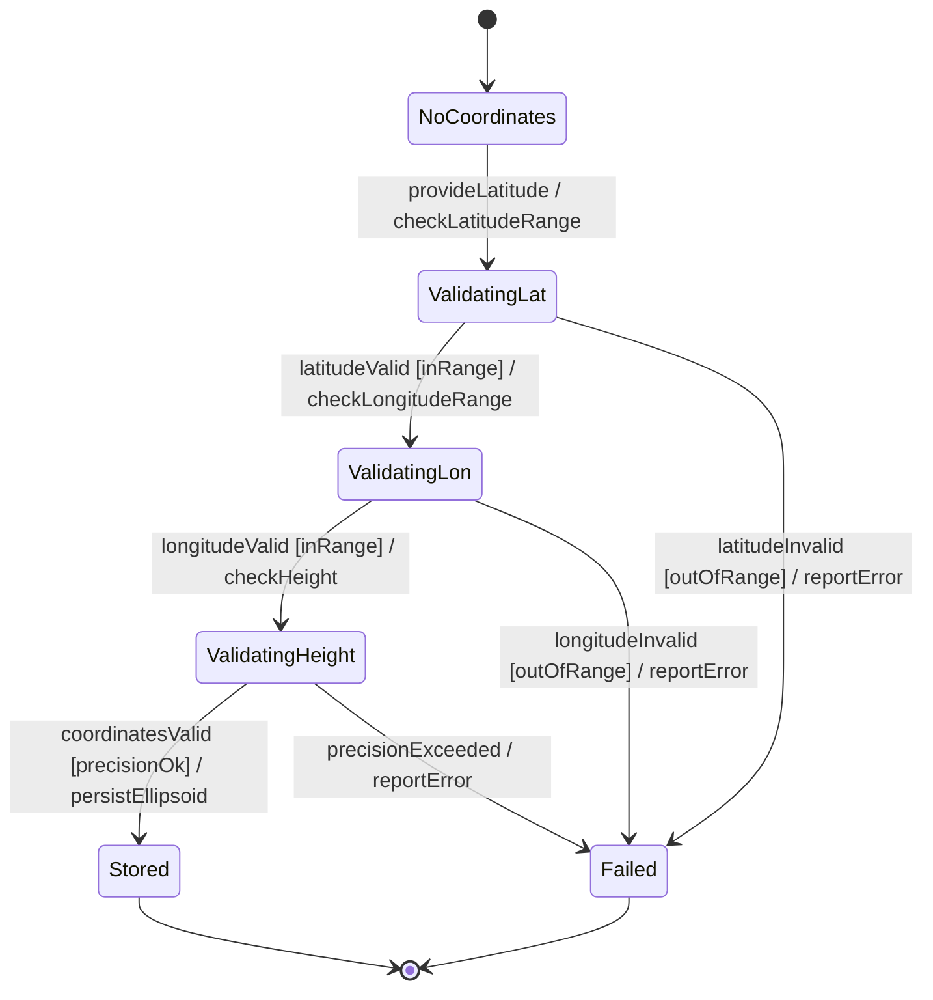

# Use Case: Record Ellipsoidal Location

## Parent Epic
- [ ] #7 - [Geo-Location: Geographic Location Specification](https://github.com/gintatkinson/3dgs-027/blob/main/docs/epics/epic-01-geo-location-specification.md) (Specifies location using ellipsoidal coordinates)

## 1. Actors
- **Primary Actor:** LocationRecorder (entity recording a location)
- **Secondary Actors:** GeodeticCalculator (provides conversion to Cartesian if needed)

## 2. Preconditions
- A geo-location record exists with a configured reference frame and geodetic system.
- The LocationRecorder has write access to location data.

## 3. Trigger
A user or system provides latitude, longitude, and optional height values to record an ellipsoidal location.

## 4. Main Success Scenario (Basic Flow)
1. The LocationRecorder provides latitude, longitude, and optional height values.
2. The system validates that latitude is within the range [-90.0, +90.0] decimal degrees.
3. The system validates that longitude is within the range [-180.0, +180.0] decimal degrees.
4. If height is provided, the system validates that height is a finite number within decimal64 precision of 6 fraction digits.
5. The system validates that all coordinate values conform to their decimal64 fraction-digit constraints (16 for lat/lon, 6 for height).
6. The system selects the ellipsoidal coordinate representation, replacing any existing Cartesian coordinates.
7. The system stores the ellipsoidal location data.
8. The system reports successful recording with the stored coordinate values.

## 5. Alternate and Exception Flows

- **5a. Latitude out of range (Branches from Basic Flow step 2):**
  1. The latitude value exceeds 90.0 or is below -90.0 decimal degrees.
  2. The system rejects the value and reports that latitude must be within [-90.0, +90.0].

- **5b. Longitude out of range (Branches from Basic Flow step 3):**
  1. The longitude value exceeds 180.0 or is below -180.0 decimal degrees.
  2. The system rejects the value and reports that longitude must be within [-180.0, +180.0].

- **5c. Coordinate at exact boundary accepted (Branches from Basic Flow step 2/3):**
  1. Latitude is exactly 90.0 (North Pole) or -90.0 (South Pole), or longitude is exactly 180.0 or -180.0.
  2. The system accepts the boundary value and stores it as valid.

- **5d. Height provided without latitude/longitude (Branches from Basic Flow step 1):**
  1. Only height is provided without latitude or longitude.
  2. The system stores the partial data but flags the location as incomplete for 2D positioning.

- **5e. Non-finite coordinate values (Branches from Basic Flow step 4):**
  1. Any coordinate value is NaN, Infinity, or -Infinity.
  2. The system rejects the value as invalid.

- **5f. Excessive decimal precision (Branches from Basic Flow step 5):**
  1. A latitude/longitude value exceeds 16 fraction digits or height exceeds 6 fraction digits.
  2. The system rounds to the allowed precision or rejects the value.

## 6. Postconditions (Guarantees)
- **Success Guarantee:** The geo-location record has valid ellipsoidal coordinates (latitude, longitude, optional height) stored. The Cartesian alternative is cleared. Coordinates are within valid ranges and precision constraints.
- **Failure Guarantee:** The previous coordinate representation (if any) remains unchanged. The system reports the specific validation failure.

## UML Diagrams

### Use Case Diagram

### State Machine Diagram

## 7. Operational Context

From RFC 9179 Section 2.2:
> For the standard location choice, 'latitude' and 'longitude' are specified as decimal degrees, and the 'height' value is in fractions of meters.

From the YANG schema (latitude):
> The latitude value on the astronomical body. The definition and precision of this measurement is indicated by the reference-frame.

## 8. Realization Matrix

### Required User Stories
- [ ] #12 - [Select and Manage Mutually Exclusive Coordinate Representation](https://github.com/gintatkinson/3dgs-027/blob/main/docs/user-stories/us-05-select-coordinate-system.md) (Selecting ellipsoid replaces Cartesian representation)
- [ ] #9 - [Convert Between Ellipsoidal and Cartesian Coordinate Systems](https://github.com/gintatkinson/3dgs-027/blob/main/docs/user-stories/us-02-coordinate-conversion.md) (Ellipsoidal coordinates may be converted to Cartesian)
- [ ] #11 - [Project Future Position from Current Location and Velocity Vector](https://github.com/gintatkinson/3dgs-027/blob/main/docs/user-stories/us-04-project-position.md) (Ellipsoidal position is the source for motion projection)

### Required Features
- [ ] #4 - [Ellipsoidal Coordinates](https://github.com/gintatkinson/3dgs-027/blob/main/docs/features/feat-04-ellipsoidal-coordinates.md) (Provides latitude, longitude, and height attributes)

## Source References
Structural Schema: [ietf-geo-location.yang](https://github.com/YangModels/yang/blob/main/standard/ietf/RFC/ietf-geo-location%402022-02-11.yang)
Normative Specification: [RFC 9179 - A YANG Grouping for Geographic Locations](https://datatracker.ietf.org/doc/rfc9179/)
