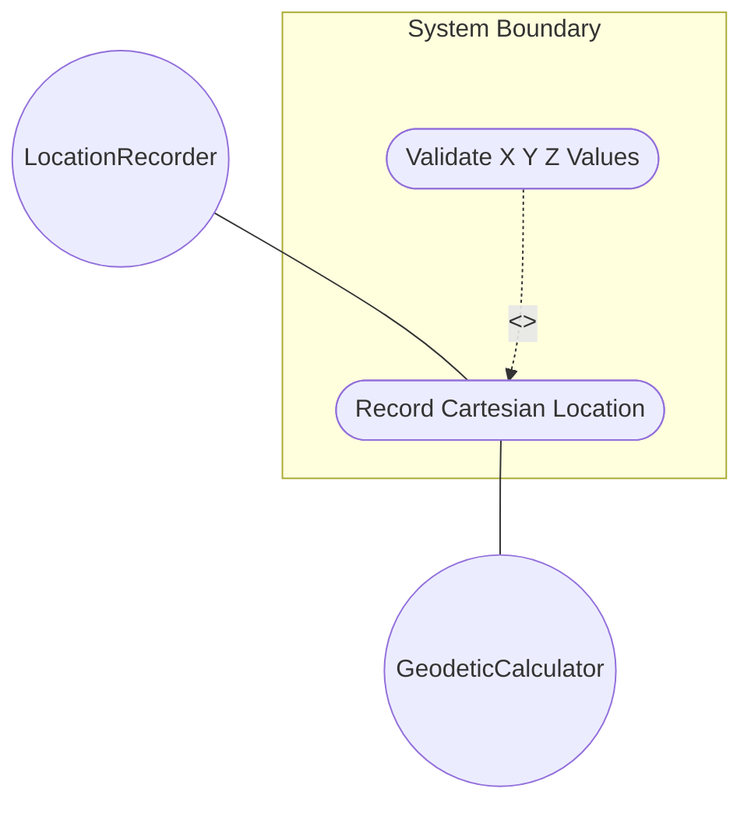
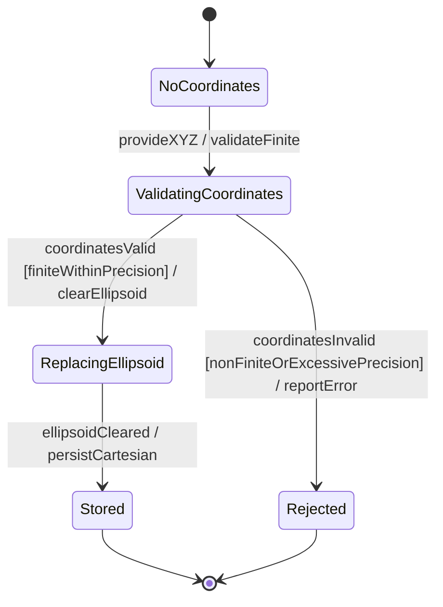

# Use Case: Record Cartesian Location

## Parent Epic
- [ ] #7 - [Geo-Location: Geographic Location Specification](https://github.com/gintatkinson/3dgs-027/blob/main/docs/epics/epic-01-geo-location-specification.md) (Specifies location using Cartesian coordinates)

## 1. Actors
- **Primary Actor:** LocationRecorder (entity recording a location)
- **Secondary Actors:** GeodeticCalculator (provides conversion to ellipsoidal if needed)

## 2. Preconditions
- A geo-location record exists with a configured reference frame and geodetic system.
- The LocationRecorder has write access to location data.

## 3. Trigger
A user or system provides X, Y, Z coordinate values in meters to record a Cartesian location.

## 4. Main Success Scenario (Basic Flow)
1. The LocationRecorder provides X, Y, and Z coordinate values in meters.
2. The system validates that all three values are finite numbers within decimal64 precision of 6 fraction digits.
3. The system selects the Cartesian coordinate representation, replacing any existing ellipsoidal coordinates.
4. The system stores the Cartesian location data.
5. The system reports successful recording with the stored X, Y, Z values.

## 5. Alternate and Exception Flows

- **5a. Incomplete coordinate set (Branches from Basic Flow step 1):**
  1. Only one or two of X, Y, Z are provided.
  2. The system stores the available values but flags the location as incomplete for 3D positioning.

- **5b. Non-finite coordinate values (Branches from Basic Flow step 2):**
  1. Any of X, Y, or Z is NaN, Infinity, or -Infinity.
  2. The system rejects the value as invalid.

- **5c. Excessive decimal precision (Branches from Basic Flow step 2):**
  1. A coordinate value exceeds 6 fraction digits.
  2. The system rounds to 6 fraction digits or rejects the value.

- **5d. Coordinate origin without reference frame (Branches from Basic Flow step 1):**
  1. No reference frame has been configured for the geo-location record.
  2. The system accepts the coordinates but warns that without a reference frame, the coordinate meaning is undefined.

- **5e. Switching from ellipsoidal to Cartesian (Branches from Basic Flow step 3):**
  1. A previous ellipsoidal location exists on this record.
  2. The system clears the ellipsoidal coordinates and stores the new Cartesian data exclusively.

- **5f. Conversion precision loss when switching (Branches from Basic Flow step 3):**
  1. The previous coordinates were ellipsoidal with 16 fraction-digit precision.
  2. When replaced by Cartesian, only 6 fraction-digit precision is available per the type constraint.
  3. The system stores the Cartesian coordinates and notes the potential precision reduction.

- **5g. Extreme coordinate values approaching decimal64 limits (Branches from Basic Flow step 2):**
  1. Coordinate values approach the maximum representable decimal64 range.
  2. The system stores the values and verifies no overflow occurs during arithmetic operations.

## 6. Postconditions (Guarantees)
- **Success Guarantee:** The geo-location record has valid Cartesian coordinates (X, Y, Z in meters) stored. The ellipsoidal alternative is cleared.
- **Failure Guarantee:** The previous coordinate representation (if any) remains unchanged. The system reports the specific validation failure.

## UML Diagrams

### Use Case Diagram

### State Machine Diagram

## 7. Operational Context

From RFC 9179 Section 2.2:
> For the Cartesian choice, 'x', 'y', and 'z' are in fractions of meters. In both choices, the exact meanings of all the values are defined by the 'geodetic-datum' value.

## 8. Realization Matrix

### Required User Stories
- [ ] #12 - [Select and Manage Mutually Exclusive Coordinate Representation](https://github.com/gintatkinson/3dgs-027/blob/main/docs/user-stories/us-05-select-coordinate-system.md) (Selecting Cartesian replaces ellipsoidal representation)
- [ ] #9 - [Convert Between Ellipsoidal and Cartesian Coordinate Systems](https://github.com/gintatkinson/3dgs-027/blob/main/docs/user-stories/us-02-coordinate-conversion.md) (Cartesian coordinates may be converted to ellipsoidal)
- [ ] #11 - [Project Future Position from Current Location and Velocity Vector](https://github.com/gintatkinson/3dgs-027/blob/main/docs/user-stories/us-04-project-position.md) (Cartesian position is the source for motion projection)

### Required Features
- [ ] #5 - [Cartesian Coordinates](https://github.com/gintatkinson/3dgs-027/blob/main/docs/features/feat-05-cartesian-coordinates.md) (Provides X, Y, Z attributes)

## Source References
Structural Schema: [ietf-geo-location.yang](https://github.com/YangModels/yang/blob/main/standard/ietf/RFC/ietf-geo-location%402022-02-11.yang)
Normative Specification: [RFC 9179 - A YANG Grouping for Geographic Locations](https://datatracker.ietf.org/doc/rfc9179/)
