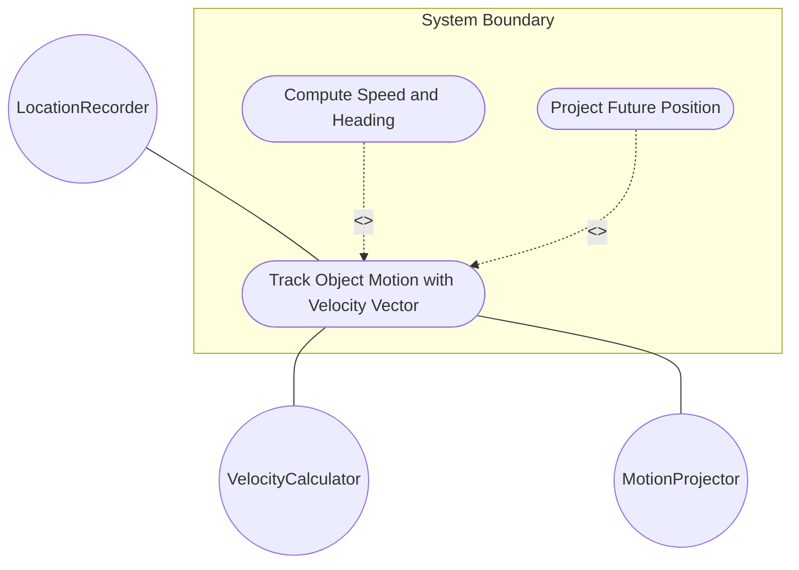
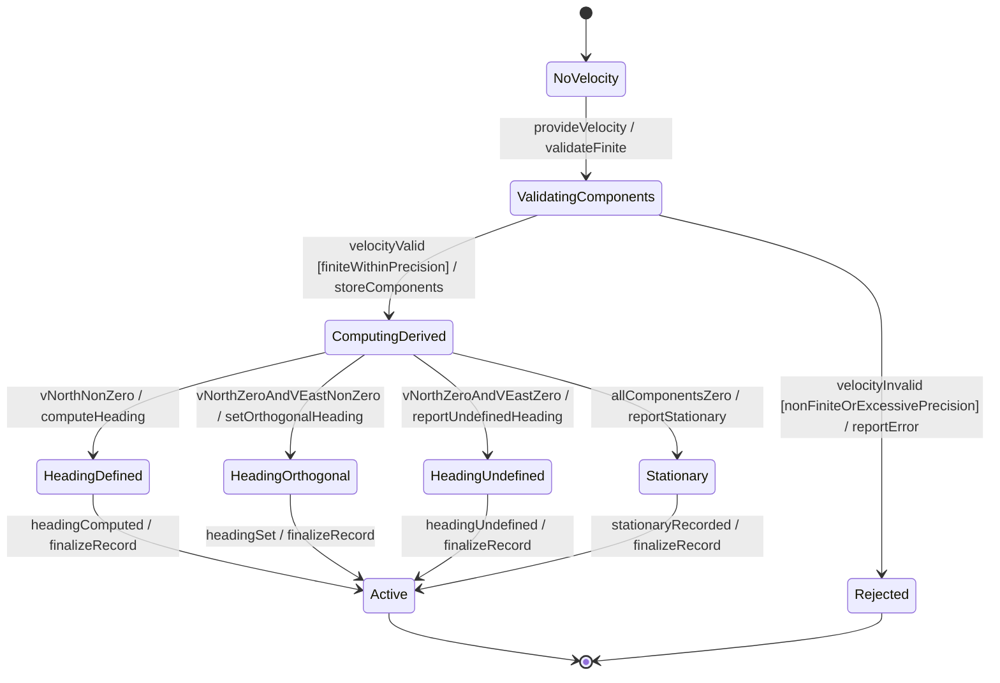

# Use Case: Track Object Motion with Velocity Vector

## Parent Epic
- [ ] #7 - [Geo-Location: Geographic Location Specification](https://github.com/gintatkinson/3dgs-027/blob/main/docs/epics/epic-01-geo-location-specification.md) (Defines three-dimensional velocity tracking for objects in motion)

## 1. Actors
- **Primary Actor:** LocationRecorder (entity recording motion data)
- **Secondary Actors:** VelocityCalculator (computes derived speed and heading), MotionProjector (projects future position)

## 2. Preconditions
- A geo-location record exists with valid coordinates.
- A recording timestamp has been assigned to the geo-location record.

## 3. Trigger
A user or system provides v-north, v-east, and v-up velocity components to record the object's motion at the timestamp moment.

## 4. Main Success Scenario (Basic Flow)
1. The LocationRecorder provides v-north, v-east, and v-up values in meters per second.
2. The system validates that all velocity components are finite numbers within decimal64 precision of 12 fraction digits.
3. The system stores the velocity vector components.
4. The VelocityCalculator computes the derived planar speed from v-north and v-east components.
5. The VelocityCalculator computes the derived heading from the arctangent of v-east divided by v-north.
6. The system stores the derived speed and heading alongside the raw velocity vector.
7. The system reports successful recording with both raw and derived motion data.

## 5. Alternate and Exception Flows

- **5a. Zero velocity vector (Branches from Basic Flow step 1):**
  1. All three components (v-north, v-east, v-up) are set to 0.0.
  2. The system stores the zero vector and reports the object as stationary.

- **5b. Division by zero in heading calculation (Branches from Basic Flow step 5):**
  1. v-north is zero and v-east is positive: heading is 90 degrees (due east).
  2. v-north is zero and v-east is negative: heading is 270 degrees (due west).
  3. Both v-north and v-east are zero: heading is undefined; the system reports "heading undefined for zero horizontal velocity".

- **5c. Non-finite velocity values (Branches from Basic Flow step 2):**
  1. Any velocity component is NaN, Infinity, or -Infinity.
  2. The system rejects the value as invalid.

- **5d. Excessive decimal precision (Branches from Basic Flow step 2):**
  1. A velocity component exceeds 12 fraction digits.
  2. The system rounds to 12 fraction digits or rejects the value.

- **5e. Slow motion tracking (Branches from Basic Flow step 1):**
  1. Velocity components are extremely small (e.g., representing continental drift at ~1 mm/year).
  2. The system stores the high-precision small values within the 12 fraction-digit limit.

- **5f. Motion projection from velocity and time delta (Branches from Basic Flow step 6):**
  1. A consumer requests the projected position at a future time using the stored velocity.
  2. The MotionProjector computes new coordinates by linear interpolation: component_new = component_original + (velocity_component * delta_time).

## 6. Postconditions (Guarantees)
- **Success Guarantee:** The velocity vector is stored with valid v-north, v-east, and v-up components. Derived speed and heading are computed and available. The object's motion at the timestamp is fully described.
- **Failure Guarantee:** The previous velocity vector (if any) or empty velocity remains unchanged. The system reports the specific validation failure.

## UML Diagrams

### Use Case Diagram

### State Machine Diagram

## 7. Operational Context

From RFC 9179 Section 2.3:
> Support is added for objects in relatively stable motion. For objects in relatively stable motion, the grouping provides a three-dimensional vector value. The components of the vector are 'v-north', 'v-east', and 'v-up', which are all given in fractional meters per second.

> To derive the two-dimensional heading and speed, one would use the following formulas: speed = sqrt(v_north^2 + v_east^2), heading = arctan(v_east / v_north)

## 8. Realization Matrix

### Required User Stories
- [ ] #8 - [Calculate Speed and Heading from Velocity Vector Components](https://github.com/gintatkinson/3dgs-027/blob/main/docs/user-stories/us-01-calculate-speed-heading.md) (Speed and heading are derived from v-north and v-east)
- [ ] #11 - [Project Future Position from Current Location and Velocity Vector](https://github.com/gintatkinson/3dgs-027/blob/main/docs/user-stories/us-04-project-position.md) (Position projection uses the velocity vector and time delta)

### Required Features
- [ ] #6 - [Velocity Vector](https://github.com/gintatkinson/3dgs-027/blob/main/docs/features/feat-06-velocity-vector.md) (Provides v-north, v-east, and v-up attributes)

## Source References
Structural Schema: [ietf-geo-location.yang](https://github.com/YangModels/yang/blob/main/standard/ietf/RFC/ietf-geo-location%402022-02-11.yang)
Normative Specification: [RFC 9179 - A YANG Grouping for Geographic Locations](https://datatracker.ietf.org/doc/rfc9179/)
