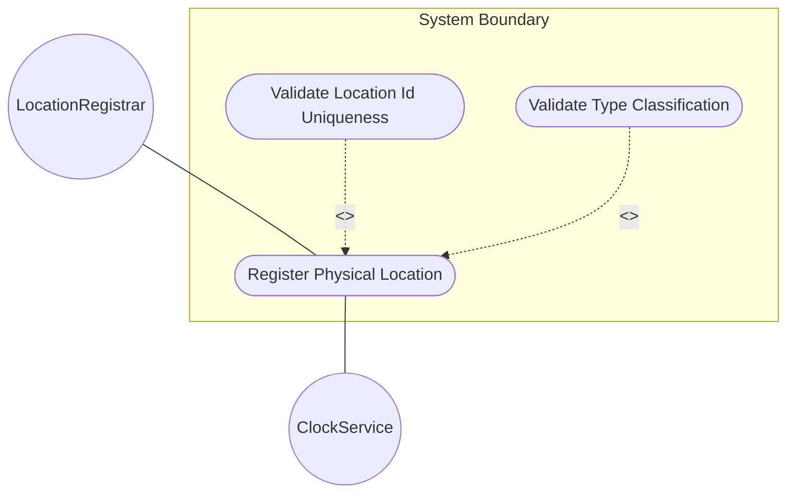
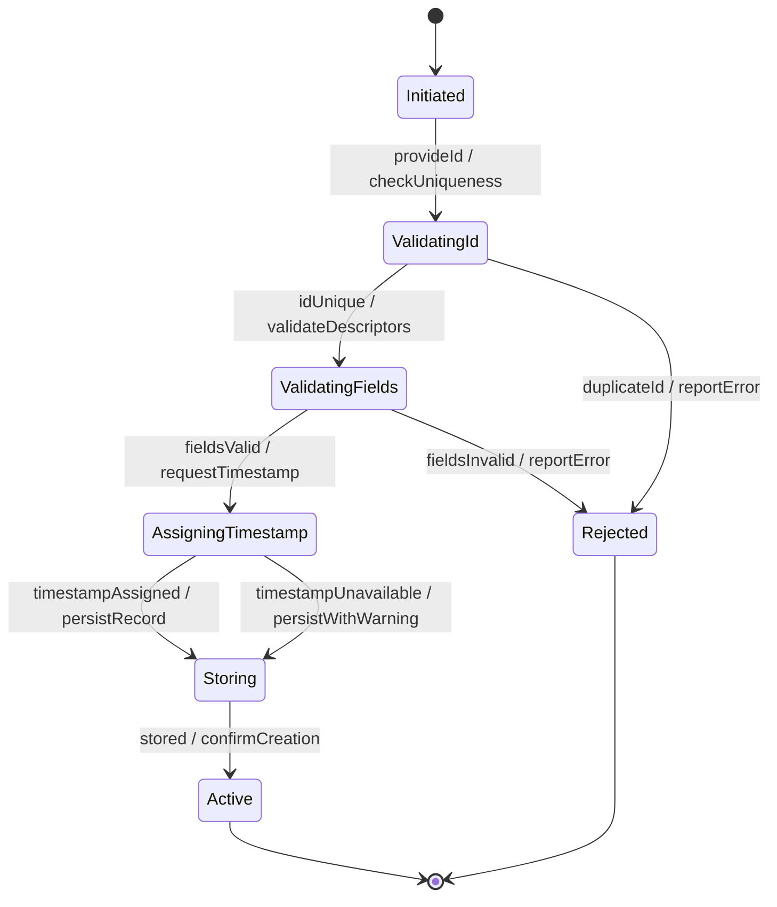

# Use Case: Register Physical Location in Inventory

## Parent Epic
- [ ] #30 - [Location Hierarchy & Physical Addressing](https://github.com/gintatkinson/3dgs-027/blob/main/docs/epics/epic-02-location-hierarchy.md) (Root container for registering location entries in the inventory)

## 1. Actors
- **Primary Actor:** LocationRegistrar (entity recording new physical locations)
- **Secondary Actors:** ClockService (provides timestamp reference)

## 2. Preconditions
- The base network inventory module is loaded and available.
- The registrar has authorization to create location records.

## 3. Trigger
A network operator or automated tooling (RFID, geolocation service) provides new physical location information that needs to be recorded in the inventory.

## 4. Main Success Scenario (Basic Flow)
1. The LocationRegistrar provides a unique location id, a name, and a type classification (e.g., 'site', 'building', 'room').
2. The system validates that the id is unique within the locations container.
3. The system validates that the type string, name, alias, and description fields do not contain control characters or exceed string length limits.
4. The system assigns a recording timestamp to the location entry.
5. The system stores the location record with all provided descriptors.
6. The system reports successful creation with the assigned timestamp.

## 5. Alternate and Exception Flows

- **5a. Duplicate location id (Branches from Basic Flow step 2):**
  1. The system detects that the provided id already exists in the locations list.
  2. The system rejects the record and reports a data-exists error with the conflicting id value.

- **5b. Type string exceeds maximum length (Branches from Basic Flow step 3):**
  1. The system detects a type string longer than the allowed maximum.
  2. The system rejects the record and reports a string-length-constraint error.

- **5c. Control characters in text fields (Branches from Basic Flow step 3):**
  1. The system detects non-printable or control characters in name, alias, description, or type fields.
  2. The system rejects the record and reports a character-validation error.

- **5d. Timestamp service unavailable (Branches from Basic Flow step 4):**
  1. The ClockService fails to generate a timestamp.
  2. The system stores the record with an absent timestamp and reports a warning.
  3. The record is retrievable but flagged as having an unknown recording time.

- **5e. UUID format violation (Branches from Basic Flow step 1):**
  1. The LocationRegistrar provides a uuid value that does not conform to RFC 4122 format.
  2. The system rejects the record and reports a type-validation error for the uuid field.

- **5f. Empty mandatory id field (Branches from Basic Flow step 1):**
  1. The LocationRegistrar omits the mandatory id field.
  2. The system rejects the record and reports a missing-key error.

- **5g. Description contains control characters (Branches from Basic Flow step 3):**
  1. The description string includes unicode control characters (values 0x00-0x1F).
  2. The system rejects the record and reports a character-validation error for the description field.

- **5h. Parent reference is self-referencing (Branches from Basic Flow step 1):**
  1. The LocationRegistrar sets the parent field equal to the location's own id.
  2. The system detects the self-reference and rejects the record with a circular-reference error.

- **5i. Missing required write authorization (Branches from Basic Flow step 1):**
  1. The LocationRegistrar does not have write permissions on the locations subtree.
  2. The system rejects the request with an access-denied error per NACM rules.

- **5j. Name exceeds string length limit (Branches from Basic Flow step 3):**
  1. The name string exceeds the system's maximum allowed length for string fields.
  2. The system rejects the record and reports a length-constraint-violation error.

- **5k. Concurrent write conflict (Branches from Basic Flow step 5):**
  1. Another registrar modifies the same location entry concurrently.
  2. The system detects the write conflict and reports a resource-denied error.

- **5l. Locations container not yet provisioned (Branches from Basic Flow step 2):**
  1. The locations container has not been initialized by the controller.
  2. The system rejects the request and reports a data-missing error for the parent container.

- **5m. Duplicate uuid in inventory (Branches from Basic Flow step 1):**
  1. The LocationRegistrar provides a uuid that matches another location's uuid.
  2. The system accepts the record but issues a warning about non-unique uuid across locations.

- **5n. Alias exceeds string length limit (Branches from Basic Flow step 3):**
  1. The alias string exceeds the system's maximum allowed length.
  2. The system rejects the value and reports a length-constraint-violation error.

- **5o. Query timeout on large inventory during uniqueness check (Branches from Basic Flow step 2):**
  1. The uniqueness check against a large location list exceeds the configured query timeout.
  2. The system returns a partial-commit-error or retries with paginated id scanning.

## 6. Postconditions (Guarantees)
- **Success Guarantee:** A new location entry is stored with a unique id, valid type string, recording timestamp, and all provided descriptor fields. The location is queryable by id and filterable by type.
- **Failure Guarantee:** No partial location record is persisted. The system reports the specific validation failure to the caller.

## UML Diagrams

### Use Case Diagram

### State Machine Diagram

## 7. Operational Context

From the IETF draft (Section 2):
> The "location" list is generalized to support a variety of geographic location, such as sites, rooms, buildings.

From the YANG schema (location list):
> List of locations within the network.

From the IETF draft (Section 6):
> Sources of controller location data may include RFID tooling, geolocation services, as well as manual entry via controller interfaces.

## 8. Realization Matrix

### Required User Stories
- [ ] #33 - [Verify Location Completeness for Field Dispatch](https://github.com/gintatkinson/3dgs-027/blob/main/docs/user-stories/us-10-verify-dispatch-readiness.md) (Dispatch verification validates the location record after creation)
- [ ] #35 - [Filter Locations by Custom Type Classification](https://github.com/gintatkinson/3dgs-027/blob/main/docs/user-stories/us-12-filter-locations-by-type.md) (Type-based filtering enables retrieval of registered locations by category)

### Required Features
- [ ] #22 - [Locations Container](https://github.com/gintatkinson/3dgs-027/blob/main/docs/features/feat-07-locations-container.md) (Top-level container that hosts the location list)
- [ ] #23 - [Location Entity](https://github.com/gintatkinson/3dgs-027/blob/main/docs/features/feat-08-location-entity.md) (The location list entry created during registration)

## Source References
Structural Schema: [ietf-ni-location.yang](https://github.com/ietf-ivy-wg/network-inventory-location/blob/main/ietf-ni-location.yang)
Normative Specification: [draft-ietf-ivy-network-inventory-location-06](https://datatracker.ietf.org/doc/html/draft-ietf-ivy-network-inventory-location)
