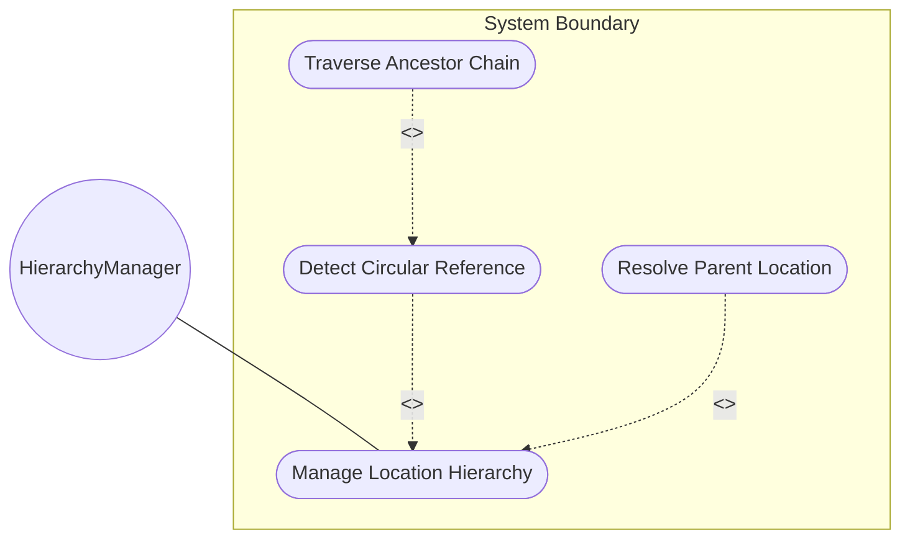
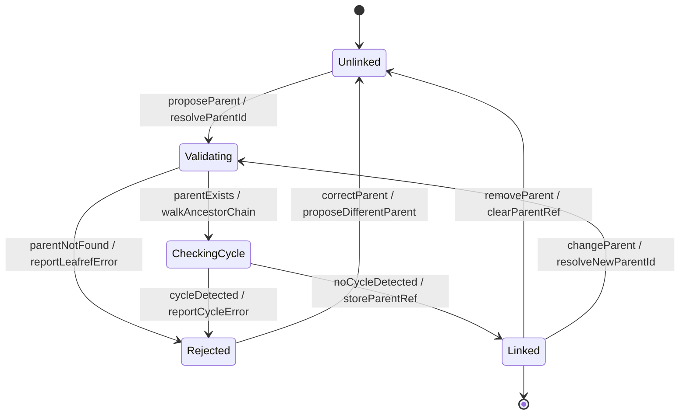

# Use Case: Manage Location Hierarchy

## Parent Epic
- [ ] #30 - [Location Hierarchy & Physical Addressing](https://github.com/gintatkinson/3dgs-027/blob/main/docs/epics/epic-02-location-hierarchy.md) (Hierarchical parent-child structure management for locations)

## 1. Actors
- **Primary Actor:** HierarchyManager (entity configuring the parent-child containment structure)
- **Secondary Actors:** HierarchyNavigator (traverses and validates ancestor chains)

## 2. Preconditions
- The target child location and proposed parent location both exist in the inventory.
- The HierarchyManager has authorization to modify location relationships.

## 3. Trigger
An operator needs to establish or modify the physical containment structure (e.g., a building is within a site, or a room is within a building) by setting the parent reference on a location.

## 4. Main Success Scenario (Basic Flow)
1. The HierarchyManager selects a child location and proposes a parent location id.
2. The system resolves the proposed parent location to verify it exists.
3. The system traverses the proposed parent's ancestor chain to check for cycles.
4. The system verifies that the proposed parent does not appear in the child's existing descendant tree.
5. The system stores the parent reference on the child location.
6. The system reports successful hierarchy update with the new parent.

## 5. Alternate and Exception Flows

- **5a. Proposed parent does not exist (Branches from Basic Flow step 2):**
  1. The system attempts to resolve the parent id and finds no matching location.
  2. The system rejects the assignment and reports a dangling leafref error.

- **5b. Circular reference detected (Branches from Basic Flow step 3):**
  1. The system discovers that the proposed parent appears in the child's descendant chain.
  2. The system rejects the assignment and reports a cycle-detection error with the conflicting ids.

- **5c. Child sets itself as parent (Branches from Basic Flow step 3):**
  1. The proposed parent id equals the child's own id.
  2. The system detects self-reference and rejects the assignment immediately.

- **5d. Removing an existing parent (Branches from Basic Flow step 1):**
  1. The HierarchyManager clears the parent reference on a location.
  2. The system removes the hierarchy link, making the location a root node in the containment tree.

- **5e. Updating parent to a different location (Branches from Basic Flow step 5):**
  1. The HierarchyManager changes the parent from one location to another.
  2. The system performs the full cycle-detection on the new proposed parent.
  3. On success, the old parent reference is replaced; on failure, the old parent is preserved.

- **5f. Parent reference to deleted location (Branches from Basic Flow step 3):**
  1. The proposed parent location was deleted during the assignment validation window.
  2. The system detects the leafref violation and rejects the assignment.

- **5g. Hierarchy depth exceeds configured maximum (Branches from Basic Flow step 3):**
  1. Adding this parent would create a hierarchy chain deeper than the system's configured maximum depth.
  2. The system rejects the assignment and reports a depth-exceeded error.

- **5h. Concurrent modification of parent chain (Branches from Basic Flow step 4):**
  1. Another operator modifies the parent of an ancestor location during validation.
  2. The system detects the concurrent modification and rejects the assignment with a resource-denied error.

- **5i. Parent reference to location in different administrative domain (Branches from Basic Flow step 2):**
  1. The proposed parent belongs to a different administrative domain or namespace.
  2. The system rejects the cross-domain hierarchy assignment.

- **5j. Bulk hierarchy restructure (Branches from Basic Flow step 1):**
  1. The HierarchyManager moves an entire subtree by changing the root node's parent.
  2. The system validates the entire descendant tree against the new parent chain and applies the change atomically.

- **5k. Missing write authorization (Branches from Basic Flow step 1):**
  1. The HierarchyManager lacks NACM write permissions on the location's parent leaf.
  2. The system rejects the assignment with an access-denied error.

- **5l. Location currently locked by another operation (Branches from Basic Flow step 5):**
  1. The child location is locked by a concurrent read-write transaction.
  2. The system retries the assignment or rejects with a resource-busy error.

- **5m. Parent id contains only whitespace (Branches from Basic Flow step 1):**
  1. The HierarchyManager provides a parent id consisting solely of whitespace characters.
  2. The system treats this as equivalent to clearing the parent and removes the hierarchy link.

- **5n. Location is referenced by rack assignments (Branches from Basic Flow step 1):**
  1. The HierarchyManager attempts to delete a location that is referenced by rack location-ref entries.
  2. The system rejects the deletion and reports a referential-integrity violation.

- **5o. Query timeout during ancestor traversal (Branches from Basic Flow step 3):**
  1. The ancestor chain traversal against a very deep hierarchy exceeds the query timeout.
  2. The system returns a partial-result error and recommends using depth-limited traversal.

## 6. Postconditions (Guarantees)
- **Success Guarantee:** The child location's parent reference is updated and the containment tree remains a valid directed acyclic graph. Hierarchical queries (ancestors, descendants) return the correct updated structure.
- **Failure Guarantee:** The child location's parent reference is unchanged. The system reports the specific validation failure (dangling reference or detected cycle).

## UML Diagrams

### Use Case Diagram

### State Machine Diagram

## 7. Operational Context

From the IETF draft (Section 2):
> Locations can be nested to form a hierarchy. For example, buildings may be within a site, and a room may be within a building.

From the YANG schema (parent leaf):
> The identifier of the location that physically contains this location.

From the IETF draft (Section 1):
> The information about sites, equipment rooms, and other more precise locations is critical, but it cannot be automatically populated and retrieved from NEs.

## 8. Realization Matrix

### Required User Stories
- [ ] #34 - [Traverse and Resolve Nested Location Hierarchies](https://github.com/gintatkinson/3dgs-027/blob/main/docs/user-stories/us-11-traverse-location-hierarchy.md) (Hierarchy traversal resolves ancestor and descendant chains)
- [ ] #37 - [Detect and Prevent Circular Location Hierarchy References](https://github.com/gintatkinson/3dgs-027/blob/main/docs/user-stories/us-14-detect-location-cycle.md) (Cycle detection validates parent assignments)

### Required Features
- [ ] #23 - [Location Entity](https://github.com/gintatkinson/3dgs-027/blob/main/docs/features/feat-08-location-entity.md) (Provides the id key and parent leafref that establish hierarchy)
- [ ] #22 - [Locations Container](https://github.com/gintatkinson/3dgs-027/blob/main/docs/features/feat-07-locations-container.md) (Provides the scope for resolving parent ids)

## Source References
Structural Schema: [ietf-ni-location.yang](https://github.com/ietf-ivy-wg/network-inventory-location/blob/main/ietf-ni-location.yang)
Normative Specification: [draft-ietf-ivy-network-inventory-location-06](https://datatracker.ietf.org/doc/html/draft-ietf-ivy-network-inventory-location)
