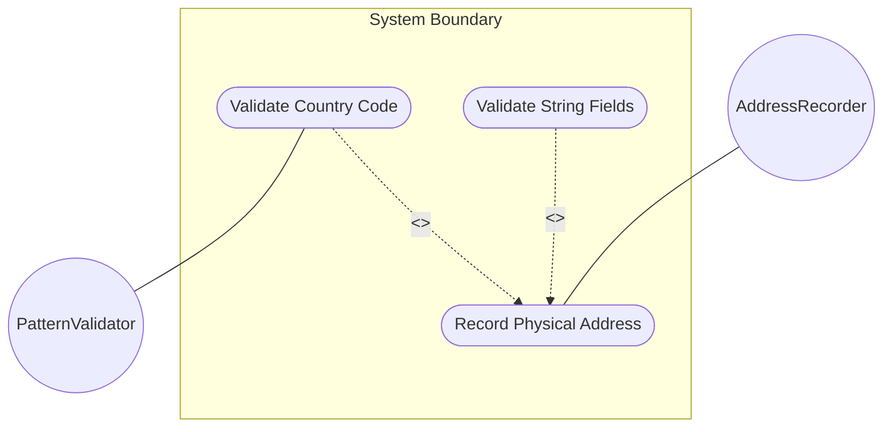
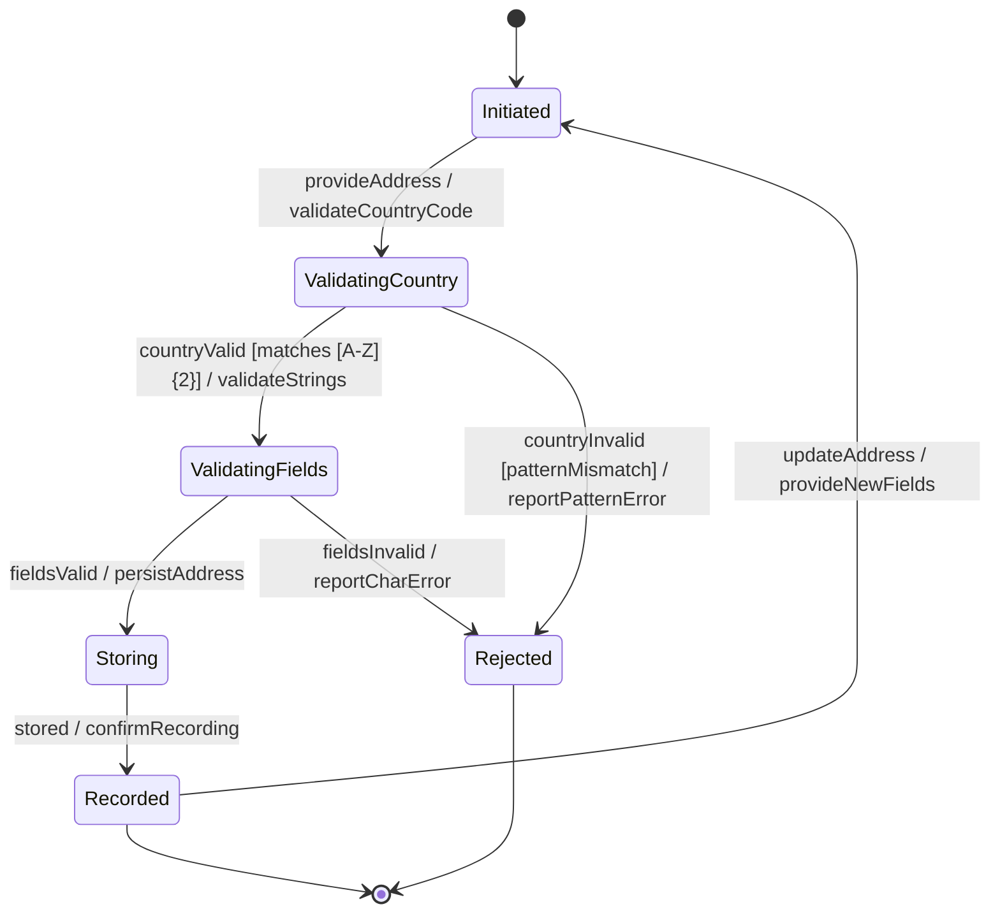

# Use Case: Record Physical Address for Location

## Parent Epic
- [ ] #30 - [Location Hierarchy & Physical Addressing](https://github.com/gintatkinson/3dgs-027/blob/main/docs/epics/epic-02-location-hierarchy.md) (Postal address recording for location identification)

## 1. Actors
- **Primary Actor:** AddressRecorder (entity recording postal address information for a location)
- **Secondary Actors:** PatternValidator (validates the country code format)

## 2. Preconditions
- The target location exists in the inventory.
- The AddressRecorder has authorization to modify location data.

## 3. Trigger
An operator needs to record or update the postal address for a physical location to support field dispatch, planning, or regulatory compliance.

## 4. Main Success Scenario (Basic Flow)
1. The AddressRecorder selects a location and provides postal address fields: address (street), postal-code, state, city, and country-code.
2. The system validates the country-code against the two-letter uppercase pattern `[A-Z]{2}`.
3. The system validates that all string fields contain printable characters and do not exceed length limits.
4. The system stores the physical address container with all provided fields.
5. The system reports successful address recording.

## 5. Alternate and Exception Flows

- **5a. Country code fails format validation (Branches from Basic Flow step 2):**
  1. The country-code value contains lowercase letters, digits, or more than two characters.
  2. The system rejects the value and reports a pattern-validation error with the expected format.

- **5b. Country code uses invalid but well-formed value (Branches from Basic Flow step 2):**
  1. The country-code matches `[A-Z]{2}` format but does not correspond to a recognized ISO country code (e.g., 'ZZ').
  2. The system accepts the value since only format is validated, but issues an informational warning about unrecognized country code.

- **5c. Partial address with only city and country (Branches from Basic Flow step 1):**
  1. The AddressRecorder provides only city and country-code fields.
  2. The system stores only those fields; address, postal-code, and state remain absent.

- **5d. Empty address container (Branches from Basic Flow step 1):**
  1. The AddressRecorder provides no address fields.
  2. The system stores an empty physical-address container. This is valid per schema (all fields optional).

- **5e. Control characters in address fields (Branches from Basic Flow step 3):**
  1. The system detects non-printable characters in any field.
  2. The system rejects the record and reports a character-validation error for the offending field.

- **5f. Address string exceeds maximum length (Branches from Basic Flow step 3):**
  1. The address street field contains more characters than the system's maximum string length.
  2. The system rejects the value and reports a length-constraint-violation error.

- **5g. Postal code string exceeds maximum length (Branches from Basic Flow step 3):**
  1. The postal-code field exceeds the allowed string length.
  2. The system rejects the value and reports a length-constraint-violation error.

- **5h. State/region string exceeds maximum length (Branches from Basic Flow step 3):**
  1. The state field exceeds the allowed string length.
  2. The system rejects the value and reports a length-constraint-violation error.

- **5i. City string exceeds maximum length (Branches from Basic Flow step 3):**
  1. The city field exceeds the allowed string length.
  2. The system rejects the value and reports a length-constraint-violation error.

- **5j. Country code contains numeric digits (Branches from Basic Flow step 2):**
  1. The country-code value contains numeric characters (e.g., 'A1').
  2. The system rejects the value and reports a pattern-validation error.

- **5k. Country code contains special characters (Branches from Basic Flow step 2):**
  1. The country-code value contains special characters or symbols.
  2. The system rejects the value and reports a pattern-validation error.

- **5l. Country code is a single character (Branches from Basic Flow step 2):**
  1. The country-code value is only one character.
  2. The system rejects the value and reports a pattern-validation error for insufficient length.

- **5m. Country code is more than two characters (Branches from Basic Flow step 2):**
  1. The country-code value has three or more characters.
  2. The system rejects the value and reports a pattern-validation error for excessive length.

- **5n. Missing write authorization (Branches from Basic Flow step 1):**
  1. The AddressRecorder lacks NACM write permissions on the physical-address subtree.
  2. The system rejects the request with an access-denied error.

- **5o. Concurrent address modification (Branches from Basic Flow step 4):**
  1. Another operator modifies the physical address concurrently.
  2. The system detects the write conflict and reports a resource-denied error.

- **5p. Location does not exist (Branches from Basic Flow step 1):**
  1. The target location referenced by the AddressRecorder does not exist.
  2. The system rejects the request with a data-missing error.

- **5q. Location's valid-until has expired (Branches from Basic Flow step 1):**
  1. The target location has an expired valid-until timestamp.
  2. The system accepts the address update but issues a warning that the location is stale.

- **5r. Country code is empty after trimming whitespace (Branches from Basic Flow step 2):**
  1. The country-code value contains only whitespace characters.
  2. The system rejects the value and reports a pattern-validation error.

## 6. Postconditions (Guarantees)
- **Success Guarantee:** The location's physical-address container is stored with the provided fields. The address is retrievable through the location query and satisfies the presence check for field dispatch verification.
- **Failure Guarantee:** The physical-address container remains unchanged or absent. The system reports the specific validation failure.

## UML Diagrams

### Use Case Diagram

### State Machine Diagram

## 7. Operational Context

From the IETF draft (Section 6):
> Before using a location for field dispatch or planning, verification is required to ensure at least one of physical-address or geo-location is present.

From the YANG schema (country-code leaf):
> Specifies a country. Expressed as ISO ALPHA-2 code.

## 8. Realization Matrix

### Required User Stories
- [ ] #33 - [Verify Location Completeness for Field Dispatch](https://github.com/gintatkinson/3dgs-027/blob/main/docs/user-stories/us-10-verify-dispatch-readiness.md) (Dispatch verification depends on physical address presence)
- [ ] #36 - [Validate Physical Address Country Code Format](https://github.com/gintatkinson/3dgs-027/blob/main/docs/user-stories/us-13-validate-country-code.md) (Country code pattern validation is part of address recording)

### Required Features
- [ ] #24 - [Physical Address](https://github.com/gintatkinson/3dgs-027/blob/main/docs/features/feat-09-physical-address.md) (Container holding the postal address fields)
- [ ] #23 - [Location Entity](https://github.com/gintatkinson/3dgs-027/blob/main/docs/features/feat-08-location-entity.md) (Parent location aggregating the physical address)

## Source References
Structural Schema: [ietf-ni-location.yang](https://github.com/ietf-ivy-wg/network-inventory-location/blob/main/ietf-ni-location.yang)
Normative Specification: [draft-ietf-ivy-network-inventory-location-06](https://datatracker.ietf.org/doc/html/draft-ietf-ivy-network-inventory-location)
