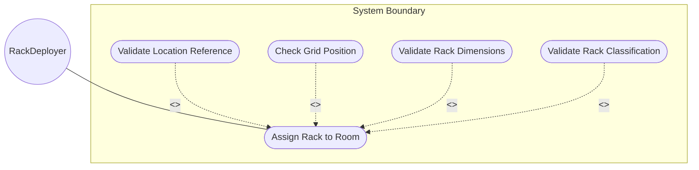
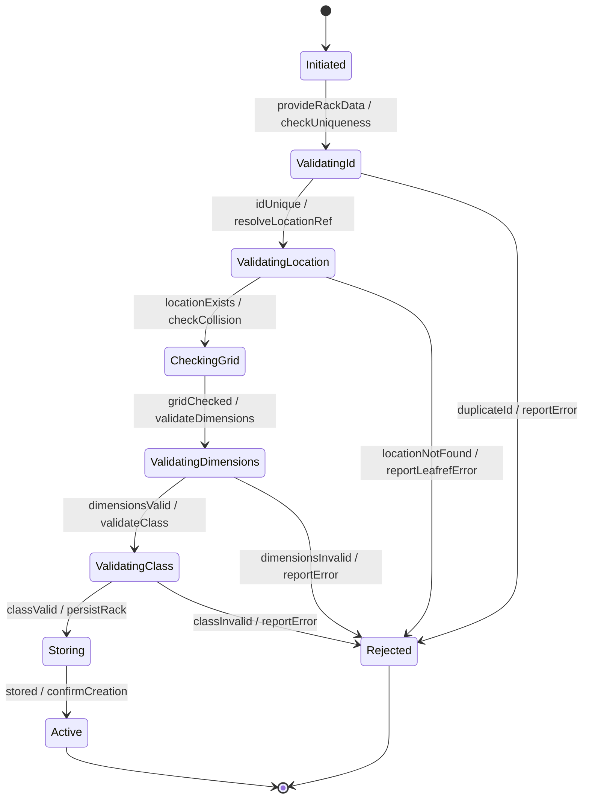

# Use Case: Assign Rack to Equipment Room

## Parent Epic
- [ ] #31 - [Rack Infrastructure Management](https://github.com/gintatkinson/3dgs-027/blob/main/docs/epics/epic-03-rack-infrastructure.md) (Rack creation and assignment to a parent location)

## 1. Actors
- **Primary Actor:** RackDeployer (entity registering racks and assigning them to locations)
- **Secondary Actors:** GridPositionChecker (validates grid position uniqueness), ClockService

## 2. Preconditions
- The target equipment room location exists in the inventory.
- The RackDeployer has authorization to create rack records.

## 3. Trigger
A new physical rack is installed in an equipment room and needs to be registered in the inventory with its physical attributes, electrical characteristics, and grid position.

## 4. Main Success Scenario (Basic Flow)
1. The RackDeployer provides a unique rack id, physical dimensions (height, width, depth in mm), electrical characteristics (max-voltage, max-allocated-power), security classification (rack-class), and a rack-location with location-ref, row-number, and column-number.
2. The system validates that the rack id is unique within the racks container.
3. The system validates that the location-ref resolves to an existing location.
4. The system checks for grid position collisions at the specified location, row, and column.
5. The system validates all dimension and power values are positive integers within uint16 range.
6. The system validates the rack-class against the rack-class-type identity hierarchy.
7. The system assigns a recording timestamp and stores the rack record.
8. The system reports successful rack registration with the assigned timestamp.

## 5. Alternate and Exception Flows

- **5a. Duplicate rack id (Branches from Basic Flow step 2):**
  1. The system detects the id already exists in the rack list.
  2. The system rejects the record and reports a data-exists error.

- **5b. Location reference does not exist (Branches from Basic Flow step 3):**
  1. The system attempts to resolve the location-ref and finds no matching location.
  2. The system rejects the assignment and reports a dangling leafref error.

- **5c. Grid position collision (Branches from Basic Flow step 4):**
  1. The system detects another rack already occupies the same row and column at the specified location.
  2. The system issues a collision warning but allows the assignment.
  3. The rack is stored with a collision warning flag.

- **5d. Dimension value is zero (Branches from Basic Flow step 5):**
  1. The system detects a zero value for height, width, or depth.
  2. The system accepts the value but issues a warning about physically impossible zero dimension.

- **5e. Invalid rack-class identity (Branches from Basic Flow step 6):**
  1. The rack-class value does not derive from rack-class-type.
  2. The system rejects the value and reports an identityref validation error.

- **5f. No location assignment (Branches from Basic Flow step 1):**
  1. The RackDeployer registers a rack without a rack-location container.
  2. The system stores the rack with no physical location assignment; the rack appears in the inventory but is not mapped to any room.

- **5g. Height exceeds uint16 maximum (Branches from Basic Flow step 5):**
  1. The height value exceeds 65535 millimeters.
  2. The system rejects the value and reports a range-overflow error.

- **5h. Width value is negative or overflow (Branches from Basic Flow step 5):**
  1. The width value exceeds the uint16 maximum or is negative (rejected at type level).
  2. The system rejects the value.

- **5i. Depth value is negative or overflow (Branches from Basic Flow step 5):**
  1. The depth value exceeds uint16 maximum.
  2. The system rejects the value and reports a range-overflow error.

- **5j. Max-voltage exceeds uint16 maximum (Branches from Basic Flow step 5):**
  1. The max-voltage value exceeds 65535 volts.
  2. The system rejects the value and reports a range-overflow error.

- **5k. Max-allocated-power exceeds uint16 maximum (Branches from Basic Flow step 5):**
  1. The max-allocated-power value exceeds 65535 watts.
  2. The system rejects the value and reports a range-overflow error.

- **5l. Row number exceeds uint32 maximum (Branches from Basic Flow step 1):**
  1. The rack-location row-number value exceeds 4294967295.
  2. The system rejects the value and reports a range-overflow error.

- **5m. Column number exceeds uint32 maximum (Branches from Basic Flow step 1):**
  1. The rack-location column-number value exceeds 4294967295.
  2. The system rejects the value and reports a range-overflow error.

- **5n. UUID format violation (Branches from Basic Flow step 1):**
  1. The RackDeployer provides a uuid not conforming to RFC 4122.
  2. The system rejects the value and reports a type-validation error.

- **5o. Name string exceeds maximum length (Branches from Basic Flow step 1):**
  1. The name value exceeds the allowed string length.
  2. The system rejects the value and reports a length-constraint error.

- **5p. Description string exceeds maximum length (Branches from Basic Flow step 1):**
  1. The description value exceeds the allowed string length.
  2. The system rejects the value.

- **5q. Missing mandatory id field (Branches from Basic Flow step 1):**
  1. The RackDeployer omits the required id field.
  2. The system rejects the record and reports a missing-key error.

- **5r. Missing write authorization (Branches from Basic Flow step 1):**
  1. The RackDeployer lacks NACM write permissions on the racks subtree.
  2. The system rejects the request with an access-denied error.

- **5s. Timestamp generation failure (Branches from Basic Flow step 7):**
  1. The ClockService is unavailable during timestamp assignment.
  2. The system stores the rack with an absent timestamp and reports a warning.

- **5t. Concurrent rack modification (Branches from Basic Flow step 7):**
  1. Another operator modifies the same rack concurrently.
  2. The system detects the write conflict and reports a resource-denied error.

- **5u. Alias string exceeds maximum length (Branches from Basic Flow step 1):**
  1. The alias value exceeds the allowed string length.
  2. The system rejects the value and reports a length-constraint error.

- **5v. Location's valid-until expired (Branches from Basic Flow step 3):**
  1. The referenced location has an expired valid-until timestamp.
  2. The system accepts the rack assignment but issues a stale-location warning.

- **5w. Row-number specified without location-ref (Branches from Basic Flow step 1):**
  1. The rack-location provides row-number or column-number but no location-ref.
  2. The system stores the grid coordinates but warns they have no meaningful context without a location reference.

- **5x. Rack registered with only id and no other attributes (Branches from Basic Flow step 1):**
  1. The RackDeployer provides only the mandatory id field.
  2. The system stores the rack with all optional fields absent; no validation errors occur.

- **5y. Location-ref references a location in a different inventory domain (Branches from Basic Flow step 3):**
  1. The location-ref resolves to a location in a separate inventory instance.
  2. The system rejects the cross-domain reference and reports a referential-scope error.

## 6. Postconditions (Guarantees)
- **Success Guarantee:** A new rack entry is stored with all physical, electrical, and classification attributes. If a rack-location was provided, the rack is mapped to the specified room and grid position. The rack is queryable by id and filterable by location-ref.
- **Failure Guarantee:** No partial rack record is persisted. The system reports the specific validation failure.

## UML Diagrams

### Use Case Diagram

### State Machine Diagram

## 7. Operational Context

From the IETF draft (Section 3):
> Each rack is assigned a unique ID and a name in the context of a facility, e.g. a site. A rack may have some specific attributes, such as appearance-related attributes and electricity-related attributes.

From the YANG schema (rack list):
> List of racks within the inventory (e.g., in an equipment room).

## 8. Realization Matrix

### Required User Stories
- [ ] #38 - [Verify Rack Power Capacity Against Deployed Chassis Loads](https://github.com/gintatkinson/3dgs-027/blob/main/docs/user-stories/us-15-verify-rack-power-capacity.md) (Power capacity check is needed when equipment is later installed in the rack)
- [ ] #39 - [Detect Rack Grid Position Collisions Within a Location](https://github.com/gintatkinson/3dgs-027/blob/main/docs/user-stories/us-16-detect-rack-grid-collisions.md) (Grid collision detection runs during rack placement)

### Required Features
- [ ] #27 - [Rack Entity](https://github.com/gintatkinson/3dgs-027/blob/main/docs/features/feat-12-rack-entity.md) (Provides dimensions, power, and classification attributes)
- [ ] #28 - [Rack Location](https://github.com/gintatkinson/3dgs-027/blob/main/docs/features/feat-13-rack-location.md) (Provides location-ref and grid coordinates)
- [ ] #26 - [Racks Container](https://github.com/gintatkinson/3dgs-027/blob/main/docs/features/feat-11-racks-container.md) (Provides the top-level container for rack list registration)

## Source References
Structural Schema: [ietf-ni-location.yang](https://github.com/ietf-ivy-wg/network-inventory-location/blob/main/ietf-ni-location.yang)
Normative Specification: [draft-ietf-ivy-network-inventory-location-06](https://datatracker.ietf.org/doc/html/draft-ietf-ivy-network-inventory-location)
