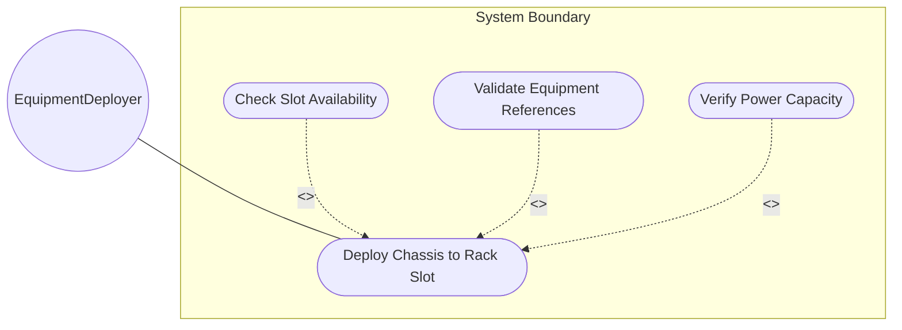
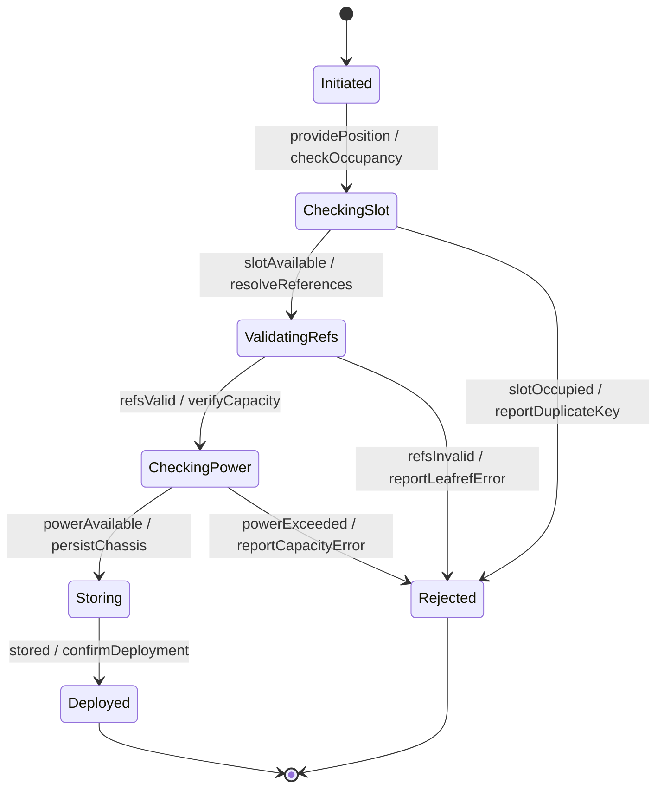

# Use Case: Deploy Chassis to Rack Slot

## Parent Epic
- [ ] #31 - [Rack Infrastructure Management](https://github.com/gintatkinson/3dgs-027/blob/main/docs/epics/epic-03-rack-infrastructure.md) (Chassis installation within rack U-slots)

## 1. Actors
- **Primary Actor:** EquipmentDeployer (entity installing network equipment chassis in racks)
- **Secondary Actors:** RackCapacityPlanner (verifies power headroom), ClockService

## 2. Preconditions
- The target rack exists in the inventory.
- The referenced network element and component exist in the base inventory.
- The EquipmentDeployer has authorization to modify rack records.

## 3. Trigger
A network equipment chassis is physically installed in a rack slot and needs to be registered to enable inventory tracking, capacity management, and maintenance scheduling.

## 4. Main Success Scenario (Basic Flow)
1. The EquipmentDeployer selects a rack and specifies a relative-position (U-slot number), a ne-ref pointing to the network element, and a component-ref pointing to the specific chassis component.
2. The system validates that the relative-position is not already occupied within the rack.
3. The system validates that the ne-ref resolves to an existing network element.
4. The system validates that the component-ref resolves to an existing component within the referenced network element.
5. The system verifies that installing the chassis does not exceed the rack's max-allocated-power.
6. The system stores the chassis entry in the rack's contained-chassis list.
7. The system reports successful chassis deployment.

## 5. Alternate and Exception Flows

- **5a. Slot position already occupied (Branches from Basic Flow step 2):**
  1. The system detects an existing chassis at the same relative-position in the rack.
  2. The system rejects the entry and reports a duplicate-key error.

- **5b. Network element not found (Branches from Basic Flow step 3):**
  1. The system attempts to resolve the ne-ref leafref and finds no matching network element.
  2. The system rejects the entry and reports a leafref constraint violation.

- **5c. Component not found in network element (Branches from Basic Flow step 4):**
  1. The system resolves the ne-ref but the component-ref does not reference a valid component.
  2. The system rejects the entry and reports a leafref constraint violation.

- **5d. Power capacity exceeded (Branches from Basic Flow step 5):**
  1. The system computes the total power draw of all installed chassis plus the new chassis.
  2. The total exceeds the rack's max-allocated-power.
  3. The system rejects the installation and reports a capacity-violation error with the current allocation and available headroom.

- **5e. Slot position exceeds rack height (Branches from Basic Flow step 2):**
  1. The relative-position value exceeds the rack's physical height capacity (e.g., U-slot 50 on a 42U rack).
  2. The system issues a warning about out-of-bounds slot placement but allows the assignment.

- **5f. Empty slot reservation (Branches from Basic Flow step 1):**
  1. The EquipmentDeployer registers a relative-position without ne-ref or component-ref.
  2. The system stores an empty, reserved slot entry for future deployment planning.

- **5g. Relative-position exceeds uint8 maximum (Branches from Basic Flow step 2):**
  1. The relative-position value exceeds 255.
  2. The system rejects the value and reports a range-overflow error.

- **5h. ne-ref leafref fails to resolve during validation race (Branches from Basic Flow step 3):**
  1. The network element referenced by ne-ref is deleted during validation.
  2. The system detects the race condition and rejects the entry with a referential-integrity error.

- **5i. component-ref resolves to wrong type of component (Branches from Basic Flow step 4):**
  1. The component-ref resolves to a component that is not a chassis type.
  2. The system rejects the entry and reports a type-mismatch error.

- **5j. Power capacity check timeout on large chassis list (Branches from Basic Flow step 5):**
  1. Aggregating power draw for a rack with hundreds of installed chassis exceeds the computation timeout.
  2. The system returns a partial-assessment warning and recommends verifying capacity asynchronously.

- **5k. Rack currently locked by maintenance operation (Branches from Basic Flow step 6):**
  1. The rack is locked by a concurrent maintenance or decommission operation.
  2. The system rejects the deployment and reports a resource-busy error.

- **5l. Missing write authorization on rack subtree (Branches from Basic Flow step 1):**
  1. The EquipmentDeployer lacks NACM write permissions on the rack's contained-chassis list.
  2. The system rejects the request with an access-denied error.

- **5m. Chassis deployment to rack that has expired valid-until (Branches from Basic Flow step 1):**
  1. The target rack has a valid-until timestamp in the past.
  2. The system allows deployment but issues a warning about deploying to a stale rack record.

- **5n. Decommission of chassis that is not installed (Branches from Basic Flow step 1):**
  1. The EquipmentDeployer attempts to delete a chassis entry that does not exist at the specified relative-position.
  2. The system rejects the deletion and reports a data-missing error.

- **5o. Bulk chassis deployment across multiple slots (Branches from Basic Flow step 1):**
  1. The EquipmentDeployer deploys multiple chassis entries in a single transaction.
  2. The system validates all entries atomically; if any entry fails validation, the entire transaction is rolled back.

- **5p. ne-ref references a deprecated or decommissioned network element (Branches from Basic Flow step 3):**
  1. The ne-ref resolves to a network element that is marked as decommissioned.
  2. The system accepts the deployment but issues a warning about referencing a decommissioned element.

- **5q. component-ref specified without ne-ref (Branches from Basic Flow step 4):**
  1. The EquipmentDeployer provides a component-ref without an accompanying ne-ref.
  2. The system cannot resolve the leafref path and rejects the entry.

- **5r. Chassis requires voltage incompatible with rack supply (Branches from Basic Flow step 5):**
  1. The equipment requires a voltage different from the rack's max-voltage specification.
  2. The system issues an incompatibility warning but allows deployment.

- **5s. Rack has no max-allocated-power defined for capacity check (Branches from Basic Flow step 5):**
  1. The rack has no max-allocated-power value set.
  2. The system skips the power capacity check and allows deployment with a warning about unbounded power allocation.

- **5t. Deployment of chassis in a distributed multi-chassis NE spanning multiple racks (Branches from Basic Flow step 1):**
  1. The EquipmentDeployer deploys chassis-2 of NE-1 at a different rack, while chassis-1 is already in another rack.
  2. The system allows the distributed deployment and tracks both chassis entries under the same ne-ref.

- **5u. Chassis deployment violates physical dimension constraints (Branches from Basic Flow step 5):**
  1. The chassis physical dimensions exceed the available space in the rack slot.
  2. The system allows deployment but issues a dimensional-incompatibility warning.

## 6. Postconditions (Guarantees)
- **Success Guarantee:** The chassis is registered at the specified rack slot with equipment references. The rack's contained-chassis list is updated. The chassis is queryable by rack id and relative-position.
- **Failure Guarantee:** No chassis entry is persisted. The rack state is unchanged. The system reports the specific validation failure.

## UML Diagrams

### Use Case Diagram

### State Machine Diagram

## 7. Operational Context

From the YANG schema (contained-chassis list):
> The list of chassis within a rack.

From the YANG schema (relative-position leaf):
> Relative position (e.g., U-slot) of chassis within the rack.

From the IETF draft (Appendix A.2):
> This example illustrates a distributed deployment where a single logical network element spans multiple physical locations.

## 8. Realization Matrix

### Required User Stories
- [ ] #38 - [Verify Rack Power Capacity Against Deployed Chassis Loads](https://github.com/gintatkinson/3dgs-027/blob/main/docs/user-stories/us-15-verify-rack-power-capacity.md) (Power capacity verification occurs during chassis deployment)
- [ ] #39 - [Detect Rack Grid Position Collisions Within a Location](https://github.com/gintatkinson/3dgs-027/blob/main/docs/user-stories/us-16-detect-rack-grid-collisions.md) (Slot collision detection for rack positions)

### Required Features
- [ ] #29 - [Rack Contained Chassis](https://github.com/gintatkinson/3dgs-027/blob/main/docs/features/feat-14-rack-contained-chassis.md) (The chassis list within a rack)
- [ ] #27 - [Rack Entity](https://github.com/gintatkinson/3dgs-027/blob/main/docs/features/feat-12-rack-entity.md) (Provides max-allocated-power for capacity checks)

## Source References
Structural Schema: [ietf-ni-location.yang](https://github.com/ietf-ivy-wg/network-inventory-location/blob/main/ietf-ni-location.yang)
Normative Specification: [draft-ietf-ivy-network-inventory-location-06](https://datatracker.ietf.org/doc/html/draft-ietf-ivy-network-inventory-location)
