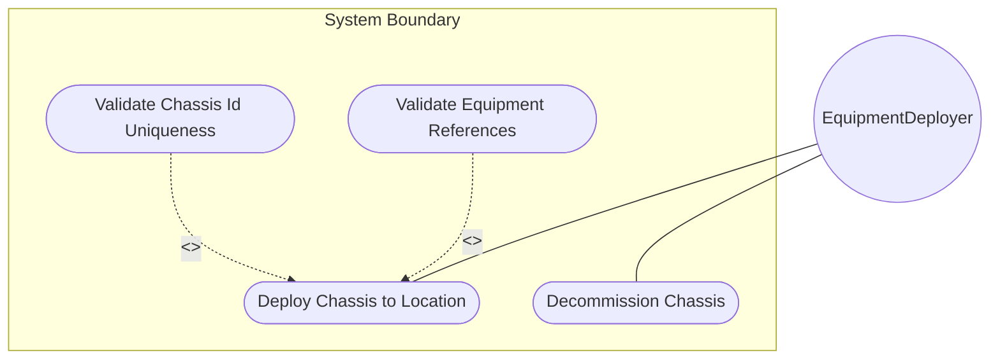
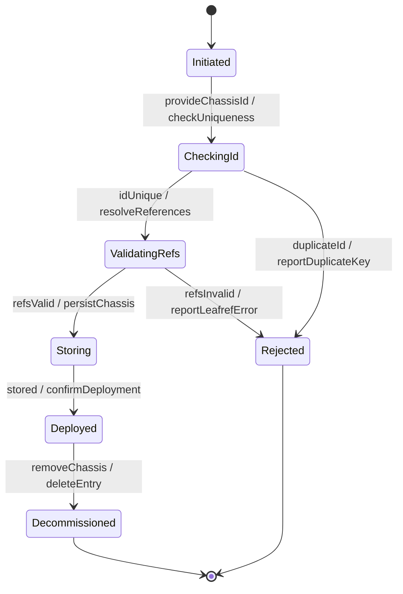

# Use Case: Deploy Chassis Directly to Location

## Parent Epic
- [ ] #30 - [Location Hierarchy & Physical Addressing](https://github.com/gintatkinson/3dgs-027/blob/main/docs/epics/epic-02-location-hierarchy.md) (Direct chassis deployment without rack enclosure)

## 1. Actors
- **Primary Actor:** EquipmentDeployer (entity installing network equipment directly at a location)
- **Secondary Actors:** ClockService

## 2. Preconditions
- The target location exists in the inventory.
- The referenced network element and component exist in the base inventory.
- The EquipmentDeployer has authorization to modify location records.

## 3. Trigger
Network equipment (e.g., Wi-Fi access point, wall-mounted switch, outdoor radio) is physically installed at a location without a rack enclosure and needs to be registered in the inventory.

## 4. Main Success Scenario (Basic Flow)
1. The EquipmentDeployer selects a location and provides a unique chassis-id, a ne-ref referencing the network element, and a component-ref referencing the chassis component.
2. The system validates that the chassis-id is unique within the location's contained-chassis list.
3. The system validates that the ne-ref resolves to an existing network element.
4. The system validates that the component-ref resolves to an existing component within the referenced network element.
5. The system stores the chassis entry in the location's contained-chassis list.
6. The system reports successful chassis deployment at the location.

## 5. Alternate and Exception Flows

- **5a. Duplicate chassis-id in location (Branches from Basic Flow step 2):**
  1. The system detects an existing chassis with the same chassis-id in the same location.
  2. The system rejects the entry and reports a duplicate-key error.

- **5b. Network element not found (Branches from Basic Flow step 3):**
  1. The system attempts to resolve the ne-ref and finds no matching network element.
  2. The system rejects the entry and reports a leafref constraint violation.

- **5c. Component not found in network element (Branches from Basic Flow step 4):**
  1. The ne-ref is valid but the component-ref does not reference an existing component.
  2. The system rejects the entry and reports a leafref constraint violation.

- **5d. component-ref specified without ne-ref (Branches from Basic Flow step 4):**
  1. The EquipmentDeployer provides a component-ref without a ne-ref.
  2. The system cannot resolve the component-ref path and rejects the entry.

- **5e. Multiple chassis referencing same network element (Branches from Basic Flow step 1):**
  1. The EquipmentDeployer adds a second chassis entry at the same location referencing the same ne-ref but different component-ref.
  2. This is valid for distributed systems where one logical NE has multiple chassis at the same location.
  3. The system accepts the entry.

- **5f. Decommission chassis from location (Branches from Basic Flow step 5):**
  1. The EquipmentDeployer deletes a chassis entry from the location.
  2. The system removes the chassis association; the location inventory is updated.

- **5g. chassis-id exceeds uint32 maximum (Branches from Basic Flow step 2):**
  1. The chassis-id value exceeds 4294967295.
  2. The system rejects the value and reports a range-overflow error.

- **5h. ne-ref references deleted network element during validation (Branches from Basic Flow step 3):**
  1. The network element is deleted between ne-ref validation and chassis storage.
  2. The system detects the race condition and rejects the entry.

- **5i. Location valid-until expired (Branches from Basic Flow step 1):**
  1. The target location has a valid-until timestamp in the past.
  2. The system accepts the deployment but issues a stale-location warning.

- **5j. Missing write authorization on location subtree (Branches from Basic Flow step 1):**
  1. The EquipmentDeployer lacks NACM write permissions on the location's contained-chassis list.
  2. The system rejects the request with an access-denied error.

- **5k. Location does not exist (Branches from Basic Flow step 1):**
  1. The target location id does not resolve to any existing location.
  2. The system rejects the request and reports a data-missing error.

- **5l. Concurrent chassis modification at same location (Branches from Basic Flow step 5):**
  1. Another operator modifies the same location's contained-chassis list concurrently.
  2. The system detects the write conflict and reports a resource-denied error.

- **5m. Chassis entry references component in different administrative domain (Branches from Basic Flow step 4):**
  1. The component-ref resolves to a component in a different administrative namespace.
  2. The system rejects the cross-domain chassis association.

- **5n. Bulk deployment of multiple chassis to location (Branches from Basic Flow step 1):**
  1. The EquipmentDeployer deploys multiple chassis entries in one transaction.
  2. The system validates all entries atomically and commits or rolls back as a unit.

- **5o. component-ref specified with valid but wrong-type component (Branches from Basic Flow step 4):**
  1. The component-ref resolves to a component that is not a chassis type (e.g., a port or module).
  2. The system rejects the entry with a type-mismatch error.

- **5p. Decommission chassis that is still referenced by active monitoring (Branches from Basic Flow step 5):**
  1. The chassis being decommissioned is referenced by active telemetry or monitoring subscriptions.
  2. The system warns about the active reference and either defers decommission or forces removal.

## 6. Postconditions (Guarantees)
- **Success Guarantee:** The chassis is registered at the location with equipment references. The location's contained-chassis list is updated. The chassis deployment is queryable by location id and chassis-id.
- **Failure Guarantee:** No chassis entry is persisted. The location state is unchanged.

## UML Diagrams

### Use Case Diagram

### State Machine Diagram

## 7. Operational Context

From the YANG schema (contained-chassis list under location):
> Chassis directly deployed in this location without rack. Also used for distributed chassis components that are logically part of a network element but physically located.

From the IETF draft (Appendix A.1):
> This example illustrates a typical edge deployment scenario where a Wi-Fi Access Point is mounted directly to a ceiling without a rack enclosure.

## 8. Realization Matrix

### Required User Stories
- [ ] #33 - [Verify Location Completeness for Field Dispatch](https://github.com/gintatkinson/3dgs-027/blob/main/docs/user-stories/us-10-verify-dispatch-readiness.md) (Location completeness verification accounts for deployed equipment)

### Required Features
- [ ] #25 - [Location Contained Chassis](https://github.com/gintatkinson/3dgs-027/blob/main/docs/features/feat-10-location-contained-chassis.md) (The chassis list directly under a location)
- [ ] #23 - [Location Entity](https://github.com/gintatkinson/3dgs-027/blob/main/docs/features/feat-08-location-entity.md) (Parent location hosting the chassis)

## Source References
Structural Schema: [ietf-ni-location.yang](https://github.com/ietf-ivy-wg/network-inventory-location/blob/main/ietf-ni-location.yang)
Normative Specification: [draft-ietf-ivy-network-inventory-location-06](https://datatracker.ietf.org/doc/html/draft-ietf-ivy-network-inventory-location)
