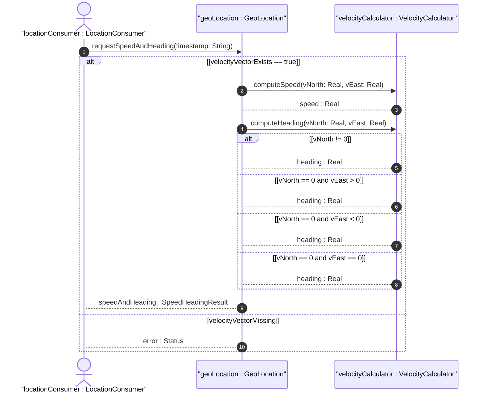

# User Story: Calculate Speed and Heading from Velocity Vector Components

## Parent Epic
- [ ] #7 - [Geo-Location: Geographic Location Specification](https://github.com/gintatkinson/3dgs-027/blob/main/docs/epics/epic-01-geo-location-specification.md) (Algorithmic derivation of planar speed and heading from north/east velocity components)

## Domain Object Mapping
- **Primary Domain Objects:** Velocity (v-north, v-east, v-up), GeoLocation
- **Actor/Role:** LocationConsumer (entity requesting derived motion metrics)

## BDD Scenario (OOA/OOD Realization)
**Given** a geo-location record has a velocity vector with v-north and v-east components
**When** the LocationConsumer requests the derived speed and heading
**Then** the system computes the planar speed as sqrt(v-north^2 + v-east^2) and heading as arctan(v-east / v-north) in degrees clockwise from true north

### As a LocationConsumer
I want to derive speed and heading from the raw v-north and v-east velocity components
So that I can interpret the object's motion in human-readable terms without performing manual trigonometric calculations

## UML Sequence Diagram

## Operational Context

From RFC 9179 Section 2.3:
> To derive the two-dimensional heading and speed, one would use the following formulas: speed = sqrt(v_north^2 + v_east^2), heading = arctan(v_east / v_north)

> Tracking more complex forms of motion is outside the scope of this work.

## Required Features Matrix
- [ ] #6 - [Velocity Vector](https://github.com/gintatkinson/3dgs-027/blob/main/docs/features/feat-06-velocity-vector.md) (Provides the v-north, v-east, and v-up velocity components required for speed and heading computation)
- [ ] #1 - [Geo-Location Container](https://github.com/gintatkinson/3dgs-027/blob/main/docs/features/feat-01-geo-location-container.md) (Provides timestamp context for the velocity measurement point in time)

## Source References
Structural Schema: [ietf-geo-location.yang](https://github.com/YangModels/yang/blob/main/standard/ietf/RFC/ietf-geo-location%402022-02-11.yang)
Normative Specification: [RFC 9179 - A YANG Grouping for Geographic Locations](https://datatracker.ietf.org/doc/rfc9179/)
