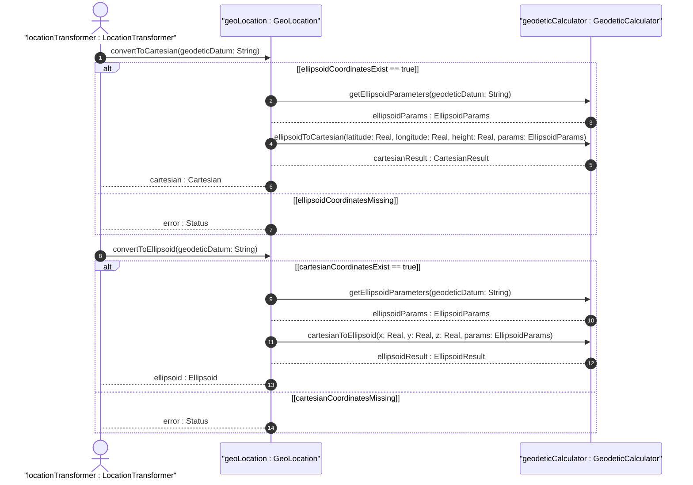

# User Story: Convert Between Ellipsoidal and Cartesian Coordinate Systems

## Parent Epic
- [ ] #7 - [Geo-Location: Geographic Location Specification](https://github.com/gintatkinson/3dgs-027/blob/main/docs/epics/epic-01-geo-location-specification.md) (Algorithmic conversion between ellipsoidal latitude/longitude/height and Cartesian X/Y/Z coordinate representations)

## Domain Object Mapping
- **Primary Domain Objects:** Ellipsoid (latitude, longitude, height), Cartesian (x, y, z), GeodeticSystem (geodetic-datum)
- **Actor/Role:** LocationTransformer (entity requesting coordinate system conversion)

## BDD Scenario (OOA/OOD Realization)
**Given** a geo-location record has ellipsoidal coordinates (latitude, longitude, height) and a geodetic datum defining the ellipsoid parameters
**When** the LocationTransformer requests conversion to Cartesian coordinates
**Then** the system computes the equivalent X, Y, Z values using the geodetic datum's reference ellipsoid model

### As a LocationTransformer
I want to convert coordinates between ellipsoidal and Cartesian representations
So that I can use the location data in systems that require a specific coordinate format

## UML Sequence Diagram

## Operational Context

From RFC 9179 Section 2.2:
> These values are given either as 'latitude', 'longitude', and an optional 'height', or as Cartesian coordinates of 'x', 'y', and 'z'. For the standard location choice, 'latitude' and 'longitude' are specified as decimal degrees, and the 'height' value is in fractions of meters. For the Cartesian choice, 'x', 'y', and 'z' are in fractions of meters. In both choices, the exact meanings of all the values are defined by the 'geodetic-datum' value.

From RFC 9179 Section 5:
> GML 'gml:pos' values can be mapped directly to the YANG grouping with the caveat that some loss of precision (in the extremes) may occur due to the YANG grouping using decimal64 values rather than doubles.

## Required Features Matrix
- [ ] #4 - [Ellipsoidal Coordinates](https://github.com/gintatkinson/3dgs-027/blob/main/docs/features/feat-04-ellipsoidal-coordinates.md) (Provides latitude, longitude, and height source values for conversion)
- [ ] #5 - [Cartesian Coordinates](https://github.com/gintatkinson/3dgs-027/blob/main/docs/features/feat-05-cartesian-coordinates.md) (Provides X, Y, Z target or source values for conversion)
- [ ] #3 - [Geodetic System](https://github.com/gintatkinson/3dgs-027/blob/main/docs/features/feat-03-geodetic-system.md) (Defines the geodetic datum parameters required for coordinate transformation)

## Source References
Structural Schema: [ietf-geo-location.yang](https://github.com/YangModels/yang/blob/main/standard/ietf/RFC/ietf-geo-location%402022-02-11.yang)
Normative Specification: [RFC 9179 - A YANG Grouping for Geographic Locations](https://datatracker.ietf.org/doc/rfc9179/)
