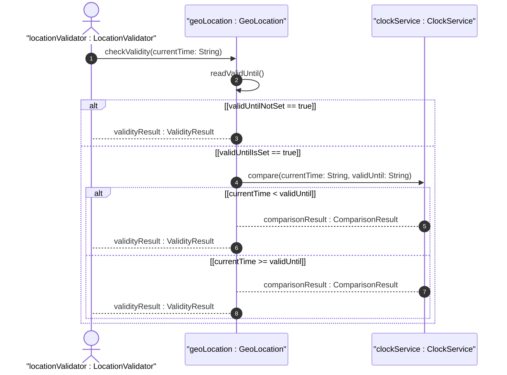
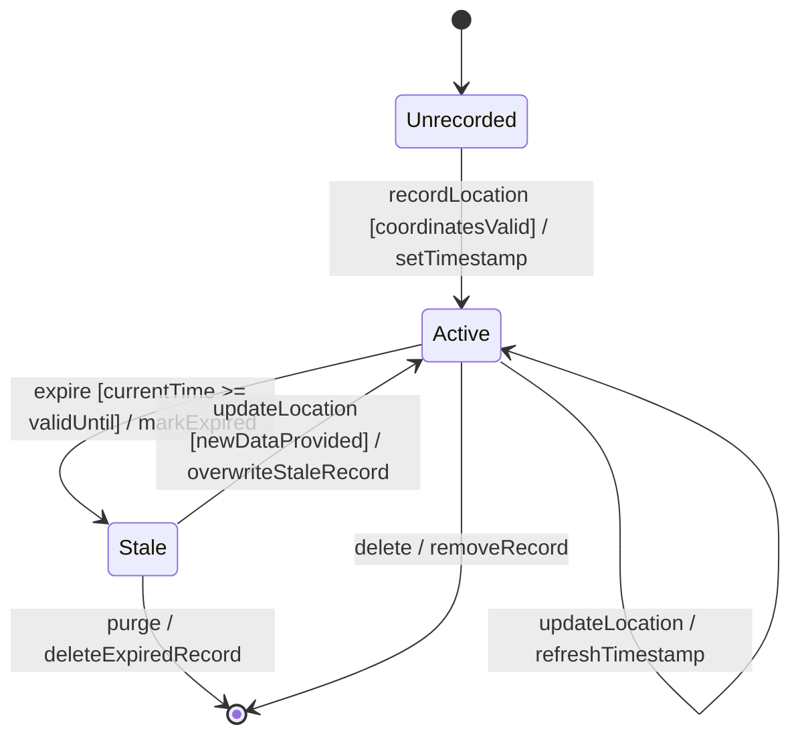

# User Story: Determine Geo-Location Record Validity and Handle Expiration

## Parent Epic
- [ ] #7 - [Geo-Location: Geographic Location Specification](https://github.com/gintatkinson/3dgs-027/blob/main/docs/epics/epic-01-geo-location-specification.md) (Temporal lifecycle management of location records based on valid-until expiration)

## Domain Object Mapping
- **Primary Domain Objects:** GeoLocation (timestamp, valid-until)
- **Actor/Role:** LocationValidator (entity checking record freshness)

## BDD Scenario (OOA/OOD Realization)
**Given** a geo-location record has a timestamp and an optional valid-until timestamp
**When** the current time is compared against the valid-until value
**Then** the record is marked as valid if current time is before valid-until (or if valid-until is absent), and marked as stale/expired if current time has passed valid-until

### As a LocationValidator
I want to determine whether a geo-location record is still valid
So that I do not act on stale or expired location data

## UML Sequence Diagram

## UML State Machine Diagram

## Operational Context

From the YANG schema (valid-until leaf):
> The timestamp for which this geo-location is valid until. If unspecified, the geo-location has no specific expiration time.

From the YANG schema (timestamp leaf):
> Reference time when location was recorded.

## Required Features Matrix
- [ ] #1 - [Geo-Location Container](https://github.com/gintatkinson/3dgs-027/blob/main/docs/features/feat-01-geo-location-container.md) (Provides the timestamp and valid-until attributes that govern record lifecycle)

## Source References
Structural Schema: [ietf-geo-location.yang](https://github.com/YangModels/yang/blob/main/standard/ietf/RFC/ietf-geo-location%402022-02-11.yang)
Normative Specification: [RFC 9179 - A YANG Grouping for Geographic Locations](https://datatracker.ietf.org/doc/rfc9179/)
