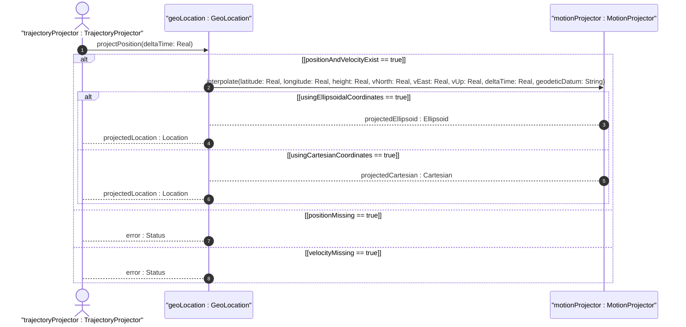

# User Story: Project Future Position from Current Location and Velocity Vector

## Parent Epic
- [ ] #7 - [Geo-Location: Geographic Location Specification](https://github.com/gintatkinson/3dgs-027/blob/main/docs/epics/epic-01-geo-location-specification.md) (Algorithmic projection of object trajectory from current position and velocity over time)

## Domain Object Mapping
- **Primary Domain Objects:** GeoLocation (timestamp), Velocity (v-north, v-east, v-up), Ellipsoid (latitude, longitude, height), Cartesian (x, y, z)
- **Actor/Role:** TrajectoryProjector (entity requesting position prediction)

## BDD Scenario (OOA/OOD Realization)
**Given** a geo-location record has a known position, a velocity vector, and a recording timestamp
**When** the TrajectoryProjector requests the projected position at a future time delta
**Then** the system computes the new coordinates by linear interpolation, adding (velocity_component * time_delta) to each coordinate component

### As a TrajectoryProjector
I want to compute the projected future position of a moving object
So that I can predict its location at a specified future time for planning, tracking, or collision avoidance

## UML Sequence Diagram

## Operational Context

From RFC 9179 Section 2.3:
> Support is added for objects in relatively stable motion. For objects in relatively stable motion, the grouping provides a three-dimensional vector value. The components of the vector are 'v-north', 'v-east', and 'v-up', which are all given in fractional meters per second.

> For some applications that demand high accuracy and where the data is infrequently updated, this velocity vector can track very slow movement such as continental drift.

> Tracking more complex forms of motion is outside the scope of this work. The intent of the grouping being defined here is to identify where something is located, and generally this is expected to be somewhere on, or relative to, Earth (or another astronomical body).

## Required Features Matrix
- [ ] #6 - [Velocity Vector](https://github.com/gintatkinson/3dgs-027/blob/main/docs/features/feat-06-velocity-vector.md) (Provides v-north, v-east, v-up velocity components for trajectory projection)
- [ ] #4 - [Ellipsoidal Coordinates](https://github.com/gintatkinson/3dgs-027/blob/main/docs/features/feat-04-ellipsoidal-coordinates.md) (Provides source ellipsoidal position for projection)
- [ ] #5 - [Cartesian Coordinates](https://github.com/gintatkinson/3dgs-027/blob/main/docs/features/feat-05-cartesian-coordinates.md) (Provides source Cartesian position for projection)
- [ ] #1 - [Geo-Location Container](https://github.com/gintatkinson/3dgs-027/blob/main/docs/features/feat-01-geo-location-container.md) (Provides recording timestamp as the reference time point for projection)

## Source References
Structural Schema: [ietf-geo-location.yang](https://github.com/YangModels/yang/blob/main/standard/ietf/RFC/ietf-geo-location%402022-02-11.yang)
Normative Specification: [RFC 9179 - A YANG Grouping for Geographic Locations](https://datatracker.ietf.org/doc/rfc9179/)
