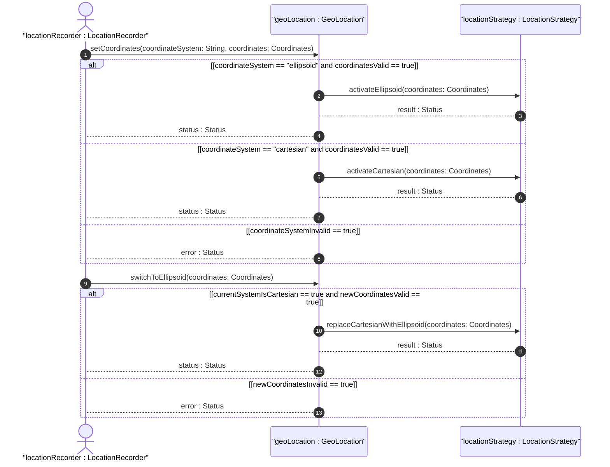

# User Story: Select and Manage Mutually Exclusive Coordinate Representation

## Parent Epic
- [ ] #7 - [Geo-Location: Geographic Location Specification](https://github.com/gintatkinson/3dgs-027/blob/main/docs/epics/epic-01-geo-location-specification.md) (Operational scenario for choosing between ellipsoidal and Cartesian coordinate systems)

## Domain Object Mapping
- **Primary Domain Objects:** Location (choice), Ellipsoid (latitude, longitude, height), Cartesian (x, y, z)
- **Actor/Role:** LocationRecorder (entity configuring a geo-location record)

## BDD Scenario (OOA/OOD Realization)
**Given** a new geo-location record is being created
**When** the LocationRecorder selects the ellipsoidal coordinate system and provides latitude, longitude, and optional height
**Then** the ellipsoidal coordinates are stored and the Cartesian alternative is unavailable for this record

### As a LocationRecorder
I want to select between ellipsoidal and Cartesian coordinate representations
So that I can capture location data in the coordinate system most appropriate for my application domain

## UML Sequence Diagram

## Operational Context

From RFC 9179 Section 2.2:
> This is the location on, or relative to, the astronomical object. It is specified using two or three coordinate values. These values are given either as 'latitude', 'longitude', and an optional 'height', or as Cartesian coordinates of 'x', 'y', and 'z'.

From the YANG schema (choice location):
> The location data either in latitude/longitude or Cartesian values.

## Required Features Matrix
- [ ] #4 - [Ellipsoidal Coordinates](https://github.com/gintatkinson/3dgs-027/blob/main/docs/features/feat-04-ellipsoidal-coordinates.md) (Provides the ellipsoidal coordinate option with latitude, longitude, and height)
- [ ] #5 - [Cartesian Coordinates](https://github.com/gintatkinson/3dgs-027/blob/main/docs/features/feat-05-cartesian-coordinates.md) (Provides the Cartesian coordinate option with X, Y, Z values)

## Source References
Structural Schema: [ietf-geo-location.yang](https://github.com/YangModels/yang/blob/main/standard/ietf/RFC/ietf-geo-location%402022-02-11.yang)
Normative Specification: [RFC 9179 - A YANG Grouping for Geographic Locations](https://datatracker.ietf.org/doc/rfc9179/)
