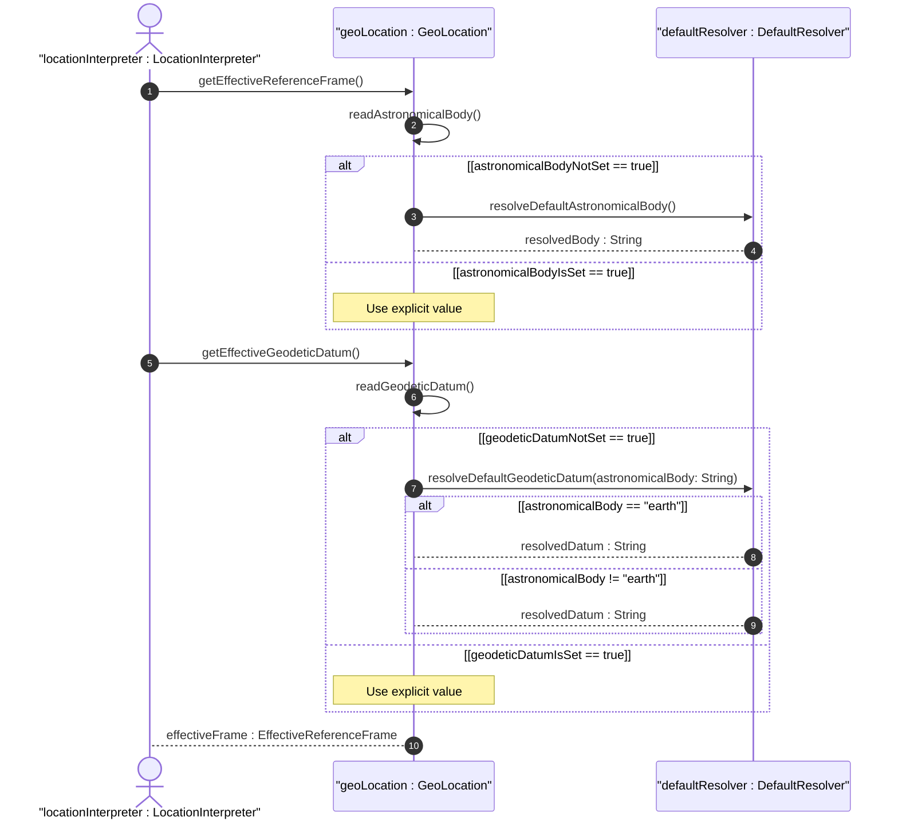

# User Story: Resolve Default Reference Frame and Geodetic Datum Values

## Parent Epic
- [ ] #7 - [Geo-Location: Geographic Location Specification](https://github.com/gintatkinson/3dgs-027/blob/main/docs/epics/epic-01-geo-location-specification.md) (Operational scenario for cascading default value resolution)

## Domain Object Mapping
- **Primary Domain Objects:** ReferenceFrame (astronomical-body), GeodeticSystem (geodetic-datum)
- **Actor/Role:** LocationInterpreter (entity reading and interpreting a geo-location record)

## BDD Scenario (OOA/OOD Realization)
**Given** a geo-location record is queried without an explicitly specified astronomical body or geodetic datum
**When** the LocationInterpreter requests the effective reference frame and geodetic datum
**Then** the system resolves 'earth' as the default astronomical body and 'wgs-84' as the effective geodetic datum when the astronomical body is 'earth'

### As a LocationInterpreter
I want to know the effective reference frame and geodetic datum even when they are not explicitly set
So that I can correctly interpret coordinate values without requiring every record to redundantly specify well-known defaults

## UML Sequence Diagram

## Operational Context

From RFC 9179 Section 2.1:
> The default 'astronomical-body' value is 'earth'.
> The default value for 'geodetic-datum' is 'wgs-84' (i.e., the World Geodetic System [WGS84]), which is used by the Global Positioning System (GPS) among many others.

From the YANG schema (astronomical-body):
> default "earth"

## Required Features Matrix
- [ ] #2 - [Reference Frame](https://github.com/gintatkinson/3dgs-027/blob/main/docs/features/feat-02-reference-frame.md) (Defines the astronomical-body attribute and its default value 'earth')
- [ ] #3 - [Geodetic System](https://github.com/gintatkinson/3dgs-027/blob/main/docs/features/feat-03-geodetic-system.md) (Defines the geodetic-datum attribute and its context-dependent default)

## Source References
Structural Schema: [ietf-geo-location.yang](https://github.com/YangModels/yang/blob/main/standard/ietf/RFC/ietf-geo-location%402022-02-11.yang)
Normative Specification: [RFC 9179 - A YANG Grouping for Geographic Locations](https://datatracker.ietf.org/doc/rfc9179/)
