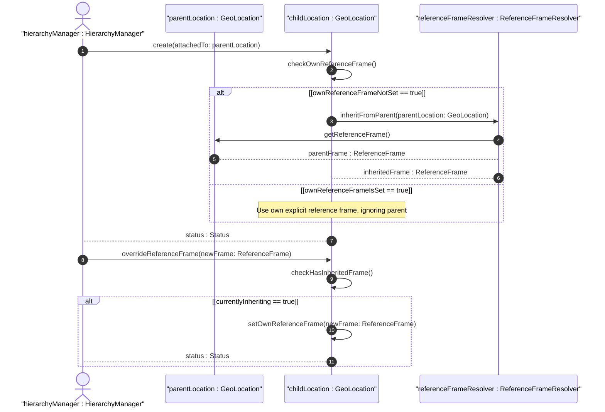

# User Story: Inherit Reference Frame in Nested Location Hierarchies

## Parent Epic
- [ ] #7 - [Geo-Location: Geographic Location Specification](https://github.com/gintatkinson/3dgs-027/blob/main/docs/epics/epic-01-geo-location-specification.md) (Operational scenario for hierarchical inheritance of reference frame data)

## Domain Object Mapping
- **Primary Domain Objects:** ReferenceFrame (astronomical-body, alternate-system, geodetic-system), GeoLocation
- **Actor/Role:** HierarchyManager (entity managing nested location structures)

## BDD Scenario (OOA/OOD Realization)
**Given** a parent geo-location record has a reference frame defining astronomical-body as 'mars' and geodetic-datum as 'mars-iau'
**When** a child geo-location record is created without specifying its own reference frame
**Then** the child location inherits the parent's reference frame values, interpreting its coordinates relative to Mars with the Mars IAU datum

### As a HierarchyManager
I want child locations to inherit the reference frame from their parent container
So that nested objects within the same spatial context do not need to redundantly repeat reference frame configuration

## UML Sequence Diagram

## Operational Context

From RFC 9179 Section 2.4:
> When locations are nested (e.g., a building may have a location that houses routers that also have locations), the module using this grouping is free to indicate in its definition that the 'reference-frame' is inherited from the containing object so that the 'reference-frame' need not be repeated in every instance of location data.

## Required Features Matrix
- [ ] #2 - [Reference Frame](https://github.com/gintatkinson/3dgs-027/blob/main/docs/features/feat-02-reference-frame.md) (Provides the reference frame attributes that are inherited by child locations)
- [ ] #1 - [Geo-Location Container](https://github.com/gintatkinson/3dgs-027/blob/main/docs/features/feat-01-geo-location-container.md) (Provides the container structure that enables parent-child location nesting)

## Source References
Structural Schema: [ietf-geo-location.yang](https://github.com/YangModels/yang/blob/main/standard/ietf/RFC/ietf-geo-location%402022-02-11.yang)
Normative Specification: [RFC 9179 - A YANG Grouping for Geographic Locations](https://datatracker.ietf.org/doc/rfc9179/)
