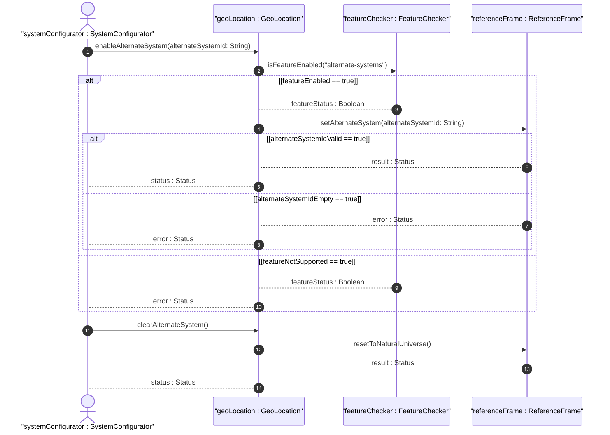

# User Story: Configure and Toggle Alternate Coordinate System Support

## Parent Epic
- [ ] #7 - [Geo-Location: Geographic Location Specification](https://github.com/gintatkinson/3dgs-027/blob/main/docs/epics/epic-01-geo-location-specification.md) (Operational scenario for enabling and using alternate reality/virtual coordinate systems)

## Domain Object Mapping
- **Primary Domain Objects:** ReferenceFrame (alternate-system)
- **Actor/Role:** SystemConfigurator (entity enabling extended system capabilities)

## BDD Scenario (OOA/OOD Realization)
**Given** a system implements the alternate-systems feature
**When** the SystemConfigurator enables alternate system support and specifies an alternate system identifier for a geo-location record
**Then** the system accepts and stores the alternate system value, and all reference frame values are interpreted within the context of that alternate system

### As a SystemConfigurator
I want to configure alternate coordinate systems for geo-location records
So that I can model locations in simulated environments, virtual realities, or non-standard coordinate frameworks

## UML Sequence Diagram

## Operational Context

From RFC 9179 Section 2.1:
> Finally, we define an optional feature that allows for changing the system for which the above values are defined. This optional feature adds an 'alternate-system' value to the reference frame. This value is normally not present, which implies the natural universe is the system. The use of this value is intended to allow for creating virtual realities or perhaps alternate coordinate systems. The definition of alternate systems is outside the scope of this document.

From the YANG schema (alternate-system leaf):
> The system in which the astronomical body and geodetic-datum is defined. Normally, this value is not present and the system is the natural universe; however, when present, this value allows for specifying alternate systems (e.g., virtual realities). An alternate-system modifies the definition (but not the type) of the other values in the reference frame.

## Required Features Matrix
- [ ] #2 - [Reference Frame](https://github.com/gintatkinson/3dgs-027/blob/main/docs/features/feat-02-reference-frame.md) (Contains the alternate-system leaf guarded by the alternate-systems feature)
- [ ] #3 - [Geodetic System](https://github.com/gintatkinson/3dgs-027/blob/main/docs/features/feat-03-geodetic-system.md) (Geodetic datum interpretation is modified by the alternate system context)

## Source References
Structural Schema: [ietf-geo-location.yang](https://github.com/YangModels/yang/blob/main/standard/ietf/RFC/ietf-geo-location%402022-02-11.yang)
Normative Specification: [RFC 9179 - A YANG Grouping for Geographic Locations](https://datatracker.ietf.org/doc/rfc9179/)
