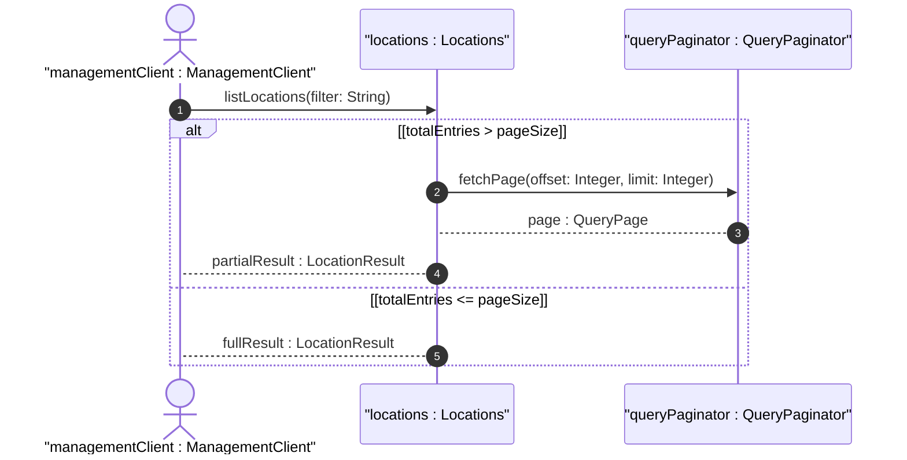

# User Story: Paginate Large Location Query Results

## Parent Epic
- [ ] #30 - [Location Hierarchy & Physical Addressing](https://github.com/gintatkinson/3dgs-027/blob/main/docs/epics/epic-02-location-hierarchy.md) (Pagination of location list for large-scale inventories)

## Domain Object Mapping
- **Primary Domain Objects:** Locations, Location
- **Actor/Role:** ManagementClient (entity querying large location inventories)

## BDD Scenario (OOA/OOD Realization)
**Given** a network inventory controller with thousands of location entries exceeding the configured page size
**When** the ManagementClient requests the full locations list
**Then** the server returns a paginated response containing a subset of entries with continuation metadata for fetching subsequent pages

### As a ManagementClient
I want to retrieve large location inventories through paginated queries
So that I can process the results incrementally without overwhelming the server or causing timeout failures

## UML Sequence Diagram

## Operational Context

From the IETF draft (Section 6):
> In large-scale inventories containing numerous network elements and components, querying location associations can impose a load on the server. To optimize retrieval and avoid overwhelming the server, mechanisms such as RESTCONF or NETCONF pagination should be utilized for queries involving large result sets.

From the IETF draft (Section 6):
> This model serves as a complement to the base inventory, providing a read-only perspective of network inventory location information known to the controller.

## Required Features Matrix
- [ ] #22 - [Locations Container](https://github.com/gintatkinson/3dgs-027/blob/main/docs/features/feat-07-locations-container.md) (Root container providing the entry point for location list queries)
- [ ] #23 - [Location Entity](https://github.com/gintatkinson/3dgs-027/blob/main/docs/features/feat-08-location-entity.md) (Individual location records that compose the paginated result set)

## Source References
Structural Schema: [ietf-ni-location.yang](https://github.com/ietf-ivy-wg/network-inventory-location/blob/main/ietf-ni-location.yang)
Normative Specification: [draft-ietf-ivy-network-inventory-location-06](https://datatracker.ietf.org/doc/html/draft-ietf-ivy-network-inventory-location)
