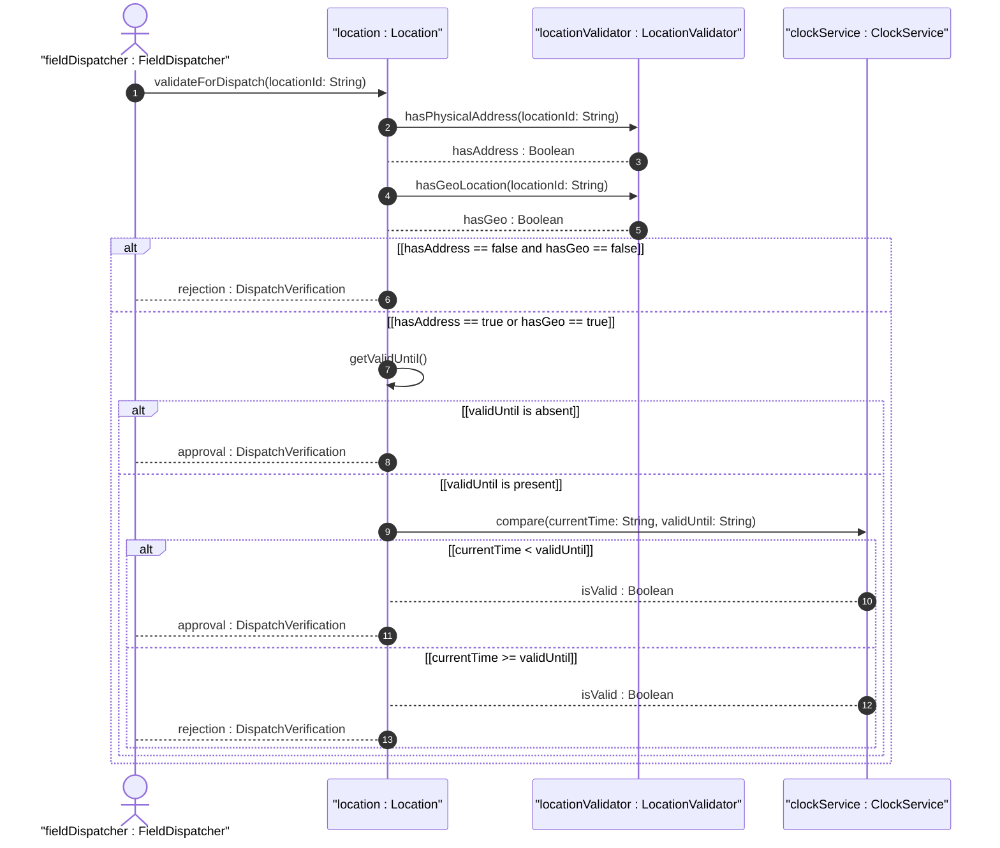

# User Story: Verify Location Completeness for Field Dispatch

## Parent Epic
- [ ] #30 - [Location Hierarchy & Physical Addressing](https://github.com/gintatkinson/3dgs-027/blob/main/docs/epics/epic-02-location-hierarchy.md) (Pre-dispatch verification of location data completeness and freshness)

## Domain Object Mapping
- **Primary Domain Objects:** Location, PhysicalAddress, GeoLocation
- **Actor/Role:** FieldDispatcher (entity preparing field dispatch or planning actions)

## BDD Scenario (OOA/OOD Realization)
**Given** a location record with a physical-address, optional geo-location, and a valid-until timestamp
**When** the FieldDispatcher requests verification that the location is usable for dispatch
**Then** the system confirms that at least one of physical-address or geo-location is present AND the valid-until is either absent or indicates a future time, or rejects the location as incomplete or stale

### As a FieldDispatcher
I want to verify that a location has adequate addressing data and is not expired
So that I can rely on location information for planning and dispatching field operations without encountering incomplete or outdated records

## UML Sequence Diagram

## Operational Context

From the IETF draft (Section 6):
> Before using a location for field dispatch or planning, verification is required to ensure at least one of physical-address or geo-location is present, and that the valid-until leaf is either not present or indicates a future time. Once the valid-until time has passed, the location MUST be considered stale and MUST NOT be used for operational purposes.

From the IETF draft (Section 6):
> Data quality is indicated through timestamps recording the last update time, as well as an optional expiration time for location validity.

## Required Features Matrix
- [ ] #23 - [Location Entity](https://github.com/gintatkinson/3dgs-027/blob/main/docs/features/feat-08-location-entity.md) (Provides the valid-until temporal attribute and aggregation of physical-address and geo-location)
- [ ] #24 - [Physical Address](https://github.com/gintatkinson/3dgs-027/blob/main/docs/features/feat-09-physical-address.md) (Postal address data checked for presence during dispatch verification)

## Source References
Structural Schema: [ietf-ni-location.yang](https://github.com/ietf-ivy-wg/network-inventory-location/blob/main/ietf-ni-location.yang)
Normative Specification: [draft-ietf-ivy-network-inventory-location-06](https://datatracker.ietf.org/doc/html/draft-ietf-ivy-network-inventory-location)
