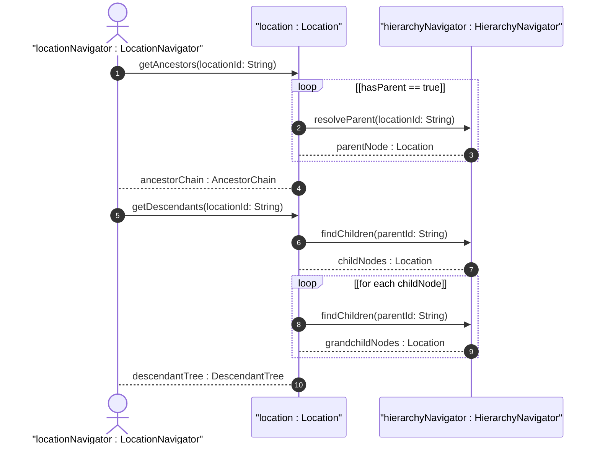

# User Story: Traverse and Resolve Nested Location Hierarchies

## Parent Epic
- [ ] #30 - [Location Hierarchy & Physical Addressing](https://github.com/gintatkinson/3dgs-027/blob/main/docs/epics/epic-02-location-hierarchy.md) (Hierarchical parent-child traversal of location records)

## Domain Object Mapping
- **Primary Domain Objects:** Location
- **Actor/Role:** LocationNavigator (entity building or traversing the location containment tree)

## BDD Scenario (OOA/OOD Realization)
**Given** a network inventory with location entries forming a hierarchy (e.g., Site -> Building -> Room)
**When** the LocationNavigator requests the full ancestor chain or descendant tree for a given location
**Then** the system traverses the parent leafref chain to resolve all ancestors up to the root, and returns the resolved hierarchy

### As a LocationNavigator
I want to traverse the parent-child relationships to build the complete location containment tree
So that I can understand the physical nesting of sites, buildings, and rooms for operational planning

## UML Sequence Diagram

## Operational Context

From the IETF draft (Section 2):
> Locations can be nested to form a hierarchy. For example, buildings may be within a site, and a room may be within a building.

From the YANG schema (parent leaf):
> The identifier of the location that physically contains this location.

## Required Features Matrix
- [ ] #23 - [Location Entity](https://github.com/gintatkinson/3dgs-027/blob/main/docs/features/feat-08-location-entity.md) (Provides the id key and parent leafref that establish the hierarchy)
- [ ] #22 - [Locations Container](https://github.com/gintatkinson/3dgs-027/blob/main/docs/features/feat-07-locations-container.md) (Provides the scope for querying sibling and child locations)

## Source References
Structural Schema: [ietf-ni-location.yang](https://github.com/ietf-ivy-wg/network-inventory-location/blob/main/ietf-ni-location.yang)
Normative Specification: [draft-ietf-ivy-network-inventory-location-06](https://datatracker.ietf.org/doc/html/draft-ietf-ivy-network-inventory-location)
