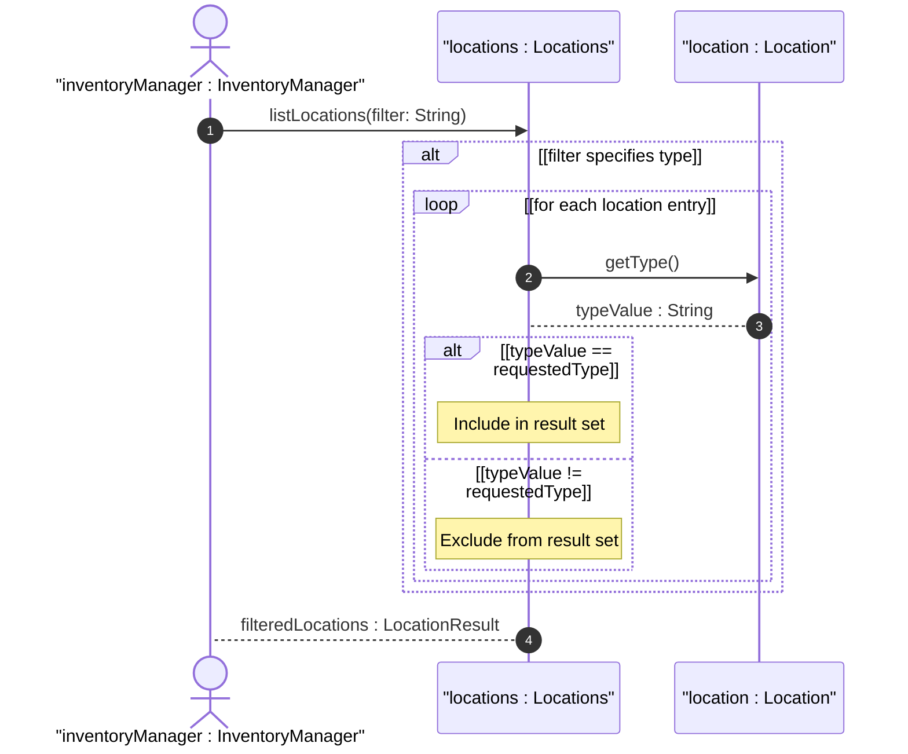

# User Story: Filter Locations by Custom Type Classification

## Parent Epic
- [ ] #30 - [Location Hierarchy & Physical Addressing](https://github.com/gintatkinson/3dgs-027/blob/main/docs/epics/epic-02-location-hierarchy.md) (Type-based filtering of location records)

## Domain Object Mapping
- **Primary Domain Objects:** Location
- **Actor/Role:** InventoryManager (entity querying locations by operational category)

## BDD Scenario (OOA/OOD Realization)
**Given** a network inventory with locations categorized by flexible string types (e.g., 'site', 'building', 'room', 'pole', 'roof')
**When** the InventoryManager filters the location list by a specific type value
**Then** the system returns only locations matching that type, excluding all other entries

### As an InventoryManager
I want to filter locations by their type classification
So that I can quickly retrieve all locations of a specific category (all sites, all rooms, all outdoor mounting points) without scanning the entire inventory

## UML Sequence Diagram

## Operational Context

From the YANG schema (type leaf):
> The type of network inventory location, e.g. equipment room, building, or site. This allows operators to flexibly define custom location types (e.g., 'pole', 'roof', 'floor') based on their specific network scenarios without requiring model extensions. String-based types enable dynamic adaptation to heterogeneous organizational naming conventions.

From the IETF draft (Section 2):
> The "location-type" is defined as a YANG identity to identify the type of an inventory location, which may be site, equipment room, building, etc.

## Required Features Matrix
- [ ] #23 - [Location Entity](https://github.com/gintatkinson/3dgs-027/blob/main/docs/features/feat-08-location-entity.md) (Provides the type attribute used for classification filtering)
- [ ] #22 - [Locations Container](https://github.com/gintatkinson/3dgs-027/blob/main/docs/features/feat-07-locations-container.md) (Provides the query interface for filtering the location list)

## Source References
Structural Schema: [ietf-ni-location.yang](https://github.com/ietf-ivy-wg/network-inventory-location/blob/main/ietf-ni-location.yang)
Normative Specification: [draft-ietf-ivy-network-inventory-location-06](https://datatracker.ietf.org/doc/html/draft-ietf-ivy-network-inventory-location)
