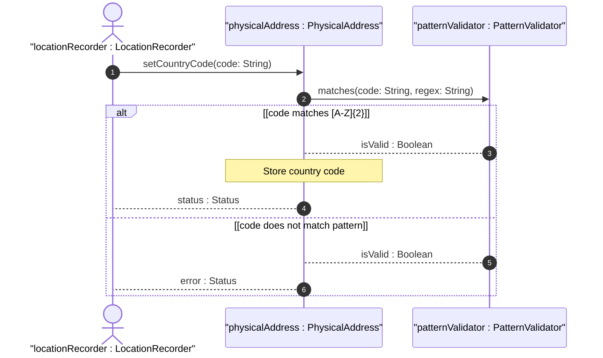
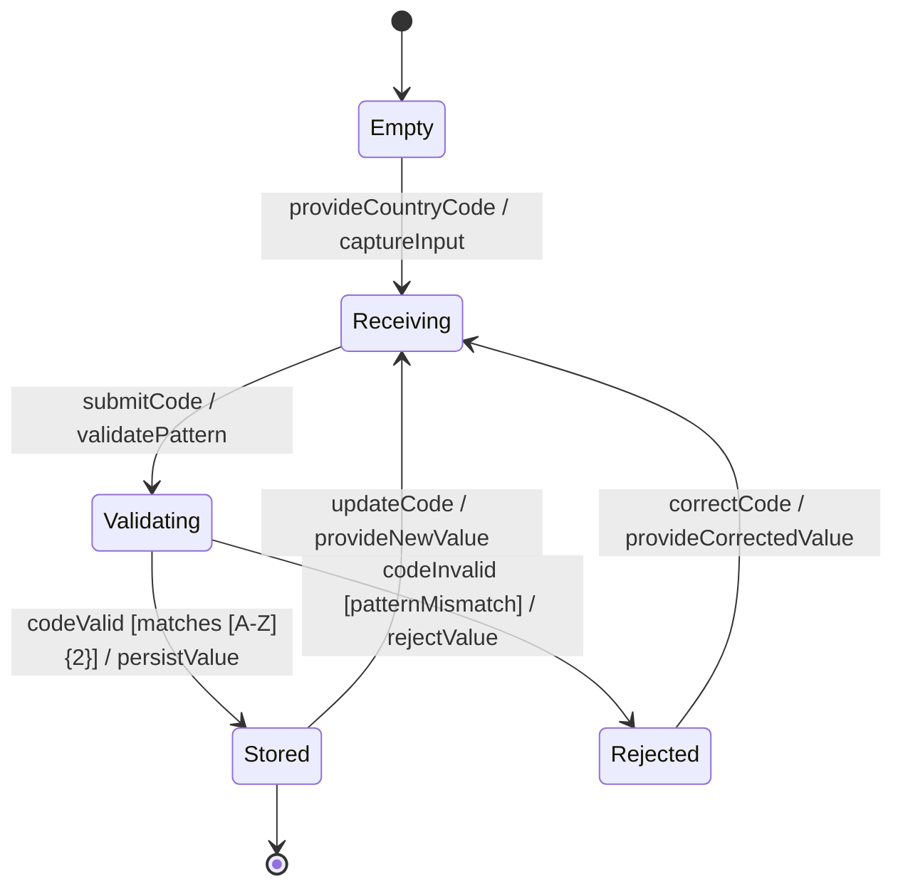

# User Story: Validate Physical Address Country Code Format

## Parent Epic
- [ ] #30 - [Location Hierarchy & Physical Addressing](https://github.com/gintatkinson/3dgs-027/blob/main/docs/epics/epic-02-location-hierarchy.md) (Pattern validation of the ISO ALPHA-2 country code field)

## Domain Object Mapping
- **Primary Domain Objects:** PhysicalAddress
- **Actor/Role:** LocationRecorder (entity recording or updating physical address data)

## BDD Scenario (OOA/OOD Realization)
**Given** a physical address container being populated for a location
**When** the LocationRecorder submits a country-code value
**Then** the system validates that the value consists of exactly two uppercase ASCII letters matching the pattern `[A-Z]{2}`, rejecting any value that contains lowercase letters, more than two characters, digits, or special characters

### As a LocationRecorder
I want country code values to be validated against the ISO ALPHA-2 two-letter uppercase format
So that invalid or malformed country codes are rejected at the point of entry, ensuring data consistency across the inventory

## UML Sequence Diagram

## UML State Machine Diagram

## Operational Context

From the YANG schema (country-code leaf):
> Specifies a country. Expressed as ISO ALPHA-2 code.

The pattern constraint `'[A-Z]{2}'` enforces exactly two uppercase ASCII letters. This validates format but not semantic correctness — the value "ZZ" would pass format validation even though it is not a recognized ISO country code.

## Required Features Matrix
- [ ] #24 - [Physical Address](https://github.com/gintatkinson/3dgs-027/blob/main/docs/features/feat-09-physical-address.md) (Container holding the country-code leaf with the pattern constraint)
- [ ] #23 - [Location Entity](https://github.com/gintatkinson/3dgs-027/blob/main/docs/features/feat-08-location-entity.md) (Parent location aggregating the physical address container)

## Source References
Structural Schema: [ietf-ni-location.yang](https://github.com/ietf-ivy-wg/network-inventory-location/blob/main/ietf-ni-location.yang)
Normative Specification: [draft-ietf-ivy-network-inventory-location-06](https://datatracker.ietf.org/doc/html/draft-ietf-ivy-network-inventory-location)
