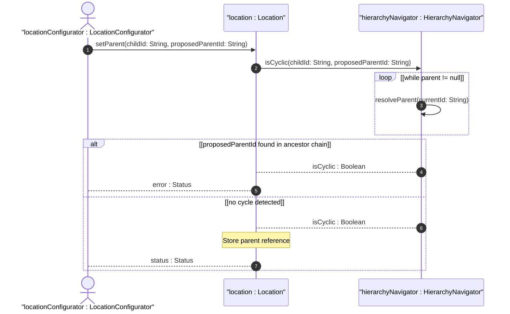
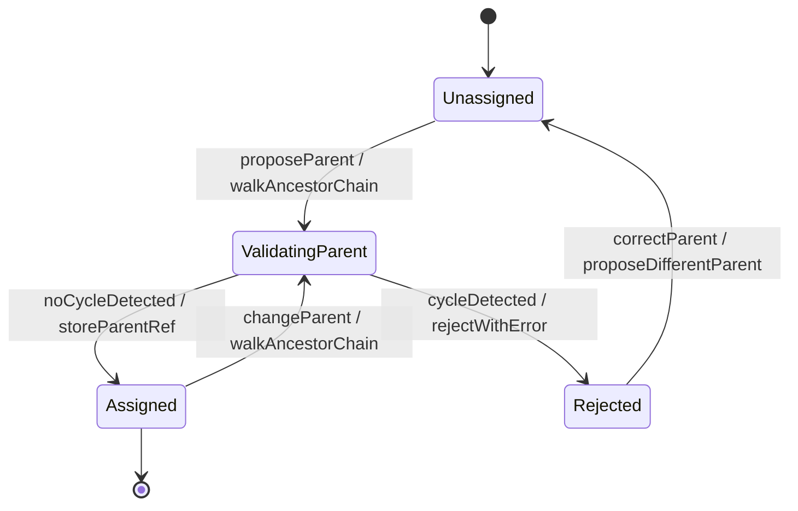

# User Story: Detect and Prevent Circular Location Hierarchy References

## Parent Epic
- [ ] #30 - [Location Hierarchy & Physical Addressing](https://github.com/gintatkinson/3dgs-027/blob/main/docs/epics/epic-02-location-hierarchy.md) (Cycle detection in the self-referencing location parent chain)

## Domain Object Mapping
- **Primary Domain Objects:** Location
- **Actor/Role:** LocationConfigurator (entity assigning parent references in the location hierarchy)

## BDD Scenario (OOA/OOD Realization)
**Given** a location hierarchy where Location A is already an ancestor of Location B
**When** the LocationConfigurator attempts to set Location A's parent to Location B (creating a cycle)
**Then** the system detects the circular reference by traversing the proposed parent chain and rejects the configuration with a cycle-detection error

### As a LocationConfigurator
I want the system to reject parent assignments that would create circular hierarchy chains
So that the location containment tree remains a valid directed acyclic graph suitable for traversal and rendering

## UML Sequence Diagram

## UML State Machine Diagram

## Operational Context

From the YANG schema (parent leaf):
> The identifier of the location that physically contains this location.

The parent leafref uses the path `../../location/id`, establishing a self-referencing hierarchy. Without cycle detection, users could configure Location A -> Location B -> Location A, creating an infinite loop that would crash hierarchy traversal and tree rendering.

## Required Features Matrix
- [ ] #23 - [Location Entity](https://github.com/gintatkinson/3dgs-027/blob/main/docs/features/feat-08-location-entity.md) (Provides the parent leafref and id that form the hierarchy)
- [ ] #22 - [Locations Container](https://github.com/gintatkinson/3dgs-027/blob/main/docs/features/feat-07-locations-container.md) (Provides the scope for resolving ancestor ids)

## Source References
Structural Schema: [ietf-ni-location.yang](https://github.com/ietf-ivy-wg/network-inventory-location/blob/main/ietf-ni-location.yang)
Normative Specification: [draft-ietf-ivy-network-inventory-location-06](https://datatracker.ietf.org/doc/html/draft-ietf-ivy-network-inventory-location)
