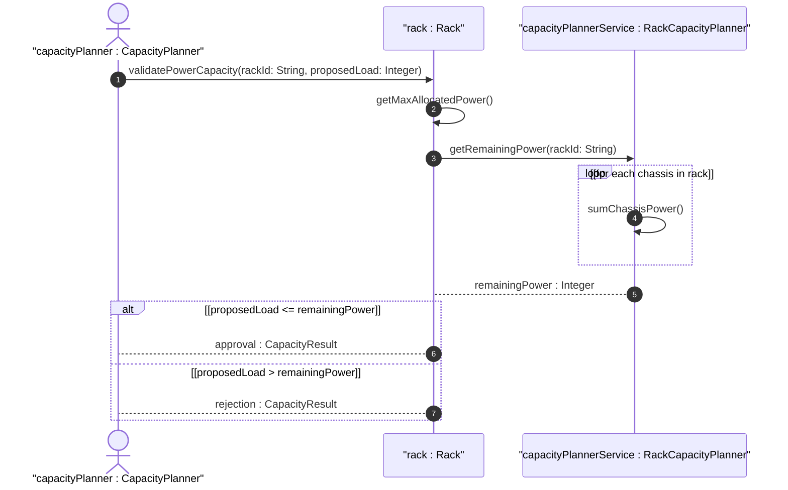

# User Story: Verify Rack Power Capacity Against Deployed Chassis Loads

## Parent Epic
- [ ] #31 - [Rack Infrastructure Management](https://github.com/gintatkinson/3dgs-027/blob/main/docs/epics/epic-03-rack-infrastructure.md) (Power capacity verification through summation of deployed chassis loads)

## Domain Object Mapping
- **Primary Domain Objects:** Rack, RackContainedChassis
- **Actor/Role:** CapacityPlanner (entity validating power headroom before chassis installation)

## BDD Scenario (OOA/OOD Realization)
**Given** a rack with max-allocated-power of 8000 watts and existing chassis consuming 7500 watts total
**When** the CapacityPlanner proposes installing an additional chassis requiring 1000 watts
**Then** the system computes the total allocated load as sum of existing loads plus the proposed load, compares it against max-allocated-power, and rejects the installation as exceeding the rack's power capacity

### As a CapacityPlanner
I want to verify that a rack has sufficient power headroom before installing new chassis
So that I can prevent power over-subscription and ensure reliable equipment operation within the rack's electrical envelope

## UML Sequence Diagram

## Operational Context

From the YANG schema (max-allocated-power leaf):
> The maximum allocated power for the rack.

From the YANG schema (contained-chassis list):
> The list of chassis within a rack.

From the IETF draft (Section 3):
> A rack may have some specific attributes, such as appearance-related attributes and electricity-related attributes.

The power capacity verification requires aggregating the power consumption of all installed chassis and comparing the total against the rack's max-allocated-power. This is a computed aggregate value derived from individual chassis entries.

## Required Features Matrix
- [ ] #27 - [Rack Entity](https://github.com/gintatkinson/3dgs-027/blob/main/docs/features/feat-12-rack-entity.md) (Provides max-allocated-power attribute for capacity comparison)
- [ ] #29 - [Rack Contained Chassis](https://github.com/gintatkinson/3dgs-027/blob/main/docs/features/feat-14-rack-contained-chassis.md) (Provides the installed chassis list whose power draw must be aggregated)

## Source References
Structural Schema: [ietf-ni-location.yang](https://github.com/ietf-ivy-wg/network-inventory-location/blob/main/ietf-ni-location.yang)
Normative Specification: [draft-ietf-ivy-network-inventory-location-06](https://datatracker.ietf.org/doc/html/draft-ietf-ivy-network-inventory-location)
