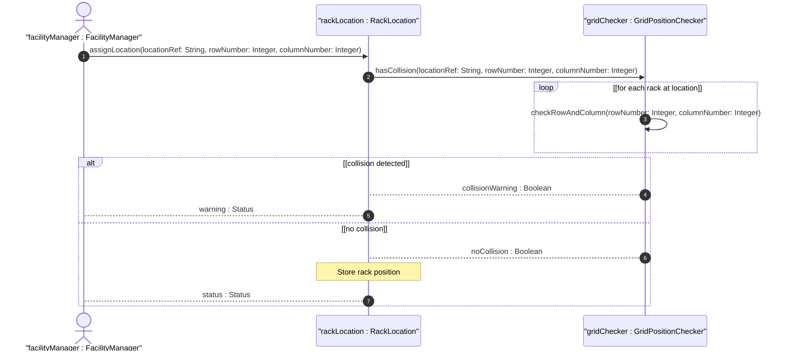

# User Story: Detect Rack Grid Position Collisions Within a Location

## Parent Epic
- [ ] #31 - [Rack Infrastructure Management](https://github.com/gintatkinson/3dgs-027/blob/main/docs/epics/epic-03-rack-infrastructure.md) (Grid collision detection for rack placement within equipment rooms)

## Domain Object Mapping
- **Primary Domain Objects:** Rack, RackLocation
- **Actor/Role:** FacilityManager (entity placing racks at grid positions within equipment rooms)

## BDD Scenario (OOA/OOD Realization)
**Given** a location 'Room-101' with an existing rack at row 1, column 3
**When** the FacilityManager attempts to place another rack at the same row 1, column 3 within Room-101
**Then** the system detects the overlapping grid position and issues a collision warning, allowing the manager to choose a different position

### As a FacilityManager
I want the system to detect when two racks claim the same grid position within a location
So that I can avoid double-booking floor positions and maintain an accurate floor plan layout

## UML Sequence Diagram

## Operational Context

From the YANG schema (rack-location container):
> The location information of the rack, which comprises the location reference, row number, and column number.

From the YANG schema (row-number leaf):
> Identifies the row within the location where the rack is located.

From the YANG schema (column-number leaf):
> Identifies the column within the location where the rack is located.

Grid position collision detection is a computational check: querying all racks assigned to the same location-ref and comparing their row-number and column-number pairs against the proposed values.

## Required Features Matrix
- [ ] #28 - [Rack Location](https://github.com/gintatkinson/3dgs-027/blob/main/docs/features/feat-13-rack-location.md) (Provides row-number, column-number, and location-ref for collision checking)
- [ ] #27 - [Rack Entity](https://github.com/gintatkinson/3dgs-027/blob/main/docs/features/feat-12-rack-entity.md) (Parent rack entity aggregating the rack-location container)

## Source References
Structural Schema: [ietf-ni-location.yang](https://github.com/ietf-ivy-wg/network-inventory-location/blob/main/ietf-ni-location.yang)
Normative Specification: [draft-ietf-ivy-network-inventory-location-06](https://datatracker.ietf.org/doc/html/draft-ietf-ivy-network-inventory-location)
